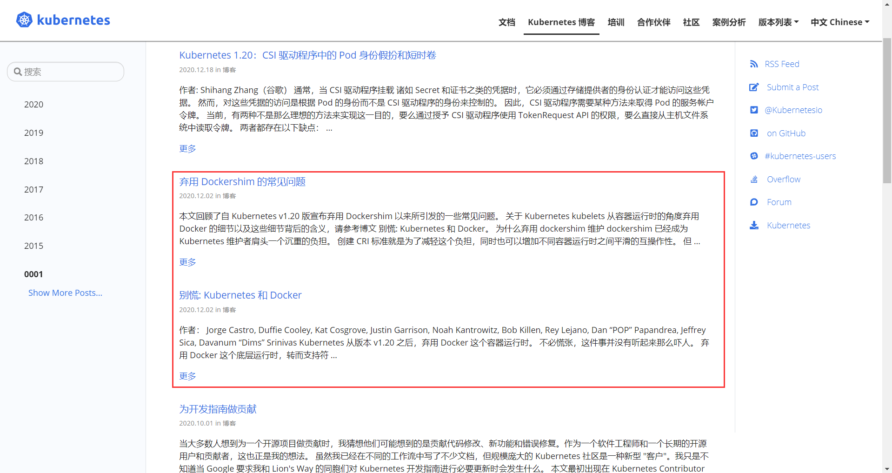

# CNI

> 之前我们以 Flannel 项目为例，来详细讲解了**容器跨主网络**的两种实现方式。与 Dokcer 类似，Kubernetes 中同样的可以通过 Flannel 来配置容器网络，当然，也会存在一些差异。


## cni0

之前的 Flannel 项目 UDP 和 VXLAN 的例子中有一个共性，那就是容器都连接在 docker0 网桥上。而网络插件则在宿主机上创建了一个特殊的设备，如 UDP 模式中的 TUN 设备，VXLAN 模式中的 VTEP 设备。docker0 则这些设备之间，通过 **IP 转发（路由表）**进行协作。

实际上，上述流程也正是 Kubernetes 对容器网络的主要处理方法。只不过 Kubernetes 是通过一个叫作 CNI 的接口，维护了一个单独的网桥来代替 docker0。这个网桥就是 **CNI 网桥**，它在宿主机上的设备名称默认为 cni0。


以 Flannel 的 VXLAN 模式为例，在 Kubernetes 环境里，它的工作方式与之前容器跨主网络中所讲解的没有任何不同，只不过 docker0 网桥被替换成了 CNI 网桥而已。


同样的，Kubernetes 也可以为 Flannel 指定所分配的子网范围。这个参数可以在部署的时配置。

```bash
kubeadm init --pod-network-cidr=10.244.0.0/16
```

当然，也可以在部署完成后，通过修改 kube-controller-manager 的配置文件来指定。


上述原理图中，若 Infra-container-1 要访问 Infra-container-2，也就是 Pod-1 要访问 Pod-2，这个 IP 包的源地址就是 `10.244.0.2`，目的 IP 地址是 `10.244.1.3`。而此时，Infra-container-1 里的 eth0 设备，同样是以 Veth Pair 的方式连接在 Node 1 的 cni0 网桥上。所以这个 IP 包就会经过 cni0 网桥出现在宿主机上。

此时，Node 1 上的路由表如下。


目的 IP 地址为 `10.244.1.3` 的 IP 包自然会匹配到第二条规则，也就是 `10.244.1.0` 对应的这条路由规则，这条规则指定了 IP 包将交给由本机的 flannel.1 设备进行处理。而在 flannel.1 在处理完后，IP 包待转发到的网关（Gateway），则正是“隧道”另一端的 VTEP 设备，即 Node 2 的 flannel.1 设备。其实整个流程，就与我们之前介绍的 Flannel VXLAN 模式完全一致。


需要注意的是，CNI 网桥只是接管所有 CNI 插件负责的，即 Kubernetes 创建的容器或者说 *Pod*。而此时，如果你用 `docker run` 命令单独启动一个容器，那么 Docker 项目还是会把这个容器连接到 docker0 网桥上。所以这个容器的 IP 地址，自然是属于 docker0 网桥的 `172.17.0.0/16` 网段。

Kubernetes 之所以要设置这样一个与 docker0 网桥功能几乎一样的 CNI 网桥，主要原因包括两个方面：

- Kubernetes 项目并没有使用 Docker 的**网络模型（CNM）**，所以**它并不希望**，也不具备配置 docker0 网桥的能力。
- Kubernetes 中有 *Pod* 这个概念，其网络插件与 Infra 容器的网络栈配置息息相关。

总的来说，Kubernetes 不太希望过多的依赖 Dokcer，在程序设计方面存在比较多的“政治正确”。当然，Kubernetes 的演进方向与最终的结果还是比较令人满意的，各类接口的设计（如 CNI，CRI，CSI）也使得优秀的解决方案蹭蹭蹭的冒出来。美其名曰“接口”，其实这颇有让“小白鼠”打白工的套路，当然，广大的 Kubernetes 玩家也乐意被“白嫖”，不留余力的投身于此。CNI 的诞生其实也颇有这种气味。


回到正题，我们知道，Kubernetes 创建一个 *Pod* 的第一步，就是创建并启动一个 Infra 容器，用来“hold”住这个 Pod 的 Network Namespace。所以，CNI 的设计思想就是：**Kubernetes 在启动 Infra 容器之后，就可以直接调用 CNI 网络插件，为这个 Infra 容器的 Network Namespace 配置符合预期的网络栈**。

当然，CNI 网络插件真正要做的正事，则是通过某种方法，把不同宿主机上的特殊设备连通，从而达到容器跨主机通信的目的。这个我们在之前已经详细介绍过了，不多赘述。


## CNI

### 相关概念

讲了这么多，那么 CNI 到底是什么呢？

CNI，全称 **Container Network Interface**，即**容器网络接口**，其目标是为容器创建基于插件的通用网络解决方案。其作为容器网络的统一标准，让各个容器管理平台（如 Kubernetes，mesos）都可以**通过相同的接口调用各式各样的网络插件**（如 Flannel，Calico，Weave）来为容器配置网络。


如上所示，其实 CNI 定义的就是一组容器运行时（如 containerd，rkt）与网络插件之间的规范定义，CRI 中针对 **PodSandbox (容器沙箱环境)** 构建的操作其实就会调用到 CNI 。你可能会问 PodSandbox 是什么？以 linux 容器来说，PodSandbox 指的其实就是 Infra 容器，它维持住了 *Pod* 这个逻辑上的概念，而 Infra 容器的网络栈配置就会拜托 CNI 来处理，其实就是我们上文中已经提过的内容。


在部署 Kubernetes 的时候，有一个步骤是安装 kubernetes-cni 包，它的目的就是在宿主机上**安装 CNI 插件所需的基础可执行文件**。我们可以在宿主机的 `/opt/cni/bin` 目录下看到它们。

```bash
ls -al /opt/cni/bin/
```


这些 CNI 的基础可执行文件，按照功能可以分为三类：

1. **Main 插件**：用来创建具体**网络设备**的二进制文件。比如，`bridge`（网桥设备），`ipvlan`，`loopback`（lo 设备），`macvlan`，`ptp`（Veth Pair 设备）以及 `vlan`。在之前所提到过的 Flannel，Weave 等项目，就属于“网桥”类型的 CNI 插件。所以在具体的实现中，它们往往会调用 `bridge` 这个二进制文件。
2.  **IPAM（IP Address Management）插件**：负责分配 IP 地址的二进制文件，如 `dhcp`，该文件会向 DHCP 服务器发起请求；`host-local`，会使用预先配置的 IP 地址段来进行分配。
3. **内置 CNI 插件**：由 CNI 社区维护的内置 CNI 插件，如 `flannel`，就是专门为 Flannel 项目提供的 CNI 插件；`tuning`，一个通过 sysctl 调整网络设备参数的二进制文件；`portmap`，一个通过 iptables 配置端口映射的二进制文件；`bandwidth`，一个使用 Token Bucket Filter (TBF) 来进行限流的二进制文件。


从这些二进制文件中不难发现，其实要实现一个 Kubernetes 容器网络方案，需要做两部分工作：

- 首先，实现这个**网络方案本身**。以 Flannel 项目为例，这一部分需要编写的，其实就是 flanneld 进程里的主要逻辑。如创建和配置 flannel.1 设备，配置宿主机路由，配置 ARP 和 FDB 表信息等。
- 实现该网络方案对应的 CNI 插件。这一部分主要需要做的，就是配置 Infra 容器里面的网络栈，并把它连接在 CNI 网桥 cni0 上。


由于 Flannel 项目对应的 CNI 插件已经被内置了，所以它无需再单独安装。而对于 Weave、Calico 等其他项目来说，我们就必须在安装插件的时候，把对应的 CNI 插件的可执行文件放在 `/opt/cni/bin/` 目录下。

接下来，我们就需要在宿主机上安装 flanneld（网络方案本身）。而在这个过程中，flanneld 启动后会在每台宿主机上生成它对应的 **CNI 配置文件**，它其实是一个 *ConfigMap*，从而告诉 Kubernetes，现在这个集群要使用 Flannel 作为容器网络方案。CNI 配置文件的内容如下，注意它是一个 JSON 文件。

```bash
cat /etc/cni/net.d/10-flannel.conflist
```


需要注意的是，在 Kubernetes 中，处理容器网络相关的逻辑并不会在 kubelet 主干代码里执行，而是会在具体的 **CRI（Container Runtime Interface）容器运行时接口**实现里完成。对于 Docker 项目来说，它的 CRI 实现叫作 dockershim，你可以在 kubelet 的代码里找到它。所以接下来，dockershim 就会去加载上述的 CNI 配置文件。


你可能会说，调个 CNI 怎么就能这么绕，Kubernetes 的调用链路怎么这么繁琐，**垫片（shim）**又是啥玩意？这里强烈推荐阅读[此文](https://aleiwu.com/post/cncf-runtime-landscape/)。当然，dockershim 也快要“寿终正寝”了，20 年年末引起了极大舆论的 Kubernetes 与 Docker “分家”的新闻其实就是指的这个事。其实如果你对 CRI 有比全面较深刻的理解，就会明白这其实不是什么大事，或者说是 Kubernetes 演进的必然结果。但是如果你是 Docker 的忠实粉丝，还是免不了叹一口气，Docker 的影响力确实在逐渐消退。




回到上述 CNI 配置文件，Kubernetes 目前不支持多个 CNI 插件混用。如果我们在 CNI 配置目录 `/etc/cni/net.d` 中放置了多个 CNI 配置文件的话，dockershim 只会加载按字母顺序排序的第一个插件。

另一方面，CNI 允许我们在一个 CNI 配置文件里，通过 `plugins` 字段，定义多个插件进行协作。在上述 CNI 配置文件中，Flannel 项目就指定了 flannel 和 portmap 这两个插件。

这时候，dockershim 会把这个 CNI 配置文件加载起来，并且把列表里的第一个插件，也就是 flannel 插件，设置为默认插件。而在后面的执行过程中，flannel 和 portmap 插件会按照定义顺序被调用，从而依次完成“配置容器网络”和“配置端口映射”这两步操作。


### Infra 容器网络栈配置

这里我们来说明一下 **CNI 插件的具体工作原理**。

当 kubelet 需要创建一个 *Pod* 的时候，Infra 容器一定是最先被创建的。在这一步，dockershim 就会调用 Docker API 创建并启动 Infra 容器，紧接着执行一个叫作 SetUpPod 的方法，该方法为 CNI 插件**准备参数**，然后调用 CNI 插件为 Infra 容器配置网络。


这里要调用的 CNI 插件，自然就是 `/opt/cni/bin/flannel`；而调用它所需要的参数，可以分为两部分。

**第一部分，是由 dockershim 设置的一组 CNI 环境变量**。其中，最重要的环境变量参数：`CNI_COMMAND`，它的取值只有两种：`ADD` 和 `DEL`。

ADD 和 DEL 操作，就是 CNI 插件唯一需要实现的两个方法。其中 ADD 操作的含义是把容器添加到 CNI 网络里；DEL 操作的含义则是把容器从 CNI 网络里移除掉。于网桥类型的 CNI 插件来说，这两个操作意味着把容器以 Veth Pair 的方式“插”到 CNI 网桥上，或者从网桥上“拔”掉。

以 ADD 操作为例。其需要的参数包括：`CNI_IFNAME` - 容器里内卡的名称 eth0，`CNI_NETNS` - *Pod* Network Namespace 文件路径，`CNI_CONTAINERID` - 容器 ID等，这些参数都属于上述 CNI 环境变量里的内容。除此之外，还有一个称为 `CNI_ARGS` 的参数，通过这个参数，CRI 实现（如 dockershim）就可以以 key - value 的格式，传递自定义信息给网络插件。这是用户自定义 CNI 协议的一个重要方法。


**第二部分，是 dockershim 从 CNI 配置文件里加载到的，默认插件的配置信息**。该配置信息在 CNI 中被称为 Network Configuration。dockershim 会把 Network Configuration 以 JSON 数据的格式，通过标准输入（stdin）的方式传递给 Flannel CNI 插件。

需要注意的是，Flannel 的 CNI 配置文件 `/etc/cni/net.d/10-flannel.conflist` 中有这么一个字段 `delegate`。

```json
...
     "delegate": {
        "hairpinMode": true,
        "isDefaultGateway": true
      }
```

`delegate` 字段的意思是，这个 CNI 插件并不会自己动手做事，而是会调用 `delegate` 字段所指定的某种 CNI 内置插件来完成。对于 Flannel 来说，它调用的 Delegate 插件，就是前面介绍到的 CNI bridge 插件。


所以说，dockershim 对 Flannel CNI 插件的调用，其实就是**走个过场**。Flannel CNI 插件唯一需要做的，就是对 dockershim 传来的 Network Configuration 进行补充。如将 `delegate` 中的 `Type` 字段设置为 `bridge`；将 `IPAM` 字段设置为 `host-local` 等。经 Flannel CNI 插件补充后，完整的 `delegate` 字段如下。

```json
{
    "hairpinMode":true,
    "ipMasq":false,
    "ipam":{
        "routes":[
            {
                "dst":"10.244.0.0/16"
            }
        ],
        "subnet":"10.244.1.0/24",
        "type":"host-local"
    },
    "isDefaultGateway":true,
    "isGateway":true,
    "mtu":1410,
    "name":"cbr0",
    "type":"bridge"
}
```

其中，`ipam` 字段里的信息读取自 Flannel 项目在宿主机上生成的 Flannel 配置文件，即宿主机上的 `/run/flannel/subnet.env` 文件。


接下来，Flannel CNI 插件就会调用 CNI bridge 插件，也就是执行 `/opt/cni/bin/bridge` 二进制文件。调用 CNI bridge 插件所需要的两部分参数中， CNI 环境变量并没有变化，所以其中的 `CNI_COMMAND` 参数仍然为 `ADD`。

而第二部分参数 Network Configration，就是上面补充好的 `delegate` 字段。Flannel CNI 插件则会把 `delegate` 字段的内容以标准输入（stdin）的方式传递给 CNI bridge 插件。此外，Flannel CNI 插件还会把 `delegate` 字段以 JSON 文件的方式保存在 `/var/lib/cni/flannel` 目录下，这是为了给后续删除容器调用 DEL 操作时使用的。

有了这两部分参数后，CNI bridge 插件就可以“代表” Flannel，进行“将容器加入到 CNI 网络里”这一操作了。


我们继续来说说 CNI bridge 插件具体做了什么事。首先它会在宿主机上检查 CNI 网桥是否存在，如果没有，那就创建 CNI 网桥。这相当于在宿主机上执行：

```bash
# 在宿主机上
ip link add cni0 type bridge
ip link set cni0 up
```


之后，CNI bridge 插件会通过 Infra 容器的 Network Namespace 文件，即宿主机中的 `/proc/<容器进程 PID>/ns/net` 文件，进入到这个 Network Namespace 中，即容器内。然后创建一对 Veth Pair 设备。

```bash
# 在容器里
# 创建一对 Veth Pair 设备，其中一个叫作 eth0，另一个叫作 vethb4963f3
ip link add eth0 type veth peer name vethb4963f3
ip link set eth0 up 
```


紧接着，它会把这个 Veth Pair 的其中一端，“移动”到宿主机上。

```bash
# 在容器里
# 将 Veth Pair 设备的另一端 vethb4963f3 设备放到宿主机里，也就是 Host Namespace
ip link set vethb4963f3 netns $HOST_NS
# 经由 Host Namespace，启动宿主机上的 vethb4963f3 设备
ip netns exec $HOST_NS ip link set vethb4963f3 up 
```


然后，CNI bridge 插件就可以把 vethb4963f3 设备”插“在 CNI 网桥上。

```bash
# 在宿主机上
ip link set vethb4963f3 master cni0
```

在将 vethb4963f3 设备连接在 CNI 网桥之后，CNI bridge 插件还会为它设置 **Hairpin Mode（发夹模式）**。这是因为在默认情况下，网桥设备是**不允许一个数据包从一个端口进来后，再从这个端口发出去**的。但是，它允许你为这个端口开启 Hairpin Mode，从而取消这个限制。这个特性，主要用于容器需要通过 NAT 端口映射的方式，“自己访问自己”的场景下。

比如，当我们执行 `docker run -p 8080:80`，其实就是在宿主机上通过 iptables 设置了一条 DNAT（目的地址转换）转发规则。这条规则的作用是，当宿主机上的进程访问 `<宿主机的 IP 地址 >:8080` 时，iptables 会把该请求直接转发到 `<容器的 IP 地址 >:80` 上。也就是说，这个请求最终会经过 docker0 网桥进入容器里面。

现在有这么一个场景，我们**在容器内访问宿主机的 8080 端口**，那么这个容器里发出的 IP 包则会经过 vethb4963f3 设备和 docker0 网桥来到宿主机上。此时，根据上述 DNAT 规则，该 IP 包又需要回到 docker0 网桥，并且还是通过 vethb4963f3 端口进入到容器里。所以这种情况下，我们就需要开启 vethb4963f3 端口的 Hairpin Mode 。

所以说，Flannel 插件通常要在 CNI 配置文件里声明 `hairpinMode=true`。这样，将来这个集群里的 *Pod* 才可以通过它自己的 *Service* 访问到自己。


接下来，CNI bridge 插件会调用 CNI ipam 插件，从 `ipam.subnet` 字段规定的网段里为容器分配一个可用的 IP 地址。然后，CNI bridge 插件就会把这个 IP 地址添加在容器的 eth0 网卡上，同时为容器设置默认路由。

```bash
# 在容器里
ip addr add 10.244.0.2/24 dev eth0
ip route add default via 10.244.0.1 dev eth0
```


最后，CNI bridge 插件会为 CNI 网桥添加 IP 地址。

```bash
# 在宿主机上
ip addr add 10.244.0.1/24 dev cni0
```

在执行完上述整个流程后，CNI 插件会把容器的 IP 地址等信息返回给 dockershim，然后被 kubelet 添加到 *Pod* 的 `Status` 字段。

至此，CNI 插件的 ADD 方法就宣告结束了。接下来的流程，就与之前的容器跨主机通信的过程完全一致了。需要注意的是，对于**非网桥类型的 CNI 插件**，上述“将容器添加到 CNI 网络”的操作流程，以及网络方案本身的工作原理，可能会有所差异。


## Kubernetes 网络模型

了解了 Kubernetes 中 CNI 网络的具体实现原理后，我们其实就很容易理解所谓的“**Kubernetes 网络模型**”了：

- 所有容器都可以直接使用 IP 地址与其他容器通信，而无需使用 NAT。
- 所有宿主机都可以直接使用 IP 地址与所有容器通信，而无需使用 NAT。反之亦然。
- 容器自己“看到”的自身的 IP 地址，和其他人（宿主机或者容器）看到的地址是完全一样的。


可以看到，这个网络模型，其实可以用一个字来总结，“通”。容器与容器之间要“通”，容器与宿主机之间也要“通”。并且 Kubernetes 要求这个“通”必须是直接基于容器和宿主机的 IP 地址来进行的。
