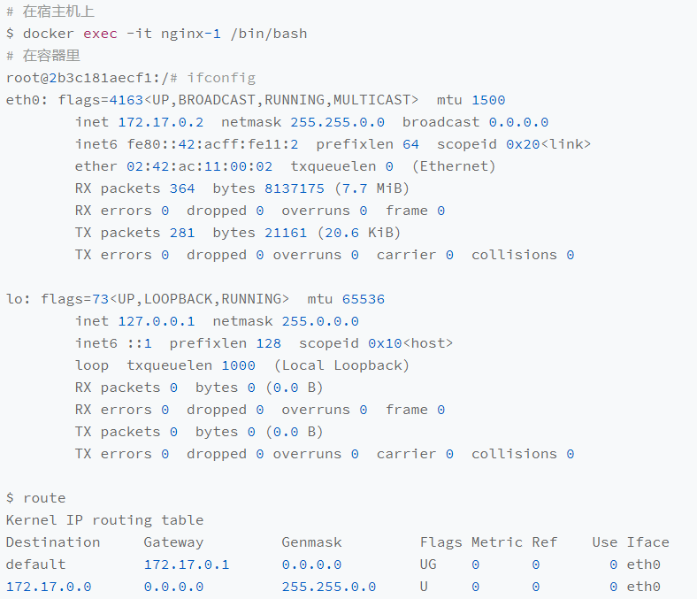

# 容器网络

>在了解 Kubernetes 网络模型之前，学习**容器网络**能帮助我们更好的理解容器间是如何通信的。事实上，如今 Kubernetes 社区层出不穷的**容器网络方案**，其实都是伴随着容器“**跨主通信**”问题而演进的。


## 基础原理

### 网络栈

Linux 容器能看见的“**网络栈**”，实际上是被隔离在它自己的 Network Namespace  当中的。而所谓“**网络栈**”，通常包括了：

- 网卡（Network Interface）
- 回环设备（Loopback Device）
- 路由表（Routing Table）
- iptables 规则

对于一个进程而言，这些要素，其实就构成了它**发起和响应网络请求**的基本环境。

值得一提的是，容器是可以通过 `--network=host` 参数直接使用**宿主机的网络栈**，即不创建一个新的 Network Namespace 。

```bash
docker run –d –-network=host --name nginx-host nginx
```

在这种情况下，这个容器启动后，直接监听的就是宿主机的 80 端口。像这样直接使用宿主机网络栈的方式，虽然可以为容器**提供良好的网络性能**，但也会不可避免地引入**共享网络资源的问题**，比如**端口冲突**。所以，在大多数情况下，我们都希望容器进程能使用自己 Network Namespace  里的网络栈，即**拥有属于自己的 IP 地址和端口**。


一个显而易见的问题就是：这个被隔离的容器进程，该**如何跟其他 Network Namespace 里的容器进程进行交互呢**？

为了理解这个问题，我们其实可以**把每一个容器类比为一台主机**，它们都**拥有一套独立的“网络栈”**。如果你想要实现两台主机之间的通信，最直接的办法，就是**把它们用一根网线连接起来**；而如果你想要实现多台主机之间的通信，那就需要用网线，**把它们连接在一个交换网络上（如交换机）**。

在 Linux 中，能够起到**虚拟交换机作用**的网络设备就是**网桥（Bridge）**。它是一个工作在**数据链路层（Data Link）**的设备，主要功能是根据 MAC 地址学习来将数据包转发到网桥的不同端口上，**网桥的每个端口与一个网段相连**。而为了实现上述目的，Docker 项目会默认在宿主机上创建一个名叫 docker0 的网桥，凡是连接在 **docker0 网桥**上的容器，就可以通过它来进行通信。


### Veth Pair

当我们需要把容器“连接”到 docker0 网桥上时，这时就需要使用一种名为 **Veth Pair 的虚拟设备**了。

Veth Pair 设备的特点是：它被创建出来后，总是以两张**虚拟网卡（Veth Peer）**的形式**成对出现**的。并且，从其中一个“网卡”发出的数据包，可以直接出现在与它对应的另一张“网卡”上，**哪怕这两个“网卡”在不同的 Network Namespace 里**。这就使得 Veth Pair 常常被用作连接不同 Network Namespace 的“网线”。


一个例子，现在我们启动了一个名为 nginx-1 的容器。

```bash
docker run –d --name nginx-1 nginx
```

进入到这个容器中查看它的网络设备。

```bash
docker exec -it nginx-1 /bin/bash
```



这张名为 eth0 的网卡，正是一个 Veth Pair 设备在容器内的一端。通过 `route` 命令查看 nginx-1 容器的**路由表**，可以看到，eth0 网卡是这个容器里的**默认路由设备**；同时，所有对 **172.17.0.0/16 网段**的请求，也会被交给 eth0 来处理（第二条 172.17.0.0 路由规则）。


而这个 Veth Pair 设备的另一端，则在**宿主机**上。可以通过查看宿主机的网络设备看到它。

```bash
ifconfig
```


nginx-1 容器对应的 Veth Pair 设备，在宿主机上是一张**虚拟网卡**，它的名字叫作 veth9c02e56。通过 `brctl show` 命令，可以看到这张网卡被“插”在了 docker0 上。

```bash
brctl show
```


我们再在这台宿主机上启动另一个 Docker 容器 nginx-2，就会发现一个新的，名为 vethb4963f3 的虚拟网卡，也被“插”在了 docker0 网桥上。


此时，如果你在 nginx-1 容器里 `ping` 一下 nginx-2 容器的 IP 地址 `172.17.0.3`，就会发现同一宿主机上的两个容器默认就是**相互连通**的。


### 通信流程

上述现象的原理其实非常简单，我们来分析下其详细的通信流程。

当我们在 nginx-1 容器里访问 nginx-2 容器的 IP 地址，比如 `ping 172.17.0.3` 的时候，该目的 IP 地址会匹配到 nginx-1 容器里的第二条路由规则。可以看到，这条路由规则的**网关（Gateway）**是 **0.0.0.0**，这就意味着这是一条**直连规则**，即**凡是匹配到这条规则的 IP 包，应该经过本机的 eth0 网卡，通过二层网络直接发往目的主机**。

而要通过二层网络到达 nginx-2 容器，就需要有 `172.17.0.3` 这个 **IP 地址对应的 MAC 地址**。所以 nginx-1 容器的网络协议栈，就需要**通过 eth0 网卡发送一个 ARP 广播**（**ARP - Address Resolution Protocol**：通过三层的 IP 地址找到对应的二层 MAC 地址的协议），来通过 IP 地址查找对应的 MAC 地址。


前面提到过，这个 eth0 网卡，只是一个 Veth Pair 设备，它的一端在这个 nginx-1 容器的 Network Namespace 里，而另一端则位于宿主机上（Host Namespace），并且被“插”在了宿主机的 docker0 网桥上。

而一旦一张虚拟网卡被“插”在网桥上，它就会变成该网桥的“**从设备**”。从设备会被“剥夺”调用网络协议栈处理数据包的资格，**从而“降级”成为网桥上的一个端口**。而这个端口唯一的作用，就是**接收流入的数据包**，然后把这些数据包的“生杀大权”（如转发或丢弃），全部交给对应的网桥。

所以，在收到这些 ARP 请求之后，docker0 网桥就会扮演**二层交换机**的角色，**把 ARP 广播转发到其他被“插”在 docker0 上的虚拟网卡上**。这样，同样连接在 docker0 上的 nginx-2 容器的网络协议栈就会收到这个 ARP 请求，从而将 `172.17.0.3` 所对应的 MAC 地址回复给 nginx-1 容器。


有了这个目的 MAC 地址，nginx-1 容器的 eth0 网卡就可以将数据包发出去。根据 Veth Pair 设备的原理，**这个数据包会立刻出现在宿主机上的 veth9c02e56 虚拟网卡上**。不过，此时这个 veth9c02e56 网卡的网络协议栈的资格已经被“剥夺”，所以这个**数据包就直接流入到了 docker0 网桥里**。

docker0 则继续处理转发的过程，扮演二层交换机的角色。此时，docker0 网桥根据数据包的目的 MAC 地址，也就是 nginx-2 容器的 MAC 地址，在它的 **CAM 表（交换机通过 MAC 地址学习维护的端口和 MAC 地址的对应表）**里查到对应的端口为 **vethb4963f3**，然后把数据包发往这个端口。

**这个端口正是 nginx-2 容器“插”在 docker0 网桥上的另一块虚拟网卡**，当然，它也是一个 Veth Pair 设备。这样，数据包就进入到了 nginx-2 容器的 Network Namespace 里。所以，nginx-2 容器看到的情况是，它自己的 eth0 网卡上出现了流入的数据包。这样，nginx-2 的网络协议栈就会对请求进行处理，最后将响应返回到 nginx-1。


同宿主机上的不同容器间通过 docker0 网桥进行通信的流程可总结如下。


熟悉了 docker0 网桥的工作方式，你就可以理解，在默认情况下，被限制在 Network Namespace 里的容器进程，实际上是**通过 Veth Pair 设备 + 宿主机网桥的方式，实现了跟同其他容器的数据交换**。


与之类似地，**当你在一台宿主机上，访问该宿主机上的容器的 IP 地址时**，这个请求的数据包，也是先根据路由规则到达 docker0 网桥，然后被转发到对应的 Veth Pair 设备，最后出现在容器里。


同样地，当一个**容器试图连接到另外一个宿主机时**，如 `ping 10.168.0.3`，它发出的请求数据包，首先经过 docker0 网桥出现在宿主机上。然后根据宿主机的路由表里的直连路由规则（10.168.0.0/24 via eth0），对 `10.168.0.3` 的访问请求就会交给宿主机的 eth0 处理。

接下来，这个数据包就会经宿主机的 eth0 网卡转发到宿主机网络上，最终到达 10.168.0.3 对应的宿主机上。当然，这个过程的实现要求这**两台宿主机本身是连通的**。


## 跨主通信

上述最后一个的例子中，有“**Docker 容器访问其他宿主机**”的场景，可以联想到这样一个问题：如果在另外一台宿主机，如 `10.168.0.3`上也有一个 Docker 容器。那么，nginx-1 容器该如何访问它？这个问题，其实就是容器的“**跨主通信**”问题。


在 Docker 的默认配置下，一台宿主机上的 docker0 网桥，和其他宿主机上的 docker0 网桥，**没有任何关联**，它们互相之间也没办法连通。所以，连接在这些网桥上的容器，自然也没办法进行通信了。

这样一个思路，如果我们通过**软件的方式**，创建一个整个集群“**公用**”的网桥，然后把集群里的所有容器都连接到这个网桥上，就可实现互相通信。这时，集群内的容器网络就会类似于下面这个样子。


可见，构建这种容器网络的核心在于：我们需要在已有的宿主机网络上，再**通过软件构建一个覆盖在已有宿主机网络之上的，可以把所有容器连通在一起的虚拟网络**。所以，这种技术就被称为：**Overlay Network（覆盖网络）**。

而 Overlay Network 本身，则可以由每台宿主机上的一个“**特殊网桥**”共同组成。比如，当 Node 1 上的 Container 1 要访问 Node 2 上的 Container 3 的时候，Node 1 上的“特殊网桥”在收到数据包之后，能够通过某种方式，把数据包发送到正确的宿主机Node 2 上。

亦或者，每台宿主机上都不需要有一个这种特殊的网桥，而仅仅通过某种方式配置**宿主机的路由表**，就能够把数据包转发到正确的宿主机上。这些**网络方案**后续都会再来详细介绍。

