# 控制器

>通过之前对于 *Pod* 的学习，你应该能感受到：*Pod* 这个看似复杂的 API 对象，实际上就是**对容器的进一步抽象和封装**。
>
>通俗来讲，“容器”镜像虽然好用，但是容器这样一个“沙盒”的概念，对于描述应用来说， 还是太过简单。这就好比，集装箱固然好用，但是如果它四面都光秃秃的，吊车还怎么把这个集装箱吊起来并摆放好呢？ 所以*Pod* 对象，其实就是容器的升级版。它对容器进行了组合，添加了更多的属性和字段。好比给集装箱四面安装了吊环，使得 Kubernetes 这架“吊车”，可以更轻松地操作它。
>
>而 Kubernetes 操作这些“集装箱”的**逻辑**，都由 **控制器（Controller）** 完成，它是一个永不终止的**控制循环**，它持续管理着集群的状态，通过 API Server 获取**系统状态**，并且不断尝试调整，以达到**期望状态**。


## Kubernetes 对象

### 相关概念

- 在 Kubernetes 系统中，Kubernetes 对象是**持久化的实体**。Kubernetes 使用这些实体去表示整个集群的状态。Kubernetes 对象是 “目标性记录” ：一旦创建对象，Kubernetes 系统将持续工作以确保对象存在。 通过创建对象，本质上是在告知 Kubernetes 系统，所需要的集群工作负载看起来是什么样子的， 这就是 Kubernetes 集群的**期望状态（Desired State）**。
- *Pod* 就是一个典型 Kubernetes API 对象，同时它也是 Kubernetes 的最小调度单位。
- API 对象，Kubernetes 资源，Kubernetes 对象，都是一个意思。
- Kubernetes 中，万物皆对象。

几乎每个 Kubernetes 对象包含两个嵌套的对象字段，它们负责管理对象的配置： 对象 *`spec`（规约）* 和 对象 *`status`（状态）* 。对于具有 `spec` 的对象，你必须在创建对象时设置其内容，描述你希望对象所具有的特征： **期望状态（Desired State）** 。

`status` 描述了对象的 **当前状态（Current State）**，它是由 Kubernetes 系统和组件设置并更新的。在任何时刻，Kubernetes 控制平面都一直积极地管理着对象的实际状态，以使之与期望状态相匹配。


### 描述一个 Kubernetes 对象

用户通常以定义一个 YAML 文件的形式来描述一个 Kubernetes 对象的期望状态。

```yaml
apiVersion: apps/v1
kind: Deployment
metadata:
  name: nginx-deployment
spec:
  selector:
    matchLabels:
      app: nginx
  replicas: 2
  template:
    metadata:
      labels:
        app: nginx
    spec:
      containers:
      - name: nginx
        image: nginx:1.14.2
        ports:
        - containerPort: 80
```

- 上述文件中并未出现 `status` 字段。因为 API 对象的 `status` 由 Kubernetes 系统和组件设置并更新，上述文件主要用于用户对 *Deployment* 的创建或更新，用户是不用定义 `status` 字段的。

  可通过 `kuberctl get deploy nginx-deployment -o yaml` 命令以 YAML 格式获取到该 API 对象运行时的当前状态（保存在 ETCD 中），在其中你可以明确的看到 `status` 字段。

- replicas 字段的值为 2，表示期望部署运行两个匹配模板的 *Pod*。


### 相关原生 Kubernetes 对象

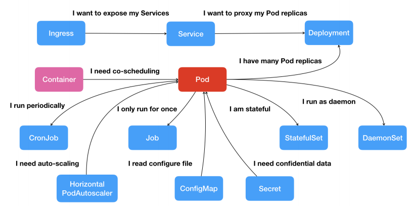


## 声明式 API

### 两种形式的 API

Kubernetes 控制器模式依赖**声明式的 API**。另外一种常见的 API 类型是**命令式 API**。

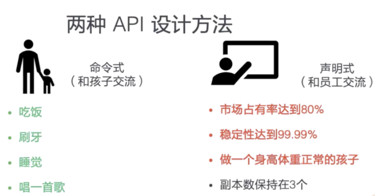

- **命令式 API**

  常见的命令式的交互方式是**家长和孩子交流方式**，因为孩子欠缺目标意识，无法理解家长期望，家长往往通过一些命令，教孩子一些明确的动作，如：**恰饭**、**睡觉**。

    而在容器编排体系中，命令式 API 即通过向系统发出一些明确的操作指令，如：**增加一个 *Pod***。

 - **声明式 API**

   常见的声明式交互方式，就是**老板对自己员工的交流方式**。老板一般不会给自己的员工下很明确的决定，实际上可能老板对于要操作的事情本身，还不如员工清楚。

   因此，老板通过给员工设置可量化的业务目标的方式，来发挥员工自身的主观能动性。如，**老板会要求某个产品的市场占有率达到  80%，而不会指出要达到这个市场占有率，要做的具体操作细节**。

   类似的，在容器编排体系中，**我们可以通过文件来声明一个应用实例的应该副本数保持在 3 个，而不用明确的去扩容 *Pod* 或是删除已有的 *Pod*，来保证副本数在 3 个**。


### 比较

在理解两种交互 API 的差别后，可以分析一下命令式 API 所存在的问题。

1. **并发访问**
   - 假如有多方并发的对一个资源请求进行操作，并且一旦其中有操作出现了错误，就需要重试。那么最后哪一个操作生效了，就很难确认，也无法保证。很多**命令式系统**往往在操作前会对系统进行**加锁**，从而保证整个系统最后生效行为的可预见性，但是**加锁行为会降低整个系统的操作执行效率**。
   - 而对于**声明式请求**，系统在一次处理多个操作时，可以很好的**归并（merge）**多次修改，其最终状态会成为多个请求所期望状态的”并集“。可以不需要加锁，就支持多方的并发访问。

2. **错误处理**

   - 在大规模的分布式系统中，错误是无处不在的。**一旦发出的命令没有响应，调用方只能通过反复重试的方式来试图恢复错误**，然而盲目的重试可能会带来更大的问题。而且在执行的过程中，还需要考虑多个命令的先后顺序、覆盖关系等等一些复杂的逻辑情况。

     实际上，许多命令式的交互系统后台往往还会搭配一个**巡检系统**，用来修正命令处理超时，重试等一些场景所造成的数据不一致问题。

   - 相对的，声明式 API 系统中天然地记录了系统**当前的和最终的状态**。同时，由于状态的**幂等性**，可以在任意时刻反复操作。在声明式系统运行的方式中，**日常的操作就是对资源状态的巡检**，不需要额外开发巡检系统。


## 控制器模式

### 控制器

上文中 *Deployment* 定义的编排动作非常简单，即：确保携带了 `app=nginx` 标签的 *Pod* 的个数，永远等于 `spec.replicas` 指定的个数（2）。这就意味着，如果在这个集群中，携带 `app=nginx` 标签的 *Pod* 的个数大于 2 的时候，就会有旧的 *Pod* 被删除；反之，就会有新的 *Pod* 被创建。完成这些工作的，就是之前介绍 Kubernetes 架构的时候，提到过的 **kube-controller-manager** 的组件。

可以查看一下 Kubernetes 项目的 **pkg/controller** 目录：

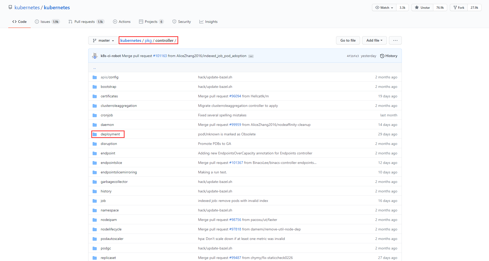

这个目录下面的每一个控制器，都以独有的方式负责某种**编排功能**。 *Deployment*，正是这些控制器的一员。**kube-controller-manager** 中就运行着各种各样的控制器。


### 控制循环

**控制器**都遵循 Kubernetes 项目中的一个通用编排模式：**控制循环（control loop）**。

通过一段 Go 语言风格的伪代码，为你简单描述了控制循环：

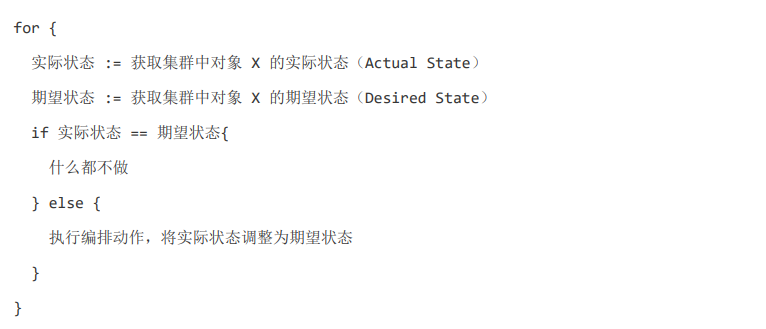

- 具体情况下，**实际状态**往往来自于 Kubernetes 集群本身。如 **kubelet** 通过心跳汇报的容器状态和节点状态，监控系统中保存的应用监控数据，或控制器主动收集的它感兴趣的信息等。
- **期望状态**则一般来自于用户提交的 YAML 文件，如 *Deployment* 对象中 `Replicas` 字段的值。这些信息往往都保存在 ETCD 中。


以上述 *Deployment* 为例，我们再来简述一下它对控制器模型的实现：

1. *Deployment* 控制器从 ETCD 中获取到所有携带了 `app:nginx` 标签的 *Pod*，然后统计它们的数量，这就是实际状态。
2. *Deployment* 对象的 `Replicas` 字段的值，作为期望状态。
3. *Deployment* 控制器将两个状态做比较，然后根据比较结果，确定是创建 *Pod*，还是删除已有的 *Pod*。

可以看到，一个 Kubernetes 对象的主要编排逻辑，实际上是在第三步的“对比”阶段完成的。通常，我们把这个操作称为**调谐（Reconcile）**，而整个过程就是**调谐循环（Reconcile Loop）**，**同步循环（Sync Loop）**或**控制循环（Control Loop）**,他们三者是一个意思。

而**调谐**的最终结果，往往都是对**被控制对象**的某种**写操作**：

- 增加 *Pod*，删除已有的 *Pod*，或者更新 *Pod* 的某个字段（写操作）。这也是 Kubernetes 项目“面向 API 对象编程”的一个直观体现。
-  *Deployment* 这种控制器的设计原理，就是我们之前提到的**控制器模式**：用一种对象管理另一种对象的艺术。


这里我们对 *Deployment* 以及其他类似的控制器，做一个简单小结：

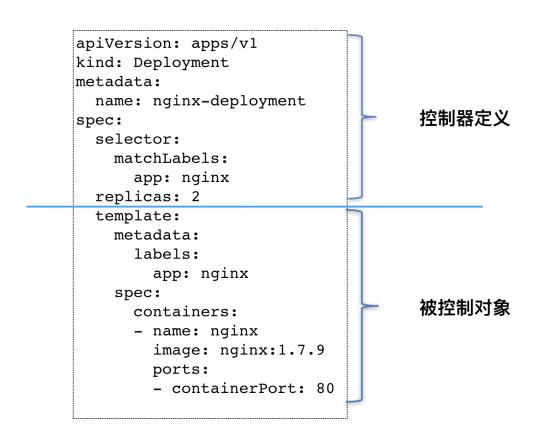

类似 *Deployment* 这样的一个控制器，实际上都由上下两部分所定义：

- 上半部分是控制器定义，包括了该 K8S 资源的相关元数据信息，详细定义，期望状态等。
- 下半部分则由被控制对象的**模板**构成，*Deployment* 中 `template` 字段里的内容，跟一个标准的 *Pod* 对象的 API 定义丝毫不差。这个 `template` 字段，在 Kubernetes 项目中有一个专有的名字：**Pod 模板（PodTemplate）**。
- 这也是为什么，在所有 API 对象的 `Metadata` 里，都有一个字段叫作 `ownerReference` 的字段，用于保存当前这个 API 对象的**拥有者（Owner）**信息。


## Deployment示例

### 控制关系

那么，由上述 nginx-deployment 所创建出来的 *Pod*，其 `ownerReference` 就是 nginx-deployment 吗？nginx-deployment 直接控制的就是 *Pod* 对象吗？接下来我们通过一个例子来详细的介绍下 *Deployment* 的扩缩容流程。

实际上，*Deployment* 与 *Pod* 的关系是这样的：

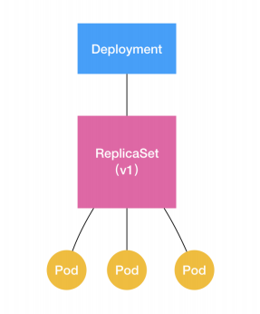

- *Deployment* 与它的 *ReplicaSet*，以及 *Pod* 的关系，实际上是一种“层层控制”的关系，*Deployment* 是一个二层控制器。
- *ReplicaSet* 通过“控制器模式”，保证系统中 *Pod* 的个数永远等于指定的个数，*ReplicaSet* 更多的被抽象为一个应用的版本，而由 *ReplicaSet* 控制的 *Pod* ，即该应用版本的副本。
- *Deployment* 通过“控制器模式”，来操作 *ReplicaSet* 的个数和属性，进而实现**水平扩展 / 收缩**和**滚动更新**这两个编排动作。

*ReplicaSet* 的结构非常简单，其 YAML 文件如下：

```yaml
apiVersion: apps/v1
kind: replicaSet
metadata:
  name: nginx-set
  labels:
    app: nginx
spec:
  replicas: 2
  selector:
    matchLabels:
      app: nginx
  template:
    metadata:
      labels:
        app: nginx
    spec:
      containers:
      - name: nginx
        image: nginx:1.7.9
```


### 滚动更新

通过 *Deployment* 实现应用的**水平扩展 / 收缩**很简单，*Deployment Controller* 只需要修改它所控制的 *ReplicaSet* 的 *Pod* 副本个数即可。比如，将 `replicas` 字段由 2 修改成 3，那么 *Deployment* 所对应的 *ReplicaSet*，就会根据修改后的值自动创建一个新的 *Pod*。这就是**水平扩展**，**水平收缩**反之。那么，**滚动更新**是什么，又是如何实现的？ 还是以这个 *Deployment* 为例，来讲解**滚动更新**的过程。

首先，我们创建这个 nginx-deployment。

```bash
kubectl create -f nginx-deployment.yaml --record
```

这里额外加了一个 `–record` 参数。它的作用是记录下你每次操作所执行的命令， 方便后面查看。


来检查一下 nginx-deployment 创建后的状态信息。

```bash
kubectl get deployments
```

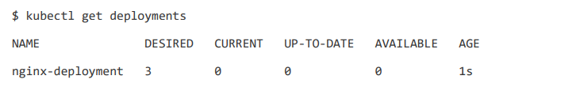

在返回结果中，我们可以看到四个状态字段：

- **DESIRED**：用户期望的 *Pod* 副本个数（ `spec.replicas` 的值）。
- **CURRENT**：当前处于 Running 状态的 *Pod* 的个数。
- **UP-TO-DATE**：当前处于最新版本的 *Pod* 的个数，所谓最新版本指的是 *Pod* 的 `Spec` 部分与 *Deployment* 中 `template` 定义的完全一致。
- **AVAILABLE**：当前已经可用的 *Pod* 的个数，即：既是 Running 状态，又是最新版本，并且已经处于 Ready 状态（ `livenessProbe` 字段，健康检查正确），同时保持 Ready 状态超过 `MinReadySeconds` 秒后的*Pod* 的个数。
- **AGE**：*Deployment* 创建的时长。

通常的， **AVAILABLE** 字段所描述的才是用户所**期望的最终状态**。


Kubernetes 项目还为我们提供了一条指令，让我们可以实时查看 *Deployment* 对象的状态变化。

```bash
kubectl rollout status deployment/nginx-deployment
```

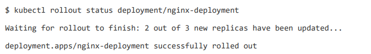

在这个返回结果中，*“2 out of 3 new replicas have been updated”* 意味着已经有 2 个 *Pod* 进入了 **UP-TO-DATE** 状态。

继续等待一会儿，就能看到该 *Deployment* 的 3 个 *Pod*，均进入了 **AVAILABLE** 状态。

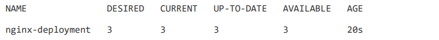


同时，可以尝试查看一下这个 *Deployment* 所控制的 *ReplicaSet*。

```bash
kubectl get rs
```

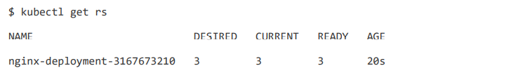

- 在用户提交了一个 *Deployment* 对象后，*Deployment Controller* 就会立即创建一 个 *Pod* 副本个数为 3 的 *ReplicaSet*。这个 *ReplicaSet* 的名字，则是由 *Deployment* 的名字和一个随机字符串共同组成。这个随机字符串称为 **Pod-template-hash**。
- *ReplicaSet* 会将 **Pod-template-hash** 加在它所控制的所有 *Pod* 的标签中，从而确保这些 *Pod* 不会与集群中的其他 *Pod* 混淆。
- *ReplicaSet* 的 **DESIRED**，**CURRENT** 和 **READY** 字段的含义，和 *Deployment* 中是基本一致的。相比之下，*Deployment* 只是在 *ReplicaSet* 的基础上，添加了 **UP-TO-DATE** 这个**与版本相关的状态字段**。


这时，我们尝试来修改 Deployment 的 *Pod* 模板，以便触发**滚动更新**。

```bahs
kubectl edit deployment/nginx-deployment
```

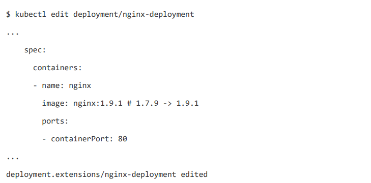

`kubectl edit` 指令，会帮你直接打开 nginx-deployment 的 API 对象，然后你就可以修改这里的 *Pod* 模板部分了。比如，将 nginx 镜像的版本升级到了 `1.9.1`。注意 `kubectl edit` 并不神秘，它不过是把 API 对象的内容由 ETCD 下载到了本地文件， 让用户修改完成后再提交而已。


`kubectl edit` 指令编辑完成后，保存退出，Kubernetes 就会立刻触发**滚动更新**的过程。

```bash
kubectl describe deployment nginx-deployment
```

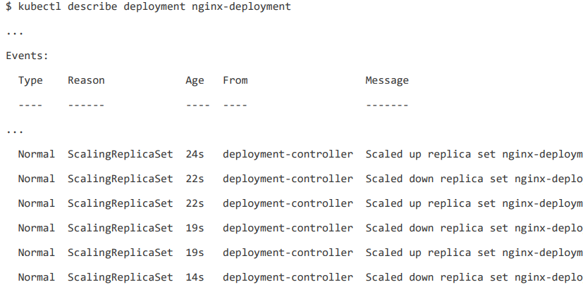

- 当你修改了 *Deployment* 里的 *Pod* 定义之后，*Deployment Controller* 会使用这个修改后的 *Pod* 模板，创建一个新的 *ReplicaSet*，它有着不同于之前 *ReplicaSet* 的 **Pod-template-hash**。同时，这个新的 *ReplicaSet* 的初始 *Pod* 副本数是 0。
- 对代表着“老版本”的 *ReplicaSet* 副本减一，紧接着对“新版本”的 *ReplicaSet* 副本加一。如此交替进行，直到旧的 *ReplicaSet* 所管理的 *Pod* 副本数为 0。
- 这样的，将一个集群中正在运行的多个 *Pod* 版本，交替地逐一升级的过程，就是**滚动更新**。


滚动更新完成后，查看新，旧两个 *ReplicaSet* 的最终状态。

```bash
kubectl get rs
```

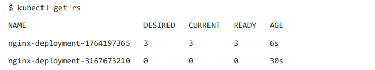

其中，旧 ReplicaSet（hash=3167673210）已经被**水平收缩**成了 0 个副本。

结合以上讲述，现在我们可以扩展一下 *Deployment*，*ReplicaSet* 和 *Pod* 的关系图了。

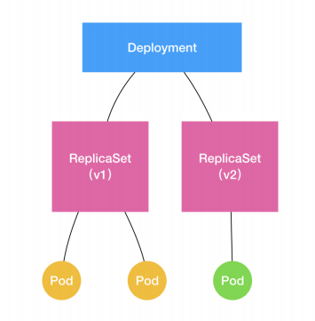

通过这样的多个 *ReplicaSet* 对象，Kubernetes 项目就实现了对多个**应用版本**的描述。