# 容器跨主网络

>之前我们学习了容器网络相关原理，同时，也很自然的引出了“**跨主通信**”这个概念。想要理解容器“跨主通信”的原理，就一定要从 Flannel 这个项目说起。


## Flannel

Flannel 项目是 CoreOS 公司主推的容器网络方案。事实上，Flannel 项目本身只是一个**框架**，真正为我们提供容器网络功能的，是 Flannel 的三种**后端实现**：

- VXLAN
- host-gw
- UDP

这三种不同的后端实现，正代表了三种容器**跨主网络**的主流实现方法。其中 UDP 与 VXLAN 模式都可称为“**隧道**”机制，其实现了容器间**三层网络（IP 地址）**的连通性。


### UDP

UDP 模式，是 Flannel 项目最早支持的一种方式，却也是**性能最差**的一种方式。该模式目前已被**弃用**。不过，Flannel 之所以最先选择 UDP 模式，就是因为这种模式是最直接，也是最容易理解的容器跨主网络实现。


一个例子，现在我们有两台宿主机。

- Node 1 上有一个容器 container-1，它的 IP 地址是 `100.96.1.2`，对应的 docker0 网桥的地址是：`100.96.1.1/24`。
- Node 2 上有一个容器 container-2，它的 IP 地址是 `100.96.2.3`，对应的 docker0 网桥的地址是：`100.96.2.1/24`。

我们现在要做的，就是设法**让 container-1 访问 container-2**。


这种情况下，container-1 容器里的进程发起的 IP 包，其**源地址**就是 `100.96.1.2`，**目的地址**就是 `100.96.2.3`。由于目的地址 `100.96.2.3` 并不在 Node 1 的 docker0 网桥的网段里，所以**这个 IP 包会被交给默认路由规则**，通过容器的网关进入 docker0 网桥，从而出现在宿主机上。

这时候，这个 IP 包的下一个目的地，就取**决于宿主机上的路由规则**了。而此时，Flannel 已经在宿主机上创建出了一系列的路由规则。

```bash
ip route
```

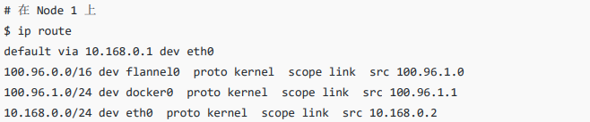

可以看到，由于我们的 IP 包的目的地址是 `100.96.2.3`，它匹配不到本机 docker0 网桥对应的 `100.96.1.0/24` 网段，只能匹配到第二条，也就是 `100.96.0.0/16` 对应的这条路由规则，从而进入到一个叫作 flannel0 的设备中。

这个 flannel0 设备其实是一个 **TUN 设备（Tunnel 设备）**。在 Linux 中，TUN 设备是一种工作在**三层（Network Layer）**的虚拟网络设备。TUN 设备的功能非常简单，即**在操作系统内核和用户应用程序之间传递 IP 包**。


像上面这种情况，当操作系统将一个 IP 包发送给 flannel0 设备之后，flannel0 就会**把这个 IP 包交给创建这个设备的应用程序**，也就是 **Flannel 进程**。这是一个从**内核态（Linux 操作系统）向用户态（Flannel 进程）**的流动方向。

反之，如果 Flannel 进程向 flannel0 设备发送了一个 IP 包，那么这个 IP 包就会出现在**宿主机网络栈**中，然后根据宿主机的路由表进行下一步处理。这是一个从用户态向内核态的流动方向。

所以，当 IP 包从容器经过 docker0 出现在宿主机，然后又根据路由表进入 flannel0 设备后，宿主机上的 flanneld 进程（Flannel 项目在每个宿主机上的主进程）就会收到这个 IP 包。然后，flanneld 看到了这个 IP 包的目的地址 `100.96.2.3`，就把它发送给了 Node 2 宿主机。


flanneld 又是如何知道这个 IP 地址对应的容器运行在 Node 2 上呢？这里用到了 Flannel 项目里一个非常重要的概念：**子网（Subnet）**。

事实上，在由 Flannel 管理的容器网络里，一台宿主机上的所有容器，**都属于该宿主机被分配的一个“子网”**。在上述例子中，Node 1 的子网是 `100.96.1.0/24`，container-1 的 IP 地址是 `100.96.1.2`。Node 2 的子网是 `100.96.2.0/24`，container-2 的 IP 地址是 `100.96.2.3`。对应的，这些**子网与宿主机的对应关系**就保存在 ETCD 中。

```bash
etcdctl ls /coreos.com/network/subnets
```

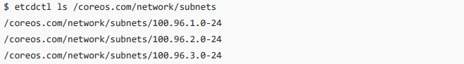


所以，flanneld 进程在处理由 flannel0 传入的 IP 包时，就可以根据目的 IP 的地址，如 `100.96.2.3`，匹配到对应的子网 `100.96.2.0/24`，从而在 ETCD 中找到这个子网对应的宿主机的 IP 地址 `10.168.0.3`。

```bash
etcdctl get /coreos.com/network/subnets/100.96.2.0-24
```

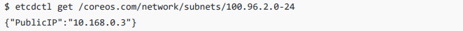

现在，对于 flanneld 来说，只要 Node 1 和 Node 2 是互通的，那么 flanneld 作为 Node 1 上的一个普通进程，就一定可以通过上述 IP 地址 `10.168.0.3` 访问到 Node 2，这不会有任何问题。


所以说，flanneld 在收到 container-1 发给 container-2 的 IP 包之后，就会把这个 IP 包**直接封装在一个 UDP 包里**，然后发送给 Node 2。当然，这个请求得以完成的原因是，每台**宿主机上的 flanneld 都监听着 8285 端口**，所以 flanneld 只要把 UDP 包发往 Node 2 的 8285 端口即可。

通过这样一个普通的**宿主机之间的 UDP 通信**，一个 UDP 包就从 Node 1 到达了 Node 2。而 Node 2 上监听 8285 端口的进程也是 flanneld，这时候 flanneld 就可以从这个 UDP 包里解析出封装在其中的 container-1 发来的原 IP 包。


接下来Node2 上 flanneld 的工作就很简单了：flanneld 会直接把这个 IP 包发送给它所管理的 TUN 设备，即 flannel0 设备。根据我之前说明的 TUN 设备的原理，这正是一个**从用户态向内核态的流动方向（Flannel 进程向 TUN 设备发送数据包）**。所以，**Linux 内核网络栈**就会负责处理这个 IP 包，通过本机的**路由表**来寻找这个 IP 包的下一步流向。

```bash
ip route
```

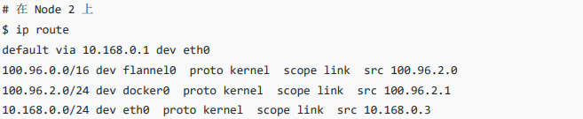

Node 2 的路由表与 Node 1 非常类似。此时，这个 IP 包的目的地址是 `100.96.2.3`，它与第三条，也就是 `100.96.2.0/24` 网段对应的路由规则匹配。所以，Linux 内核就会按照这条路由规则，把这个 IP 包转发给 docker0 网桥。

接下来的流程，我们就很熟悉了。docker0 网桥会扮演二层交换机的角色，将数据包发送给正确的端口，进而通过 Veth Pair 设备进入到 container-2 的 Network Namespace 里。


值得注意的是，上述流程要正确工作还有一个重要的前提，那就是 **docker0 网桥的地址范围必须是 Flannel 为宿主机分配的子网**。这个其实很容易实现，以 Node 1 为例，只需要在 Docker Daemon 启动时配置如下 **bip 参数**即可。

```bash
FLANNEL_SUBNET=100.96.1.1/24
dockerd --bip=$FLANNEL_SUBNET ...
```


基于 Flannel UDP 模式的跨主通信的原理图如下。

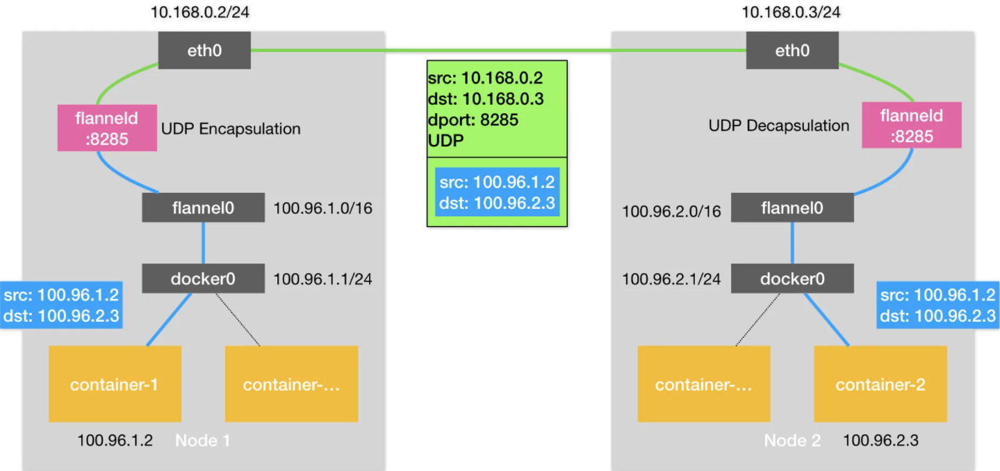

可以看到，Flannel UDP 模式提供的其实是一个**三层的 Overlay 网络**。它首先对发出端的 IP 包进行 UDP 封装，然后在接收端进行解封装拿到原始的 IP 包，进而把这个 IP 包转发给目标容器。这就好比，**Flannel 在不同宿主机上的两个容器之间打通了一条“隧道”，使得这两个容器可以直接使用 IP 地址进行通信，而无需关心容器和宿主机的分布情况**。


一个发散性的问题，为什么 flanneld 进程会用 UDP 来封装 IP 包，UDP 不是**不可靠**的吗，丢了怎么办？

这个问题的本质其实就是要理解，这次 UDP 封装的意义到底是什么，flanneld 进程的目标其实就是单纯的将 UDP 包发送至目标地址，即**目标宿主机**。这里 **UDP 包中所封装的才是我们真正的数据包**，如果上层协议使用的是 TCP，即**容器内网络栈使用的是 TCP 封装数据**，而当 flanneld 使用 UDP 包裹了我们的 TCP 包时，如果出现了丢包现象，TCP 的**确认机制**会发现这个丢包而进行重传，从而保证可靠。


开始就提到了，上述 UDP 模式已经被废弃了，因为其**严重的性能问题**。实际上，相比于两台宿主机之间的直接通信，基于 Flannel UDP 模式的容器通信多了一个额外的步骤，即 flanneld 的处理过程。而这个过程，由于使用到了 flannel0 这个 TUN 设备，仅在发出 IP 包的过程中，就需要经过**三次用户态与内核态之间的数据拷贝**。

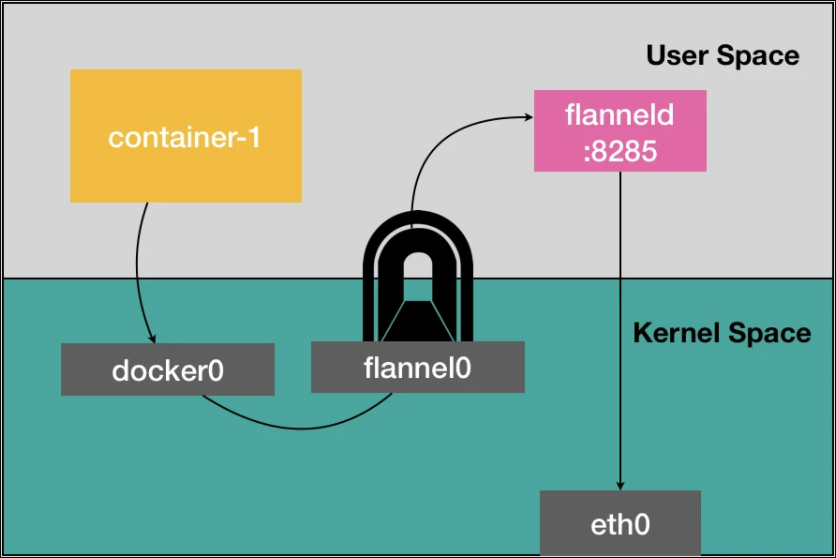

- 第一次，用户态的容器进程发出的 IP 包经过 docker0 网桥进入内核态。
- 第二次，IP 包根据路由表进入 TUN（flannel0）设备，从而回到用户态的 flanneld 进程。
- 第三次，flanneld 进行 UDP 封包之后重新进入内核态，将 UDP 包通过宿主机的 eth0 发出去。

此外，Flannel 进行 UDP **封装（Encapsulation）**和**解封装（Decapsulation）**的过程，也都是在用户态完成的。在 Linux 操作系统中，上述这些上下文切换和用户态操作的代价其实是比较高的，这也正是造成 Flannel UDP 模式性能不好的主要原因。

所以说，我们在进行系统级编程的时候，有一个非常重要的优化原则，就是要**减少用户态到内核态的切换次数，并且把核心的处理逻辑都放在内核态进行**。这也是为什么，Flannel 后来支持的 VXLAN 模式，逐渐成为了主流的容器网络方案的原因。


### VXLAN

VXLAN，即 **Virtual Extensible LAN（虚拟可扩展局域网）**，是 **Linux 内核本身就支持**的一种网络虚似化技术。

所以说，VXLAN 可以完全在**内核态实现上述封装和解封装的工作**，从而通过与前面相似的“隧道”机制，构建出**覆盖网络（Overlay Network）**。

VXLAN 的覆盖网络的设计思想是：**在现有的三层网络之上，“覆盖”一层虚拟的，由内核 VXLAN 模块负责维护的二层网络，使得连接在这个 VXLAN 二层网络上的“主机”（虚拟机或者容器均可）之间，可以像在同一个局域网（LAN）里那样自由通信**。当然，实际上，这些“主机”可能分布在不同的宿主机上，甚至是分布在不同的物理机房里。


为了能够在二层网络上打通“隧道”，VXLAN 会在宿主机上设置一个特殊的网络设备作为“隧道”的两端。这个设备就叫作 VTEP，即 **VXLAN Tunnel End Point（虚拟隧道端点）**。

而 VTEP 设备的作用，其实跟前面的 flanneld 进程非常相似。只不过，它进行封装和解封装的对象，是**二层数据帧（Ethernet frame）**；而且这个工作的执行流程，全部是在内核里完成的，因为 VXLAN 本身就是 Linux 内核中的一个模块。


上述基于 VTEP 设备进行“隧道”通信的原理图如下。

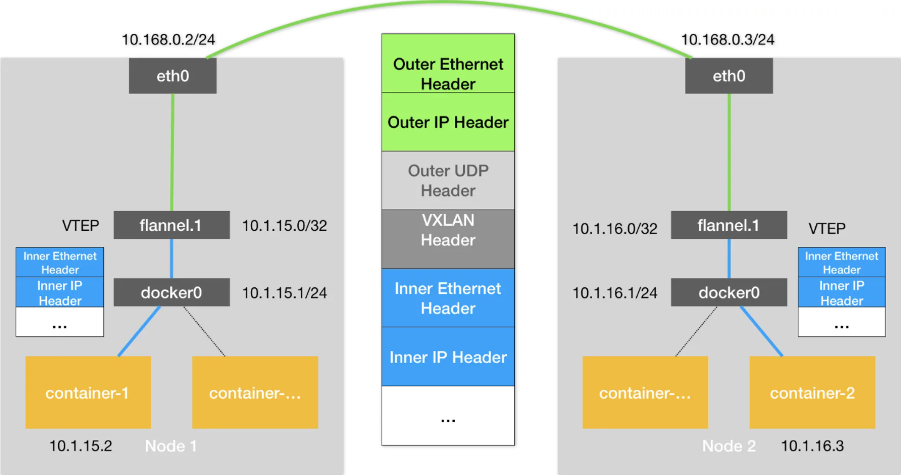

可以看到，每台宿主机上名叫 flannel.1 的设备，就是 VXLAN 所需的 VTEP 设备，它既有 IP 地址，也有 MAC 地址。现在，我们的 container-1 的 IP 地址是 `10.1.15.2`，要访问的 container-2 的 IP 地址是 `10.1.16.3`。


与之前 UDP 模式的流程类似，当 container-1 发出请求之后，这个目的地址是 `10.1.16.3` 的 IP 包，会先出现在 docker0 网桥，然后被**路由到本机 flannel.1 设备进行处理**。也就是说，来到了“隧道”的入口。为了方便叙述，接下来我们把这个 IP 包称为“**原始 IP 包**”。

为了能够将“原始 IP 包”封装并且发送到正确的宿主机，VXLAN 就需要找到这条“隧道”的出口，即**目的宿主机的 VTEP 设备**。而这个设备的信息，正是每台宿主机上的 flanneld 进程负责维护的。

比如，当 Node 2 启动并加入 Flannel 网络之后，flanneld 进程就会在 Node 1 以及其他所有节点上添加这样一条路由规则。

```bash
route -n
```

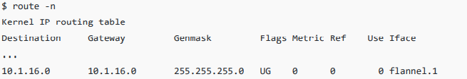

这条路由规则的含义是：凡是发往 `10.1.16.0/24` 网段的 IP 包，都需要经由 flannel.1 设备发出，并且，它最后被发往的网关地址是 `10.1.16.0`。而从上述 Flannel VXLAN 模式的原理图中我们可以清楚的看到，`10.1.16.0` **正是 Node 2 上的 VTEP 设备，即 flannel.1 设备的 IP 地址**。


接下来为了叙述方便，我们把 Node 1 和 Node 2 上的 flannel.1 设备分别称为“**源 VTEP 设备**”和“**目的 VTEP 设备**”。这时，这些 VTEP 设备之间，就需要想办法组成一个**虚拟的二层网络**，即**通过二层数据帧进行通信**。所以，“源 VTEP 设备”收到“原始 IP 包”后，就要想办法把“原始 IP 包”加上一个目的 MAC 地址，封装成一个二层数据帧，然后发送给“目的 VTEP 设备”，当然，这么做还是因为**这个 IP 包的目的地址不是本机**。


这里需要解决的问题就是：**“目的 VTEP 设备”的 MAC 地址是什么**？

此时，根据之前的路由记录，我们已经知道了**“目的 VTEP 设备”的 IP 地址**。而要根据三层 IP 地址查询对应的二层 MAC 地址，其实就是 **ARP（Address Resolution Protocol ）**表的功能。

而这里要用到的 ARP 记录，也是 flanneld 进程在 Node 2 节点启动时，自动添加在 Node 1 以及其他所有节点上的。

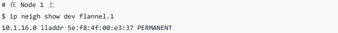

这条记录的含义非常明确：IP 地址 `10.1.16.0` 对应的 MAC 地址是 `5e:f8:4f:00:e3:37`。可以看到，Flannel 并不依赖 **ARP 学习**，而会在每台节点启动时把它的 VTEP 设备对应的 ARP 记录，直接下放到其他每台宿主机上。


有了这个“目的 VTEP 设备”的 MAC 地址，Linux 内核就可以开始二层封包的工作了。二层帧的格式如下。


可以看到，Linux 内核会把“目的 VTEP 设备”的 MAC 地址，填写在图中的 `Inner Ethernet Header` 字段，得到一个二层数据帧。值得注意的是，上述封包过程只是**加一个二层头**，**不会改变“原始 IP 包”的内容**。所以图中的 `Inner IP Header` 字段，依然是 container-2 的 IP 地址 `10.1.16.3`。

但是，上面提到的这些 VTEP 设备的 MAC 地址，**对于宿主机网络来说并没有什么实际意义**，**由 eth0 网卡进行通信的宿主机网络可完全不认识这些地址**。所以上面封装出来的这个数据帧，**并不能在宿主机二层网络里传输**。为了方便叙述，我们把它称为**“内部数据帧”（Inner Ethernet Frame）**。


所以接下来，**Linux 内核还需要再把“内部数据帧”进一步封装成为宿主机网络里的一个普通的数据帧**，好让它载着“内部数据帧”，通过宿主机的 eth0 网卡进行传输。我们把这次要封装出来的，宿主机对应的数据帧称为**“外部数据帧”（Outer Ethernet Frame）**。

为了实现这个“**搭便车**”的机制，Linux 内核会在“内部数据帧”前面，加上一个特殊的 **VXLAN 头**，用来表示这个“乘客”实际上是一个 VXLAN 要使用的数据帧。

而这个 VXLAN 头里有一个重要的标志叫作 **VNI**，**它是 VTEP 设备识别某个数据帧是不是应该归自己处理的重要标识**。而在 Flannel 中，VNI 的默认值是 1，这也是为何，宿主机上的 VTEP 设备都叫作 flannel.1 的原因，这里的“1”，其实就是 VNI 的值。

然后，Linux 内核会把这个数据帧封装进一个 **UDP 包**里发出去。所以，跟 UDP 模式类似，在宿主机看来，它会以为自己的 flannel.1 设备只是在向另外一台宿主机的 flannel.1 设备，发起了一次普通的 UDP 链接。它哪里会知道，这个 UDP 包里面，其实是一个完整的二层数据帧，这其实和特洛伊的故事非常类似。


那么，如何拿到目标“目的 VTEP 设备”所对应的宿主机地址呢？这是封装“外部数据帧”必要的信息。也就是说，**这个 UDP 包到底该发给哪台宿主机**？

在这种场景下，flannel.1 设备实际上要扮演一个“网桥”的角色，在二层网络进行 UDP 包的转发。而在 Linux 内核里面，“网桥”设备进行转发的依据，来自于一个叫作 **FDB（Forwarding Database）**的**转发数据库**。这个 flannel.1“网桥”所对应的 FDB 信息，同样也是 flanneld 进程负责维护的。

```bash
bridge fdb show flannel.1 | grep 5e:f8:4f:00:e3:37
```

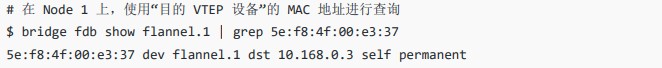

上述 FDB 记录里指定了这样一条规则：即发往我们前面提到的“目的 VTEP 设备”（MAC 地址 `5e:f8:4f:00:e3:37`）的二层数据帧，应该通过 flannel.1 设备，发往 IP 地址为 `10.168.0.3` 的主机。显然，这台主机正是 Node 2，UDP 包要发往的目的地就这样被找到了。


接下来的流程，**就是一个正常的，宿主机网络上的封包工作了**。

UDP 包是一个**四层数据包**，所以 Linux 内核会在它前面加上一个 IP 头，即原理图中的 `Outer IP Header`，组成一个 IP 包。并且，在这个 IP 头里，会填上之前通过 FDB 查询出来的**目的主机的 IP 地址**，即 Node 2 的 IP 地址 `10.168.0.3`。

然后，Linux 内核再在这个 IP 包前面加上二层数据帧头，即原理图中的 `Outer Ethernet Header`，并把 Node 2 的 MAC 地址填进去。这时，该 MAC 地址本就是 Node 1 中 ARP 表需要学习的内容，是无需 Flannel 来维护的。最后，我们封装出来“外部数据帧”格式如下。

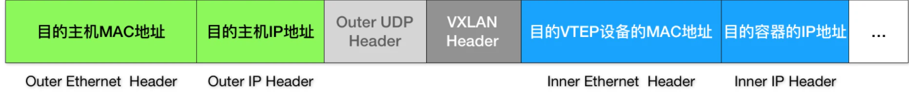


接下来，Node 1 上的 flannel.1 设备就可以把这个数据帧从 Node 1 的 eth0 网卡发出去。显然，这个数据帧会经过宿主机网络来到 Node 2 的 eth0 网卡。

然后，Node 2 的内核网络栈会发现这个数据帧里有 VXLAN Header，并且 VNI=1。所以 Linux 内核会对它进行拆包，拿到里面的“内部数据帧”，再根据 VNI 的值把它交给 Node 2 上的 flannel.1 设备。

flannel.1 设备则会进一步拆包，取出“原始 IP 包”。接下来就回到了我们熟悉的**单机容器网络的处理流程**。最终，IP 包就进入到了 container-2 容器的 Network Namespace 中。

