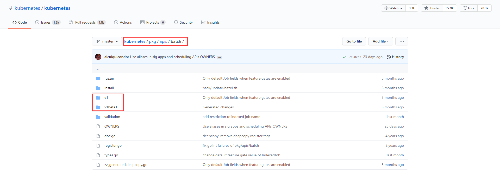
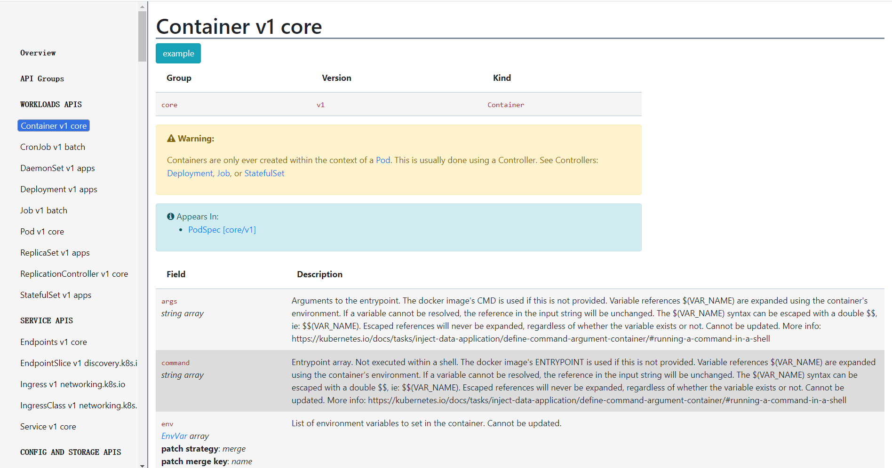
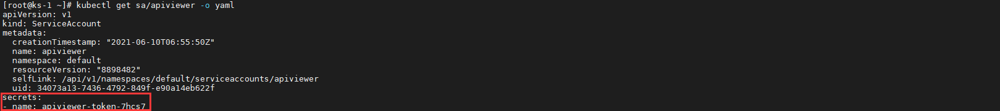
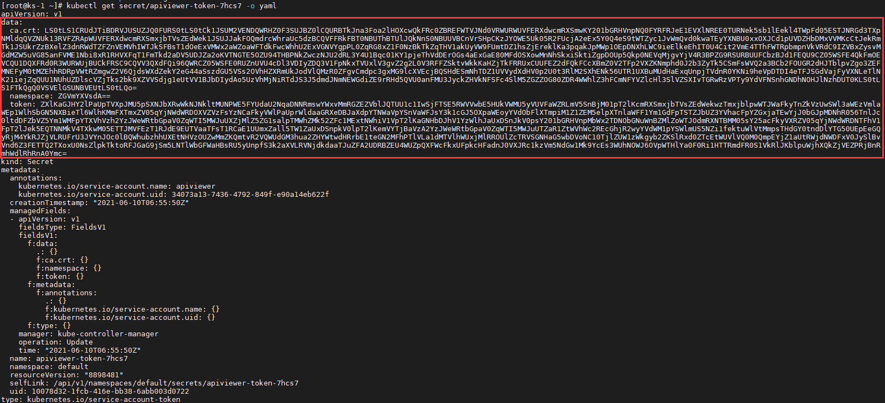
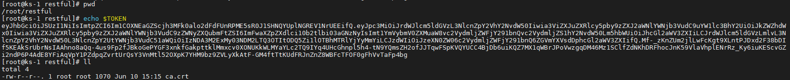
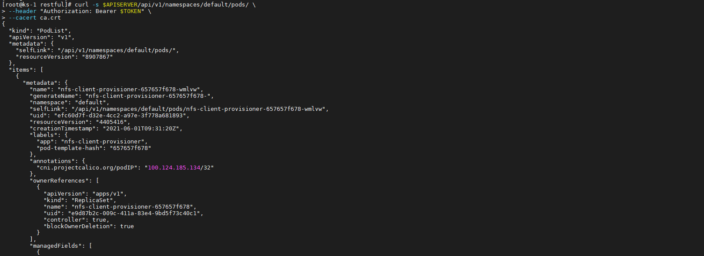
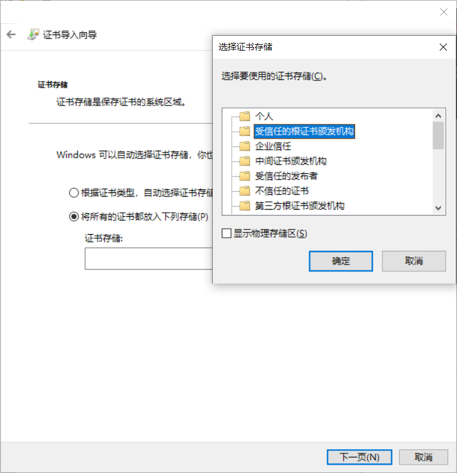
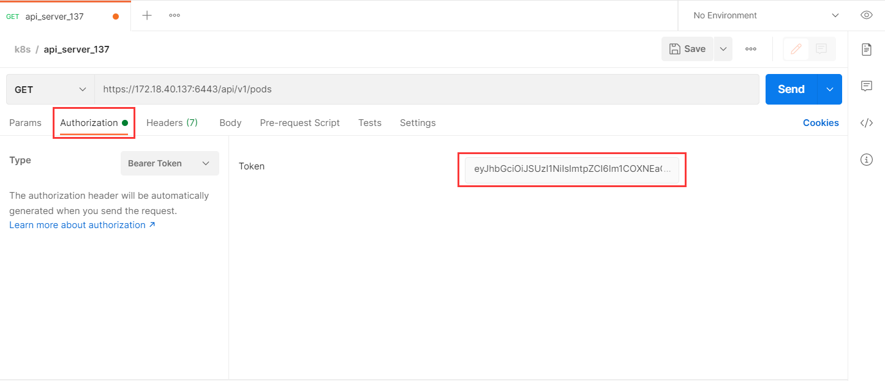
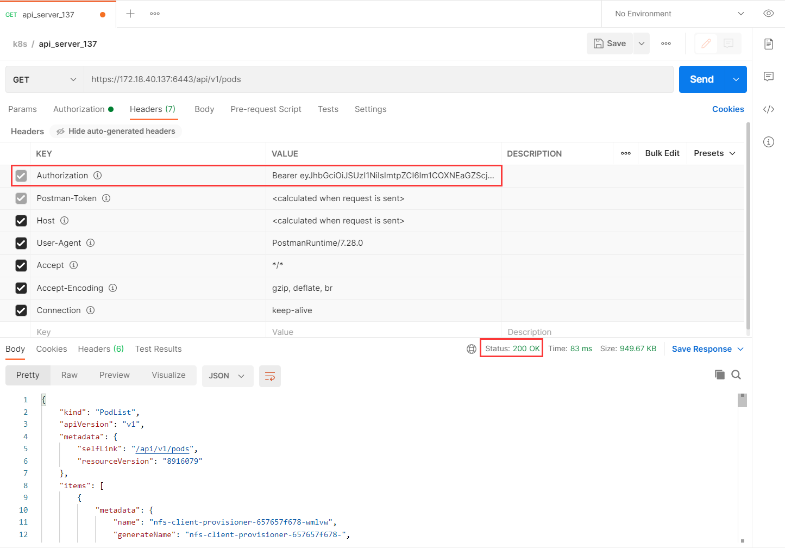

# Kubernetes API

>**REST API** 是 Kubernetes 的基本结构。 Kubernetes 所有的**操作**与系统**组件间的通信**以及**外部用户命令**本质都是调用 API Server 处理的 **REST API**。 因此，Kubernetes 平台**万物皆 API 对象**。


## 通用概念

### API 版本控制

不同的 **API 版本**代表着不同的**稳定性**和**支持级别**。如下为各级别的**摘要**。

- **Alpha**

  1. 版本名称包含 `alpha`，如 `v1alpha1`。
  2. 软件可能会有 **Bug**。某些特性可能默认禁用。
  3. 对某个特性的支持可能会**随时被删除**。
  4. API 可能在以后的软件版本中以**不兼容的方式更改**。
  5. 缺陷**长期支持**，建议仅用于短期**测试集群**。

- **Beta**

  1. 版本名称包含 `beta`，如， `v2beta3`。
  2. 软件被很好的测试过。启用某个特性被认为是安全的，**特性默认开启**。
  3. 长期支持。

- **Stable**

  1. 版本名称如 `vX`，其中 `X` 为整数，如 `v1`。
  2. 特性的稳定版本会出现在后续很多版本的发布软件中。


### API 组

API 组能够简化对 Kubernetes API 的扩展。 API 组信息出现在 **REST 路径**中，也出现在序列化对象的 `apiVersion` 字段中。API 组可大致分为两类。

- **核心组**（也称 *legacy*）：其 REST 路径为 `/api/vi`。同时，核心组并不作为 `apiVersion` 字段的一部分，比如在**资源清单**中见的非常多的 `apiVersion: v1`。*Pod*，*Node*，*Volume*，*Service* 等，都是常见的**核心组资源**。
- **普通组**：不同于**核心组**的最大特点**无分组**，**普通组**即**具有分组信息的组**。其 REST 路径为 `/apis/$GROUP_NAME/$VERSION`，同时在序列化对象中使用 `apiVersion: $GROUP_NAME/$VERSION` ，如 `apiVersion: batch/v1`。


可以查看 Kubernetes 项目下的 **pkg** 目录（存放 Kubernetes API 对象的目录）。



**API 组**和 **API 版本**的作用一目了然，**v1** 或 **v1beta1** 文件夹下就是**相应版本**的 API 对象的代码了。这种设计使得 Kubernetes API 的扩展变得非常容易。


### 标准 API 术语

大多数 Kubernetes API 资源类型都是对象：它们代表的是集群中某一概念的**具体实例**，例如一个 *Pod* 或 *Namespace*。

Kubernetes 一般会利用标准的 **RESTful 术语**来描述 API 概念：

- **资源类型（Resource Type）** 是在 URL 中使用的名称（`pods`，`namespaces`，`services` 等）。
- 所有资源类型都有具有一个 JSON 形式（其对象的**模式定义**）的具体表示，称作**类别（Kind）**。用户可以通过编写 **Yaml 格式的文件**来定义和描述想要操作的资源，也就是我们常说的**资源清单**。
- 某资源类型的实例的列表称作**集合（Collection）**。
- 资源类型的单个实例被称作**资源（Resource）**。


所有资源类型要么是**集群作用域**的（`/apis/GROUP/VERSION/*`），要么是**名字空间作用域**的（`/apis/GROUP/VERSION/namespaces/NAMESPACE/*`）。名字空间作用域的资源类型会在其**名字空间被删除时也被删除**。

一个简单例子，可用下列路径来**检视集合和资源**：

- **集群作用域的资源**：
  1. `GET /apis/GROUP/VERSION/RESOURCETYPE` - 返回指定资源类型的资源的集合。
  2. `GET /apis/GROUP/VERSION/RESOURCETYPE/NAME` - 返回指定资源类型下名称为 **NAME** 的资源。
- **名字空间作用域的资源**：
  1. `GET /apis/GROUP/VERSION/RESOURCETYPE` - 返回所有名字空间中指定资源类型的全部实例的集合。
  2. `GET /apis/GROUP/VERSION/namespaces/NAMESPACE/RESOURCETYPE` - 返回名字空间 **NAMESPACE** 内给定资源类型的全部实例的集合。
  3. `GET /apis/GROUP/VERSION/namespaces/NAMESPACE/RESOURCETYPE/NAME` - 返回名字空间 **NAMESPACE** 中给定资源类型的名称为 **NAME** 的实例。

几乎所有对象资源类型都支持标准的 **HTTP 动词**（`GET`，`PUT`，`POST`，`PATCH` 和 `DELETE`）来进行**检视**，**创建**，**更新**和**删除**。同时，Kubernetes 中使用术语 **LIST** 来描述**返回资源集合的操作**，以便与**返回单个资源的**，通常称作 **GET** 的操作相区分。


现在我们应该能理解 Kubernetes API 实际上就是**基于资源的**，通过 **HTTP** 提供的**编程接口**。Kubernetes 平台的任何能力，其实都是通过一个个的 **API 对象**所表现出来的，开发者能做的就是通过 Kubernetes API 去**操作**，**调整**这些 API 对象，然后通过**控制循环**来使整个集群不断的趋向于**期望状态**。

好比当我们想描述一个可扩缩容的应用时，我们会使用 *Deployment*；需要暴露一个服务时，我们创建 *Service*。而当 Kubernetes 平台**原生的 API 对象**已经描述不了开发者的**业务场景**时，也就有了 *CRD*（Custom Resource Definition）。


[Kubernetes API 文档（v1.21）](https://kubernetes.io/docs/reference/generated/kubernetes-api/v1.21/#-strong-api-overview-strong-)就展示出了非常鲜明的**声明式 API** 特点。相较于传统用的**命令式 API** 文档，它更像是一份各类 **API 对象**的**字典**，其中详细的记录了每个 **API 对象**的**字段**及其**效果**。




### 客户端库

在使用 **Kubernetes REST API** 编写应用程序时，可以根据自己的**编程语言**需要选择使用合适的**客户端库**。

| 语言   | 客户端库                                                     | 样例程序                                                     |
| ------ | ------------------------------------------------------------ | ------------------------------------------------------------ |
| Go     | [github.com/kubernetes/client-go/](https://github.com/kubernetes/client-go/) | [🔗](https://github.com/kubernetes/client-go/tree/master/examples) |
| Python | [github.com/kubernetes-client/python/](https://github.com/kubernetes-client/python/) | [🔗](https://github.com/kubernetes-client/python/tree/master/examples) |
| Java   | [github.com/kubernetes-client/java](https://github.com/kubernetes-client/java/) | [🔗](https://github.com/kubernetes-client/java#installation)  |


## HTTP REST API 访问

Kubernetes 集群搭建之后，除了使用官方的 kubectl 工具与 API Server 进行交互，我们还可以使用 Postman 工具或者 curl 命令，这样不但可以帮助我们熟悉 **Kubernetes REST API**，有些时候直接使用 Postman 或 curl **功能会更强大**。

而与 API Server 交互通常需要一个有正确权限的 *ServiceAccount*，该 *ServiceAccount* 通过 *ClusterRole*/*Role*，*ClusterRoleBinding*/*RoleBinding* 给其赋予相关资源的**操作权限**，*ServiceAccount* 对应的 **Token** 则用于 API Server 进行基本的**认证**。


### curl

首先，我们创建一个名为 `apiviewer` 的 *ServiceAccount*。

```bash
kubectl create sa apiviewer
```


查看这个 *ServiceAccount* 对应的 *Secret* 名称。

```bash
kubectl get sa/apiviewer -o yaml
```




查看这个 *Secret* 的数据。

```bash
kubectl get secret/apiviewer-token-7hcs7 -o yaml
```




创建一个 *ClusterRoleBinding*，将系统预留角色 **cluster-admin** 分配给 **apiviewer**。

```bash
kubectl create clusterrolebinding apiadmin --clusterrole cluster-admin --serviceaccount default:apiviewer
```


获取 *Secret* 中的 **Bearer Token**。

```bash
TOKEN=$(kubectl get secret/apiviewer-token-7hcs7 -o jsonpath='{.data.token}' | base64 -d)
```

然后我们把**证书**也提取出来。

```bash
kubectl get secret/apiviewer-token-7hcs7 -o jsonpath="{.data['ca\.crt']}" | base64 -d > ca.crt
```




获取 API Server URL。

```bash
APISERVER=https://$(kubectl get endpoints/kubernetes --no-headers | awk '{ print $2 }' | cut -d "," -f 1)
```


现在我们通过 `curl` 命令查询 **default** *namespace* 下的所有 *Pod*。

```bash
curl -s $APISERVER/api/v1/namespaces/default/pods/ \
--header "Authorization: Bearer $TOKEN" \
--cacert ca.crt
```




### Postman

如果要使用 Postman 工具访问 API Server，过程其实与 curl 大同小异。首先，我们将之前 *Secret* 中提取出的**证书**拷贝至 windows。双击 **.crt 文件**。




在 Postman 工具中新建一个**标签**，输入 API Server 的**请求路径**。点击下方的 **Authorization**，选择 **Bearer Token** 的 **Type**，然后在右侧的 **Token** 中输入我们之前获取到的 *Secret* 中的 **Token**。




请求 API Server，可以看到请求头中已经加上了我们刚设置的 **Authorization** 参数，且请求成功响应。




