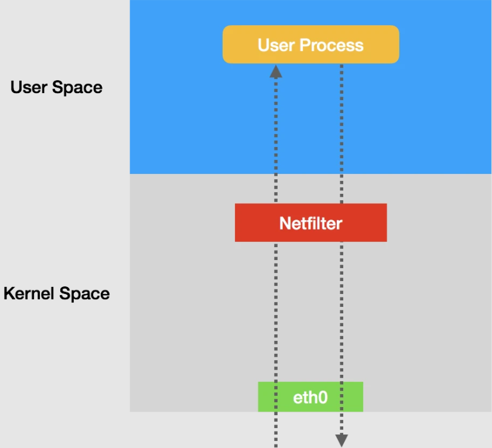
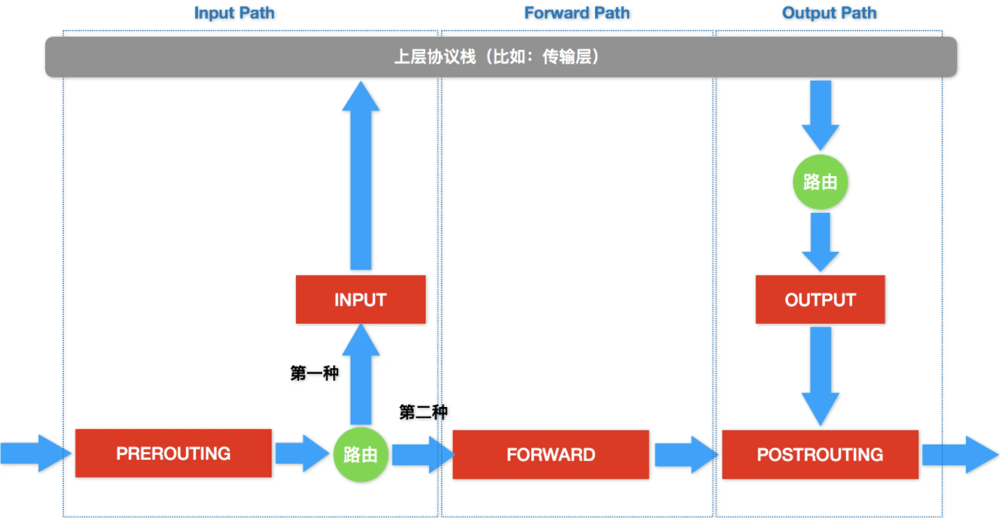
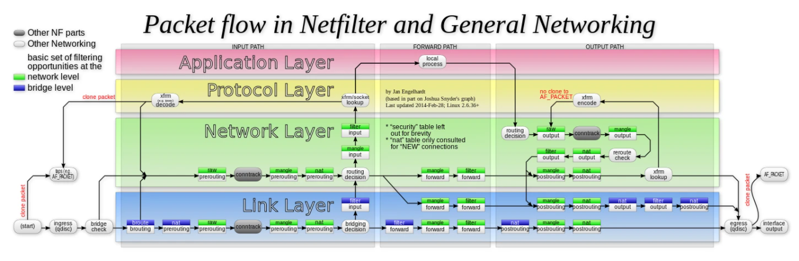

# Network Policy

>**Kubernetes 网络模型**之前被我们总结为一个“通”字，而在很多场合下，考虑到不同用户之间的隔离性，我们往往还要求容器之间的网络“不通”。
>
>通过之前对 Kubernetes 生态中主流容器网络方案原理及实现的了解，不难发现，它们通常只关注容器间网络的“连通”，却并不关心容器间网络的“隔离”。其实在 Kubernetes 中，其对于网络隔离能力的定义，是依靠一种专门的 API 对象 *NetworkPolicy* 来描述的。


## NetworkPolicy 对象

### iptables

在介绍 *NetworkPolicy* 之前，我们必须先了解 ipatables 的相关知识。

iptables 是一个操作 Linux 内核 Netfilter 子系统的“界面”。顾名思义，Netfilter 子系统的作用，就是 **Linux 内核里挡在“网卡”和“用户态进程”间的一道“防火墙”**。它们的关系如下。



可以看到，IP 包“一进一出”的两条路径上，有几个关键的“检查点”，它们正是 Netfilter 设置“防火墙”的地方。在 iptables 中，**这些“检查点”被称为链（Chain）**。这是因为这些“检查点”对应的 **iptables 规则**，是按照定义顺序依次进行匹配的。


这些“检查点”的具体工作原理，可以用以下原理图来描述。



可以看到，当一个 IP 包通过网卡进入主机之后，它就进入了 Netfilter 定义的**流入路径（Input Path）**中。在这个路径中，IP 包要经过路由表路由来决定下一步的去向。

在这次路由之前，Netfilter 设置了一个名为 PREROUTING 的“检查点”。在 Linux 内核的实现里，所谓“检查点”实际上就是内核网络协议栈代码里的钩子（Hook），如在执行路由判断的代码之前，内核会先调用 PREROUTING 的 Hook。

而在经过路由之后，IP 包的去向就分为了两种，第一种，**继续在本机处理**；第二种，**被转发到其他目的地**。


我们先来说说 IP 包的第一种去向。这时候，IP 包将继续向上层协议栈流动。在它进入传输层之前，Netfilter 会设置一个名叫 INPUT 的“检查点”。到这里，IP 包流入路径（Input Path）结束。

接下来，这个 IP 包通过传输层进入用户空间，交给用户进程处理。处理完成后，用户进程会通过本机发出返回的 IP 包。这时候，这个 IP 包就进入了**流出路径（Output Path）**。

此时，IP 包首先还是会经过主机的路由表进行路由。路由结束后，Netfilter 就会设置一个名为 OUTPUT 的“检查点”。然后，在 OUTPUT 之后，再设置一个名叫 POSTROUTING“检查点”。

你可能会觉得奇怪，为什么在流出路径结束后，Netfilter 要连着设置两个“检查点”呢？这就涉及到在流入路径里，路由判断后的第二种去向了。


第二种情况下，这个 IP 包不会进入传输层，而是会继续在网络层流动，从而进入到**转发路径（Forward Path）**。在转发路径中，Netfilter 会设置一个名叫 FORWARD 的“检查点”。

在 FORWARD“检查点”完成后，IP 包就会来到流出路径。而转发的 IP 包由于目的地已经确定，它就不会再经过路由，也自然不会经过 OUTPUT，而是会直接来到 POSTROUTING“检查点”。所以说，POSTROUTING 的作用，其实就是**上述两条路径最终汇聚在一起的“最终检查点”**。


需要注意的是，在有网桥参与的情况下，上述 Netfilter 设置“检查点”的流程，实际上也会出现在链路层（二层），并且会跟我在上面讲述的网络层（三层）的流程有交互。这些链路层的“检查点”对应的操作界面叫作 ebtables。准确地说，数据包在 Linux Netfilter 子系统里完整的流动过程其实应该如下所示。



我们之前所讲解的，正是上图中绿色部分，也就是网络层的 iptables 链的工作流程。

另外，我们还能看到，每一个白色的“检查点”上，还有一个“绿色标签”，如 `raw`，`nat`，`filter` 等。在 iptables 中，这些标签被称为**表**。比如在 OUTPUT 这个“检查点”，filter Output 和 nat Output 在 iptables 中的语法和参数就完全不一样，实现的功能也完全不同。

所以说，iptables 表的作用，就是**在某个具体的“检查点”上，按顺序执行几个不同的检查动作**。


### Kubernetes 网络隔离能力描述

Kubernetes 中的 *Pod* 默认都是“允许所有”的，即 *Pod* 可以接收来自任何发送方的请求；或者向任何接收方发送请求。如果我们需要要对这个情况作出限制，就必须通过 *NetworkPolicy* 对象来指定。

先来看一个完整的 *NetworkPolicy* 定义。

```yaml
apiVersion: networking.k8s.io/v1
kind: NetworkPolicy
metadata:
  name: test-network-policy
  namespace: default
spec:
  podSelector:
    matchLabels:
      role: db
  policyTypes:
  - Ingress
  - Egress
  ingress:
  - from:
    - ipBlock:
        cidr: 172.17.0.0/16
        except:
        - 172.17.1.0/24
    - namespaceSelector:
        matchLabels:
          project: myproject
    - podSelector:
        matchLabels:
          role: frontend
    ports:
    - protocol: TCP
      port: 6379
  egress:
  - to:
    - ipBlock:
        cidr: 10.0.0.0/24
    ports:
    - protocol: TCP
      port: 5978
```

首先我们注意到 `podSelector` 字段，它定义这个 *NetworkPolicy* 的**限制范围**，上例中即当前 *Namespace* 中携带了 `role=db` 标签的 *Pod*。而如果我们把 `podSelector` 字段留空，那么这个 *NetworkPolicy* 就会作用于当前 *Namespace* 下的所有 *Pod*。

```yaml
...
spec:
  podSelector: {}
...
```

一旦 *Pod* 被 *NetworkPolicy* 选中，那么这个 *Pod* 就会进入“拒绝所有”的状态，即**这个 *Pod* 既不允许被外界访问，也不允许对外界发起访问**。而 *NetworkPolicy* 中所定义的规则，其实就是“**白名单**”。


上述 *NetworkPolicy* 中，在 `policyTypes` 字段定义了其类型为 `ingress` 和 `egress`，即它既会影响**流入（ingress）**请求，也会影响**流出（egress）**请求。

`ingress` 字段里的 `from` 和 `ports`，指定了允许流入的“白名单”与端口。其中，在这个允许流入的“白名单”中，指定了三种并列的情况：`ipBlock`，`namespaceSelector` 和 `podSelector`。

而在 `egress` 字段里定义的 `to` 和 `ports`，描述了允许流出的“白名单”和端口。这里允许流出的“白名单”的定义方法与 `ingress` 类似。


综上所述，我们可以把这个 *NetworkPolicy* 所指定的**隔离规则**总结如下：

- 隔离规则只对 default *Namespace* 下携带了 `role=db` 标签的 *Pod* 有效。限制的请求类型包括 ingress（流入）和 egress（流出）。
- Kubernetes 会拒绝任何访问被隔离 *Pod* 的请求，除非这个请求来自于以下“白名单”里的对象，并且访问的是被隔离 *Pod* 的 6379 端口。这些“白名单”对象包括：
  1. default *Namespace* 中携带了 `role=fronted` 标签的 *Pod*。
  2. 携带了 `project=myproject` 标签的 *Namespace* 里的任何 *Pod*。
  3. 任何源地址属于 `172.17.0.0/16` 网段，且不属于 `172.17.1.0/24` 网段的请求。
- Kubernetes 会拒绝被隔离 *Pod* 对外发起任何请求，除非请求的目的地址属于 `10.0.0.0/24` 网段，并且访问的是该网段地址的 5978 端口。


注意，如果要使上面定义的 *NetworkPolicy* 在 Kubernetes 集群里真正产生作用，我们采用的 CNI 网络插件就必须是支持 Kubernetes 的 *NetworkPolicy* 的。具体实现上，凡是支持 *NetworkPolicy* 的 CNI 网络插件，都维护着一个 NetworkPolicy Controller，通过控制循环的方式对 *NetworkPolicy* 对象的增删改查做出响应，然后在宿主机上完成相应 iptables 规则的配置工作。

在 Kubernetes 生态里，目前已经实现了 *NetworkPolicy* 的网络插件包括 Calico，Weave 和 kube-router 等多个项目，但是**并不包括 Flannel 项目**。所以说，如果想要在使用 Flannel 的同时还使用 *NetworkPolicy* 的话，就需要再额外安装一个网络插件，比如 Calico 项目，来负责执行 *NetworkPolicy*。


 ### NetworkPolicy 原理

那么，这些网络插件又是如何根据 *NetworkPolicy* 对 *Pod* 进行网络隔离的呢？接下来，我们就以三层网络插件为例，如 Calico 或 kube-router，来分析一下这部分的原理。

先来看一个比较简单的 *NetworkPolicy* 定义。

```yaml
apiVersion: extensions/v1beta1
kind: NetworkPolicy
metadata:
  name: test-network-policy
  namespace: default
spec:
  podSelector:
    matchLabels:
      role: db
  ingress:
   - from:
     - namespaceSelector:
         matchLabels:
           project: myproject
     - podSelector:
         matchLabels:
           role: frontend
     ports:
       - protocol: tcp
         port: 6379
```

可以看到，我们指定的 ingress “白名单”，是携带了 `project=myproject` 标签的 *Namespace* 里的所有 *Pod*，以及 default *Namespace* 里，拥有 `role=frontend` 标签的 *Pod*，允许被访问的端口是 6379。而被隔离的对象，即所有携带了 `role=db` 标签的 *Pod*。


这个时候，Kubernetes 的网络插件就会根据这个 *NetworkPolicy* 的定义，在宿主机上生成 iptables 规则。这个过程，我们可以通过如下所示伪代码来为描述：

```python
for dstIP in 所有被 networkpolicy.spec.podSelector 选中的 Pod 的 IP 地址:
    for srcIP in 所有被 ingress.from.podSelector 选中的 Pod 的 IP 地址:
        for port, protocol in ingress.ports:
            iptables -A KUBE-NWPLCY-CHAIN -s $srcIP -d $dstIP -p $protocol -m $protocol --dport $port -j ACCEPT 
```

这其实就是一条最基本的，通过匹配条件决定下一步动作的 iptables 规则。这条规则的名称是 KUBE-NWPLCY-CHAIN，其含义为：当 IP 包的源地址是 srcIP，目的地址是 dstIP，协议是 protocol，目的端口是 port 的时候，就允许它通过（ACCEPT）。

可以看到，Kubernetes 网络插件对 *Pod* 进行网络隔离，其实是靠在宿主机上生成 *NetworkPolicy* 所对应的 iptable 规则来实现的。

此外，在设置好上述“隔离”规则之后，网络插件还需要想办法将所有对被隔离 *Pod* 的访问请求，都转发到上述 KUBE-NWPLCY-CHAIN 规则上去进行匹配。若匹配不通过，那么这个请求应该被“拒绝”。


在 CNI 网络插件中，上述需求则可以通过设置两组 iptables 规则来实现。第一组规则，**负责“拦截”对被隔离 Pod 的访问请求**。

```python
for pod in 该 Node 上的所有 Pod:
    if pod in 所有被 networkpolicy.spec.podSelector选中的 Pod：
        iptables -A FORWARD -d $podIP -m physdev --physdev-is-bridged -j KUBE-POD-SPECIFIC-FW-CHAIN
        iptables -A FORWARD -d $podIP -j KUBE-POD-SPECIFIC-FW-CHAIN
        ...
```

可以看到，这里的的 iptables 规则使用到了内置链 FORWARD，也就是我们之前介绍的 Netfilter 中转发路径（Forward Path）的 FORWARD ”检查点“。

- 第一条 FORWARD 链“拦截”的是一种特殊情况：它对应的是同一台宿主机上容器之间经过 CNI 网桥进行通信的流入数据包。其中 `--physdev-is-bridged` 的意思就是，这个 FORWARD 链匹配的是通过本机上的网桥设备，发往目的地址是 podIP 的 IP 包。当然，如果是像 Calico 这样的非网桥模式的 CNI 插件，就不存在这个情况了。
- 第二条 FORWARD 链“拦截”的则是最普遍的情况，即容器跨主通信。这时候，流入容器的数据包都是经过路由转发（FORWARD ”检查点“）而来的。


不难发现，这些规则最后都跳转（`-j` 关键字）到了名为 KUBE-POD-SPECIFIC-FW-CHAIN 的规则上。它正是网络插件为 *NetworkPolicy* 设置的第二组规则。而 KUBE-POD-SPECIFIC-FW-CHAIN 的作用就是做出“允许”或者“拒绝”的判断。

```iptables
iptables -A KUBE-POD-SPECIFIC-FW-CHAIN -j KUBE-NWPLCY-CHAIN
iptables -A KUBE-POD-SPECIFIC-FW-CHAIN -j REJECT --reject-with icmp-port-unreachable
```

可以看到，首先在第一条规则里，IP 包会被转交给之前定义的 KUBE-NWPLCY-CHAIN 规则去进行匹配。按照我们之前的讲解，如果匹配成功，那么 IP 包就会被“允许通过”。

而如果匹配失败，IP 包就会来到第二条规则上。它是一条 REJECT 规则。通过这条规则，不满足 *NetworkPolicy* 定义的请求就会被拒绝掉，从而实现了对该容器的“隔离”。


## 理解 Kubernetes 弱多租户

在了解了 Kubernetes 中对 *Pod* 进行网络“隔离”的主要手段 *NetworkPolicy* 后，不难发现实际上 *NetworkPolicy* 只是宿主机上的一系列 iptables 规则。这其实与传统 IaaS 中的**安全组（Security Group）**非常类似。

而基于上述讲述，我们就会发现这样一个事实：**Kubernetes 的网络模型以及大多数容器网络实现，其实既不会保证容器之间二层网络的互通，也不会实现容器之间的二层网络隔离**。这与传统 IaaS 项目管理虚拟机的方式是截然不同的。


Kubernetes 从底层的设计和实现上，更倾向于假设用户已经实现了一套完整的**物理基础设施**。然后，Kubernetes 负责在此基础上提供一种**“弱多租户”（soft multi-tenancy）**能力。

基于上述思路，Kubernetes 将来也不大可能把 *Namespace* 变成一个具有实质意义的隔离机制，或将它映射成为“子网”或者“租户”。毕竟竟 *NetworkPolicy* 所描述的能力，要远比基于 *Namespace* 的划分丰富得多。

这也是为什么到目前为止，Kubernetes 项目在云计算生态里的定位其实是**基础设施与 PaaS 之间的中间层**。这是非常符合“容器”这个本质上就是进程的抽象粒度的。


