# RBAC

>Kubernetes 中所有的 API 对象，均保存于 ETCD 中。每当需要对这些 API 对象进行操作时，一定都是通过访问 API Server 实现的。其中一个非常重要的原因，就是用户需要 API Server 来进行授权工作。
>
>Kubernetes 项目中，负责完成**鉴权工作（Authorization）**的机制，即 **RBAC（Role-Based Access Control）**：基于角色的访问控制。


## Kubernetes API 请求访问控制

在了解 **RBAC** 之前，我们必须先简要的介绍下Kubernetes API 请求**从发起到持久化入库**的一个流程，可以看到，**RBAC** 负责的**授权工作（Authorization）**仅是图中的第二步。一般的，这些请求通常分为两类：

- **人机交互**，即大家非常熟悉的 kubectl 交互 API Server 的过程。
- *Pod* 中的**业务逻辑**与 API Server 之间的交互。

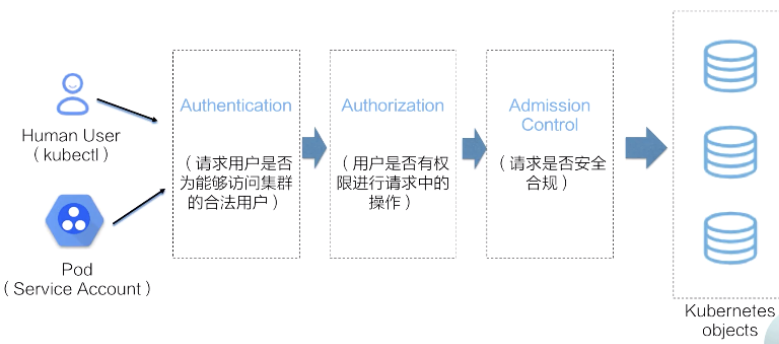

当 API Server 收到请求后，就会进入**访问控制**流程：

1. **认证（Authentication）**：API Server 判断**请求用户**是否为能够访问集群的**合法用户**。若用户为**非法用户**，API Server 则返回 **401** 的状态码，并终止该请求。
2. **鉴权（Authorization）**：API Server 判断用户**是否有权限进行请求中的操作**。若无权操作，API Server 返回 **403** 的状态码，同样终止该请求。
3. **准入控制（AdmissionControl）**：API Server 中的**准入控制器（Admission Control）** 判断请求是否是一个**安全合规**的请求。常见的，*ResourceQuota* 以及 *LimitRanger* 就由准入控制器校验。
4. 最后，我们的请求将会转换为一个 Kubernetes API 对象相应的**变更请求**，最终持久化到 ETCD 中。


## Kubernetes 认证

### 相关概念

理解 Kubernetes 认证，**数字证书**相关的知识是必不可少的。**数字证书**常见于 **TLS/SSL** 中的认证文件。相关概念解释：

- **TLS（Transport Layer Security）**：**网络通信安全协议**，传输层安全协议，其前身为 **SSL**。
- **SSL（Secure Socket Layer）**：**网络通信安全协议**，安全套接字协议，其继任者为 **TLS**。
- **OpenSSL**：如果把 **SSL** 规范类比为面向对象中的**接口**的话，**OpenSSL** 就是该接口的**实现**。
- **CA（Certificate Authority）**：证书颁发机构。负责**发放和管理数字证书的权威机构**，并作为电子商务交易中受信任的第三方，承担公钥体系中公钥的合法性检验的责任。
- **非对称加密算法**： 非对称加密算法需要两个密钥：**公钥（publickey）**与**私钥（privatekey）**。通常的，公钥用于**数据加密**与**签名校验**；私钥用于**数据解密**与**数字签名**。主要算法有 **RSA**。
- **.key 文件**：私钥。
- **.csr 文件（Certificate Signing Request）**：证书签名请求。请求生成证书时需要把该类文件提交给 **CA**。
- **.crt 文件（Certificate）**：同 **.cer 文件**，即证书。由 **CA** 颁发，内含证书持有者的**公钥**以及**用户或设备**信息。
- **X.509**：一种**证书格式**，对于 **X.509 证书**来说，认证者总是 **CA** 或由 **CA 认证的人**。一份 **X.509 证书**是一些标准字段的集合，包含有关**用户或设备**及其相应**公钥**的信息。根据文件内容编码格式，可分为以下二种：
  1. **PEM**：可阅读，通常以 "-----BEGIN..." 开头，"-----END..." 结尾，内容是 **BASE64** 编码。**Apache** 和 **NIX** 服务器偏向于使用这种编码格式。
  2. **DER**：二进制文件。**Java** 和 **Windows** 服务器偏向于使用这种编码格式。


其实，在你访问 **HTTPS** 类型的网站时，就涉及到了 **TLS/SSL** 的**传输加密**和**身份认证**。**HTTPS** 全称 *Hyper Text Transfer Protocol over Secure Socket Layer*，顾名思义 **HTTP + SSL**。

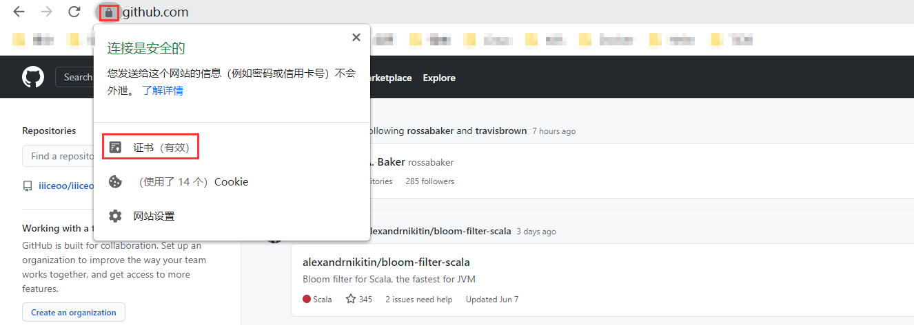

这是 *github.com* 的 **HTTPS** 标志。通常的， **HTTPS** 类型的网站，根据你使用的浏览器差异，网址背景会呈现**绿色**，或者会在头部有一把小🔒。不妨来看看它的证书。

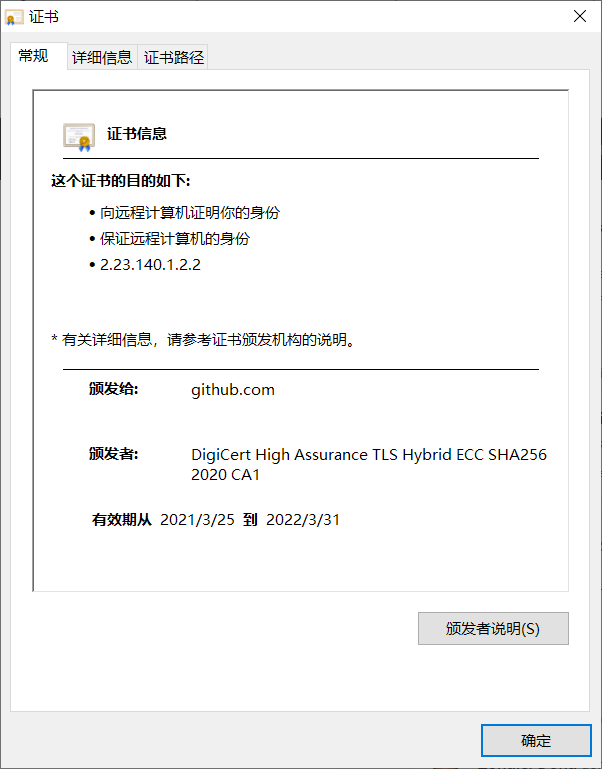

这就是一份很标准的**证书**，在 Windows 上双击任意 .crt 文件也能看到类似的对话框。上面很清楚的记载了 **CA**，**被颁发者**，证书**有效日期**等信息。同样的，**详细信息**中可以看到更多。


这份证书，其实就是 *github.com* 的建站者，通过 **OpenSSL** 等相关工具生成私钥（.key 文件）与对应的 .csr 文件后，将 .csr 文件 + 💴 提交给 CA，然后 CA 批准与颁发的。

它证明了 *github.com* 自身是互联网界的 ”**良民**“，同时，它会把这份证书发送给每一个访问自己的**浏览器**，浏览器则会判断颁发该证书的 CA 是否**值得信任**，若值得信任，这份证书则被**持久化**到**用户当前设备**的磁盘中。之后，浏览器借由证书中的**公钥**与 *github.com* 的**服务器**开始 **TLS** 握手，具体细节不再展开。

看到这里，你应该能对上述罗列的名词有更深刻的理解，如果感兴趣，之后你完全可以通过 **OpenSSL** 生成私钥，.csr 文件，CA 证书，为自己的服务器也颁发一份证书，不过这样做是肯定不能让你的网站也有一把小🔒的，得向 CA 加 💴。


### Kubernetes 用户模型

对于认证来说，首要的就是确定请求的**发起方**是谁，并最终通过**认证过程**将其转换为一个**系统可识别的用户模型**，其可用于之后的**鉴权**等。需要注意的是，Kubernetes 自身是没有**用户管理能力**的！

如何理解**用户管理能力**？即我们无法像操作 *Pod* 一样，通过 API 的方式创建删除一个”**用户实例**“。同样的，我们也无法在 ETCD 中找到**用户**对应的**存储对象**。

那么在 Kubernetes 的**访问控制流程**中，**用户模型**是如何产生的呢？答案就在请求方的**访问控制凭证**中，也就是我们平时使用的 kubeconfig 中的**证书**，或者是 *Pod* 中引入的 *ServerAccount*。在经过 Kubernetes **认证流程**之后，API Server 会将**请求凭证**中的**用户身份**转化为诸如 *User* 和 *Groups* 这样的**用户模型**。在随后的**鉴权操作**和**准入控制**流程中，API Server 会再次使用到这些**用户模型实例**。


Kubernetes 主要支持的**请求认证方式**：

- **Basic 认证**：**管理员**将 Username 和 Password 组成的**白名单**放置在 API Server 读取的**静态配置文件**下进行认证。该方式一般用于**测试**场景，在安全方面不推荐且不可拓展的一种方式。

- **X.509 证书认证**：API Server 中相对应用**较多**的使用方式。**访问者**会使用由**集群 CA** 签发的，或是添加在 **API Server Client CA** 中的**授信 CA** 签发的**客户端证书**去访问 API Server。API Server **服务端**在接收到请求后，则开始 **TLS** 握手流程。

  除了验证证书的**合法性**，API Server 还会校验**客户端证书**的**请求源地址**等信息。开启双向认证，**X.509 认证**是一个比较安全的方式，也是 Kubernetes 组件之间**默认使用的认证方式**，同时还是 kubectl 客户端对应的 kubeconfig 中经常使用到的**访问凭证**。

- **Bearer Tokens（JSON Web Tokens）**：该方式的 **Tokens** 是通用的 **JWT** 形式，其中包含了**签发者**、**用户身份**、**过期时间**等多种元信息。它的认证方式也是常见的**私钥加签**，**公钥验签**的一个基本流程。

  1. **Service Account**：每个 *Pod* 均会使用一个 *ServiceAccount*，*ServiceAccount* 中就会自动绑定一个**签名后的 JWT Token** 用于请求 API Server。
  2. **OpenID Connect**：API Server 还支持基于 OpenID 协议的 Token 认证，可以通过对 API Server 的配置连接一个指定的**外部 IDP**。同时，可以通过 Keycloak，Dex 这样的开源服务来管理 IDP，请求者可以按照自己熟悉的方式**在原身份认证服务上进行登录认证**，并最终返回一个**相应的 JWT token**。
  3. **Webhooks**：可以使用 Webhooks 的方式，将请求的 Token 发送到指定**外部服务**进行 **Token 验签**。


### X.509 证书

对于一个**集群证书体系**来说，**根 CA** 是一个非常重要的**证书对**。它会被默认放置在集群 **Master** 节点上的 **/etc/kubernetes/pki/** 目录下。

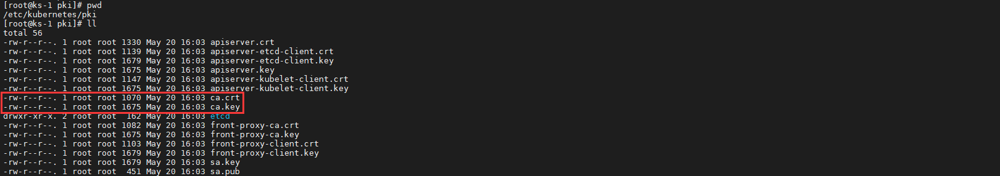

其中 **ca.crt** 即**公钥**，**ca.key** 就是**私钥**。**集群中所有组件之间的通讯用到的证书，其实都是由集群根 CA 来签发的。**


在证书中有两个**身份凭证相关的重要字段**：一个是 **CN**，一个是 **O**。通过 `openssl` 命令来进行证书的解析。

```bash
openssl x509 -in apiserver.crt -noout -text
```

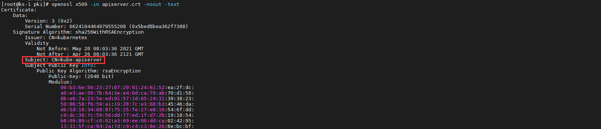

- **CN（Comman Name）**：API Server 在认证过程中将其作为**用户 *User***。
- **O（Organization）**：API Server 在认证过程中将其作为**组 *Group***。


每一个 Kubernetes 系统组件都在**集群创建**时签发了自身对应的**客户端证书**。

| 组件               | Comman Name                    | Organization |
| ------------------ | ------------------------------ | ------------ |
| controller-manager | system:kube-controller-manager |              |
| scheduler          | system:kube-scheduler          |              |
| kube-proxy         | system:kube-proxy              |              |
| kubelet            | system:node:$(node-hostname)   | system:nodes |


### 证书签发

Kubernetes 集群本身就提供了**证书签发的 API**，用于向 **CA** 请求并获取 **X.509 证书**。*CertificateSigningRequest*（*CSR*）资源用来向指定的签名者申请证书签名。

创建 *CSR* 之前，我们需要先借助 **OpenSSL** 等工具生成**私钥**。

```bash
openssl genrsa -out test.key 2048
```

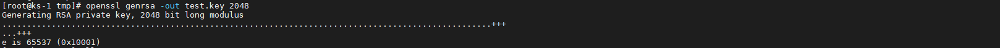


生成 **.csr 文件**。

```bash
openssl req -new -key test.key -out test.csr -subj "/CN=xzq/O=people"
```

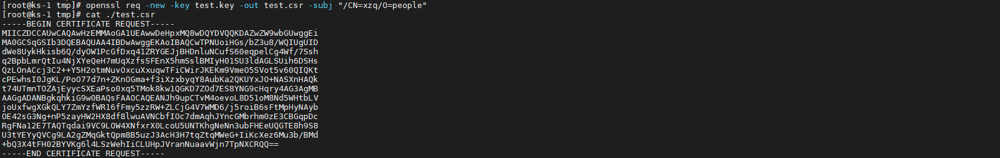


基于该 **.csr 文件**创建 *CSR* 资源。

```yaml
apiVersion: certificates.k8s.io/v1beta1
kind: CertificateSigningRequest
metadata:
  name: test
spec:
  request: $(cat test.csr | base64 | tr -d "\n")
  usages:
  - digital signature
  - key encipherment
  - server auth
```


API Server 则会根据请求，以 *CSR* 资源模型的形式创建对应的**签发请求实例**。刚开始创建的**签发实例**都会处于 pending 状态。

```bash
kubectl get csr
```

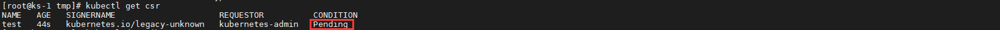

```bash
kubectl describe csr test
```

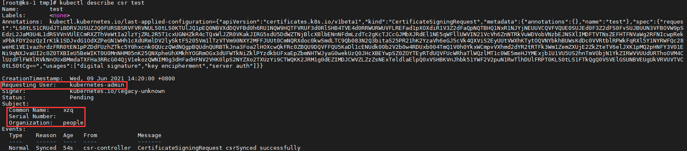


直到有权限的**管理员**进行**审批**后，该 *CSR* 才会处于 approved 的状态，请求对应的证书就会被签发。

```bash
kubectl certificate approve test
```

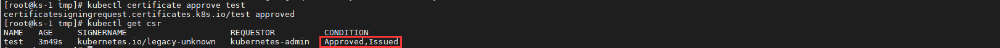

同时，对于集群管理员，他还可以直接读取**集群根 CA**，通过 **X.509** 的 **.csr 文件**签发证书，所以他可以无需定义或审批 *CSR*。

```bash
openssl x509 -req in test.csr -CA CA_LOCATION/ca.crt -Cakey CA_LOCATION/ca.key -Cacreateserial -out test.crt -day 365
```


### Service Accounts

*ServiceAccount* 也是 API Server 中应用比较广泛的一种方式。对于 *ServiceAccount* 来说，它是 Kubernetes 中唯一能够通过 API 方式管理的 **API Server 访问凭证**。

当一个 *Namespace* 创建完成后，会同时在该 *Namespace* 下生成名为 **default** 的一个 *ServiceAccount* 和对应的 *Secret*。同样的，用户也可以通过 API 创建其他名称的 *ServiceAccount*，并在该 *Namespace* 下挂载到待运行的 *pod* 中。需要注意的是，对于已经创建的 *Pod*，是**不能更新**其已经挂载的 *ServiceAccount* 中的内容的。


查看一个 **default** *Namespace* 下的 *ServiceAccount*。很清楚的看到它与一个 *Secret* 绑定。

```bash
kubectl get sa/nfs-client-provisioner -o yaml
```

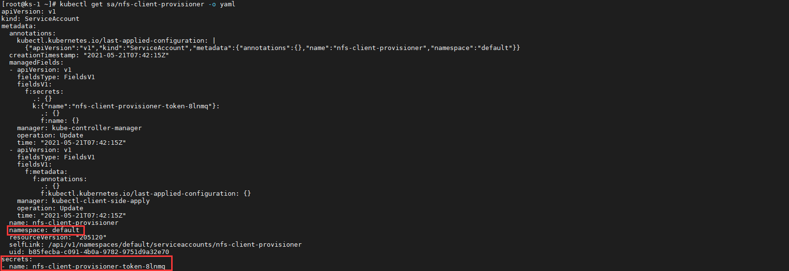


查看这个对应的 *Secret*。其中 `data.token` 字段是经过了 **base64 编码**的 **JWT 格式的认证 token**，`data.ca.crt` 字段则是被颁发的**客户端证书**。

```bash
kubectl get secret/nfs-client-provisioner-token-8lnmq -o yaml
```

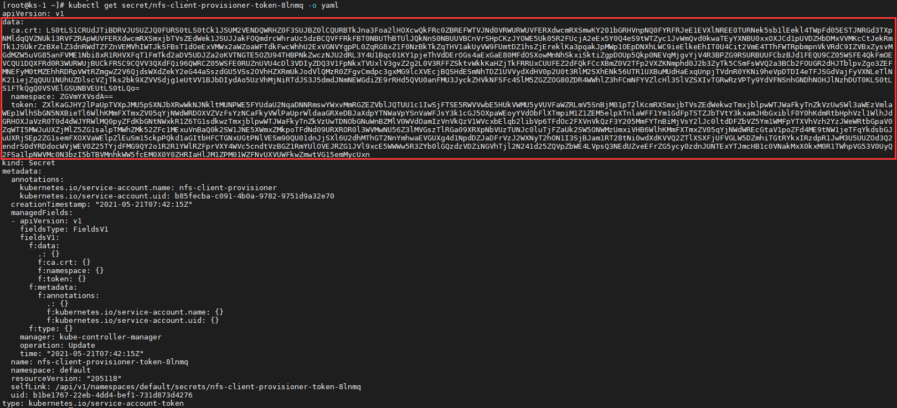


对应使用了该 *ServiceAccount* 的 *Pod* 如下，可以清楚的看到指定 *ServiceAccount* 对应 *Secret* 中的**证书**，**namespace** 和**认证 token** 会分别以**文件的形式**挂载到容器中的指定目录下。

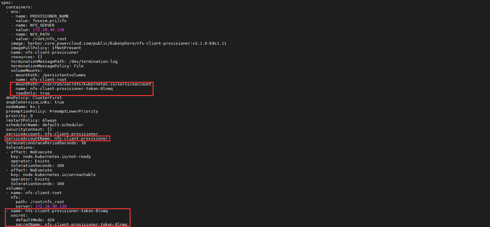


## RBAC

当一个请求在完成 API Server **认证**后，便可认为它是一个**合法用户**，之后便进入**API 请求访问控制**的第二步 **Kubernetes 鉴权**。API Server 本身**支持多种鉴权方式**，我们主要介绍在安全上推荐的鉴权方式 **RBAC**。


### 核心要素

**RBAC** 中三个最核心的要素即**主体（Subject）**，**对象（API Resources）**，**操作（Verbs）**。直观的理解就是 *“定义了什么人，可以对什么对象，执行什么操作的一组规则”*。

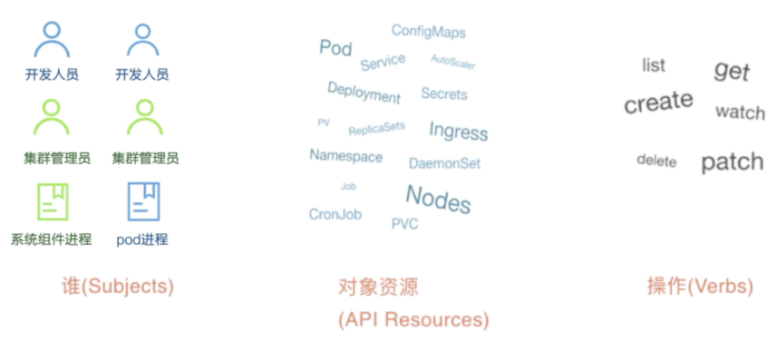

- **Subjects**：主体。可以是开发人员，集群管理员这样的**自然人**；也可以是**系统组件进程**，或者是 Pod 中的**逻辑进程**。
- **API Resource**：即请求对应的访问目标。在 Kubernetes 集群中也就是各类**资源**。
- **Verbs**：对应请求对象资源可以进行哪些操作，包括增删改查，如 `LIST`，`GET`，`WATCH` 等等。


### Role & RoleBinding

我们从 *Role* 开始了解，来看一份简单的 *Role* 资源清单。

```yaml
kind: Role
apiVersion: rbac.authorization.k8s.io/v1
metadata:
  namespace: mynamespace
  name: example-role
rules:
- apiGroups: [""]
  resources: ["pods"]
  verbs: ["get", "watch", "list"]
```

首先，很自然的发现，*Role* 是 **namespaced** 的，即它仅能在特定的 *Namespace* 下生效，本例中为 **mynamespace**。若未指定 `namespace` 字段，则默认为 **default**。 

清单中的 `rules` 字段，就是它所定义的**权限规则**。此处的**语义**为：允许“**被作用者**”，对 **mynamespace** 下面的 *Pod* ，进行 `GET`，`WATCH` 和 `LIST` 操作。注意 *pod* 属于 **API Core Groups**，核心 API 无组概念，所以 `apiGroups` 字段为一对**空引号**。


而 *RoleBinding* 则用于来关联“**被作用者**”与 *Role*，“**被作用者**”就是我们之前所了解的 **Kubernetes 认证**过程中所产生的**用户模型**。

```yaml
kind: RoleBinding
apiVersion: rbac.authorization.k8s.io/v1
metadata:
  name: example-rolebinding
  namespace: mynamespace
subjects:
- kind: User
  name: example-user
  apiGroup: rbac.authorization.k8s.io
roleRef:
  kind: Role
  name: example-role
  apiGroup: rbac.authorization.k8s.io
```

其中，`subjects` 字段即定义了“**被作用者**”，其类型为 *User*，之前已经提到过了，它只是一个**逻辑概念**，并不是真正的 **Kubernetes API 对象**。同样的。

`roleRef` 字段则通过名字引用了我们刚定义的 *Role* 对象，从而构建了“**被作用者**”和“**角色**”之间的绑定关系。需要再次提醒的是，*Role* 和 *RoleBinding* 同为 **namespaced 对象（Namespaced Object）**，它们对权限的限制规则**仅在其自身的 *Namespace* 内有效**，`roleRef`  字段也只能引用当前 *Namespace* 里的 *Role* 对象。


### ClusterRole & ClusterRoleBinding

对于**非 namespaced 对象（Non-namespaced Object）**如 *node*，或者某一个 *Role* 想要作用于所有的 *Namespace* 的时候，就需要使用 *ClusterRole* 和 *ClusterRoleBinding* 的组合了。这两个 API 对象的用法和 *Role* 与 *RoleBinding* 完全一致，唯一的区别就是在它们的定义中，均无 `namespace` 字段。

```yaml
kind: ClusterRole
apiVersion: rbac.authorization.k8s.io/v1
metadata:
  name: example-clusterrole
rules:
- apiGroups: [""]
  resources: ["pods"]
  verbs: ["get", "watch", "list"]

```

```yaml
kind: ClusterRoleBinding
apiVersion: rbac.authorization.k8s.io/v1
metadata:
  name: example-clusterrolebinding
subjects:
- kind: User
  name: example-user
  apiGroup: rbac.authorization.k8s.io
roleRef:
  kind: ClusterRole
  name: example-clusterrole
  apiGroup: rbac.authorization.k8s.io
```

上述组合所描述的**语义**为：example-user 用户拥有对所有 *Namespace* 中的 *Pod* 进行 `GET`，`WATCH` 和 `LIST` 操作的权限。


进一步的，假若在 *Role* 或 *ClusterRole* 中想要赋予用户 example-user **所有权限**，则可以给它指定一个 `verbs` 字段的**全集**。

```yaml
verbs: ["get", "list", "watch", "create", "update", "patch", "delete"]
```

对一个**应用开发人员**来说，kubectl 肯定更为直观与熟悉，这里也给出一些 kubectl 操作和 RBAC 中的对应关系。

| kubectl                                                      | RBAC                                         |
| ------------------------------------------------------------ | -------------------------------------------- |
| kubectl get deploy -w                                        | *Deployment*：`GET` `LIST` `WATCH`           |
| kubectl delete deploy test                                   | *Deployment*：`GET` `DELETE`                 |
| kubectl run --image=nginx nginx-text                         | *Deployment*：`CREATE`                       |
| kubectl edit deploy nginx-text                               | *Deployment*：`GET` `PATCH`                  |
| kubectl exec -it pod-test bash                               | *Pods*：`GET` `CREATE`                       |
| kubectl expose deploy nginx-test --port=80 --target-port=8000 | *Deployment*：`GET`<br />*Service*：`CREATE` |


类似的，*Role* 或 *ClusterRole* 中的 `rules` 字段也可以进一步细化。你可以**只针对某一个具体的对象**进行权限设置。

```yaml
rules:
- apiGroups: [""]
  resources: ["configmaps"]
  resourceNames: ["my-config"]
  verbs: ["get"]
```


如果想要在 *RoleBinding* 和 *ClusterRoleBinding* 使用 Kubernetes 的“**内置用户**” *ServiceAccount*，可以这样定义。

```yaml
kind: RoleBinding
apiVersion: rbac.authorization.k8s.io/v1
metadata:
  name: example-rolebinding
  namespace: mynamespace
subjects:
- kind: ServiceAccount
  name: example-sa
  namespace: mynamespace
roleRef:
  kind: Role
  name: example-role
  apiGroup: rbac.authorization.k8s.io
```


同样的，Kubernetes 也有**用户组** *Group* 的概念。将 *RoleBinding* 和 *ClusterRoleBinding* 中的 `Kind` 字段设置为 *Group* 即可，之前的**X.509 证书认证**方式中的 **O** 其实就与之对应。

实际上，一个 *ServiceAccount* 在 Kubernetes 中对应的完整 *User* 名为：`system:serviceaccount:<ServiceAccount 名字>`，其对应的**内置** *Group* 名为：`system:serviceaccounts:<namespace 名字>`。所以我们可以这样定义上述 *RoleBinding* 中的  `subjects`。

```yaml
subjects:
- kind: Group
  name: system:serviceaccounts:mynamespace
  apiGroup: rbac.authorization.k8s.io
```

这就意味着这个 *Role* 的权限规则可作用于 mynamespace 里的所有 *ServiceAccount*。


### 预设 ClusterRole

现在我们应该能理解，若在不进行任何权限的绑定下，RABC 会**拒绝所有的访问**。那么 Kubernetes 的**系统组件**是如何鉴权的呢？用户其实并没有为诸如**调度器（scheduler）**等创建任何角色。


其实在集群创建时，伴随着处理系统各组件的**客户端证书**，其各自的**角色**与**环境对象**也会被创建出来，这是 Kubernetes 内置的很多个为**系统保留**的 *ClusterRole*，它们的名字均以 `system:` 开头。

```bash
kubectl get clusterroles -n kube-system | grep system:
```

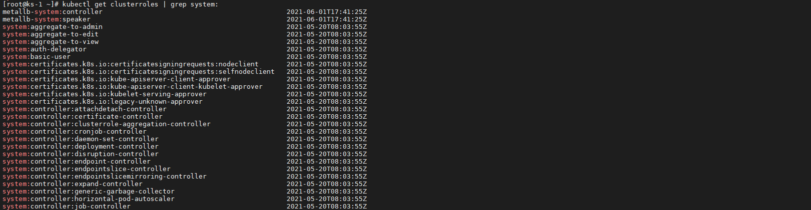

一般来说，这些系统 *ClusterRole*，是绑定给 Kubernetes 系统组件对应的 *ServiceAccount* 使用的。


除此之外，Kubernetes 还提供了四个**预先定义**好的 *ClusterRole* 来供用户直接使用：

- **cluster-amdin**
- **admin**
- **edit**
- **view**


值得注意的是，**cluster-amdin** 角色，对应的是整个 Kubernetes 项目中的最高权限（**Resources=\*.\***， **Verbs=\***）,所请务必小心使用 **cluster-amdin** 角色。

```bash
kubectl describe clusterrole cluster-admin -n kube-system
```

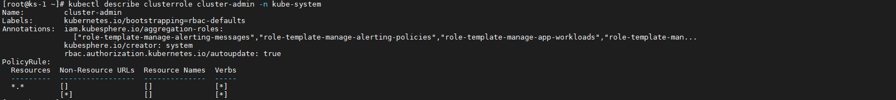


