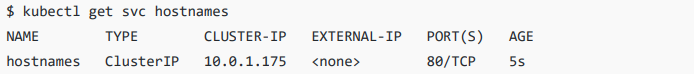

# Service 与 Ingress

>在之前的学习中，我们了解到了 *Deployment* 的**应用部署模式**。在以前，我们经常使用 Nginx 来为应用提供**统一的访问入口**以及内部的**负载均衡**；而 Kubernetes 中则通过 *Service* + *Ingress* 实现了类似的效果，完成**服务发现**与**反向代理**。


## 需求来源

 *Service* 是 Kubernetes 中非常重要的**服务对象**。我们为什么需要**服务发现**，亦或者说 Kubernetes 为何需要 *Service*？

1. ***Pod* IP 不固定**：

   **传统**的应用部署一般会**指定服务器**，我们能通过明确的 **IP 地址**去访问其他服务器；与传统的应用部署不同，Kubernetes  集群中的应用均由 *Pod* 部署， *Pod* 的**生命周期是短暂的**。

   在 *Pod* 的生命周期过程中，它的**创建或销毁**都伴随着其 **IP 地址**的变化，若还以传统的部署方式中**指定 IP 的方式去访问相关应用实例**，这样肯定是不妥的。

   如果你了解**域名或 DNS** 的相关原理，会很自然的会意识到其实**上述问题非常适合于 DNS 的应用场景**。Kubernetes 也正是这么做的，其内部的 DNS 服务（CoreDNS）会随着相关**资源**（如 *Pod*，*Service*）的创建或销毁来动态的修改**地址记录**，以确保在 Kubernetes **集群内部**每个 *Pod* 均能通过**域名**被正确访问。

2. **Pod 间负载均衡的需求**：

   *Deployment* 的**应用部署模式**需要创建一组 *Pod*，如何为这些 *Pod* 提供一个**统一的访问入口**？Pod 间又怎么控制**流量的负载均衡**？*Service* 则用于抽象这些场景。

   具体的，Kubernetes 通过 kube-proxy 组件来为每个 *Node* 动态的生成 **iptables** 或 **IPVS** 的相关配置来实现应用的**负载均衡**。


## Service 基础

### ClusterIP

先来看一个简单的 *Service* 定义。

```yaml
apiVersion: v1
kind: Service
metadata:
  name: hostnames
spec:
  selector:
    app: hostnames
  ports:
  - name: default
    protocol: TCP
    port: 80
    targetPort: 9376
```

其中，`selector` 字段用来声明该 *Service* 只代理携带了 `app=hostnames` 标签的 *Pod*，规则是 *Service* 的 **80** 端口，代理 Pod 的 **9376** 端口。这里被代理的应用 *Deployment* 如下。

```yaml
apiVersion: apps/v1
kind: Deployment
metadata:
  name: hostnames
spec:
  selector:
    matchLabels:
      app: hostnames
  replicas: 3
  template:
    metadata:
      labels:
        app: hostnames
    spec:
      containers:
      - name: hostnames
        image: k8s.gcr.io/serve_hostname
        ports:
        - containerPort: 9376
          protocol: TCP
```

*Deployment* 的**资源清单**我们应该都不陌生了。这个应用的作用就是每次访问 **9376** 端口时，返回它自己的 **hostname**。


而被 `selector` 选中的 *Pod*，就称为 *Service* 的 *Endpoints*。

```bash
kubectl get endpoints hostnames
```


需要注意的是，只有处于 **Running** 状态，且 **readinessProbe** 检查通过的 *Pod*，才会出现在 *Service* 的 *Endpoints* 列表中。当某个 *Pod* 出现问题时，Kubernetes 会自动把它从 *Endpoints* 里**摘除**。


查看该 *Service* 的信息，可见分配给该 *Service* 的 **CLUSTER-IP（VIP）**为 **10.0.1.175**。VIP 地址是 Kubernetes 自动为 *Service* 分配的。

```bash
kubectl get svc hostnames
```




通过 *Service* 访问其代理的 *Pod*。

```bash
curl 10.0.1.175:80
```


像上面这样，通过三次连续不断地访问 *Service* 的 **VIP 地址**和**代理端口 80**，它就为我们依次返回了三个 *Pod* 的 hostname，这恰好印证了 *Service* 提供的是**轮询（Round Robin）**方式的负载均衡。对于这种方式，我们称为 **ClusterIP** 模式的 *Service*。


### iptables

你可能比较好奇，上述 *Service* 究竟是如何工作的？实际上，*Service* 是由 kube-proxy 组件，加上 iptables 来共同实现的。

对于我们前面创建的名为 **hostnames** 的 *Service* 来说，一旦它被提交给 Kubernetes，那么 kube-proxy 就可以通过 *Service* 的 Informer **感知**到这样一个 *Service* 对象的添加。而作为对这个**事件的响应**，它就会在**宿主机**上创建这样一条 **iptables 规则**。

```iptables
-A KUBE-SERVICES -d 10.0.1.175/32 -p tcp -m comment --comment "default/hostnames: cluster IP" -m tcp --dport 80 -j KUBE-SVC-NWV5X2332I4OT4T3
```

这条 **iptables 规则**的含义是：凡是**目的地址**是 **10.0.1.175**，**目的端口**是 **80** 的 **IP 包**，都应该跳转到另外一条名为 **KUBE-SVC-NWV5X2332I4OT4T3** 的 **iptables 链**进行处理。

而 **10.0.1.175** 正是这个 *Service* 的 VIP。所以这条 **iptables 规则**，就为这个 *Service* 设置了一个**固定的入口地址**。并且，由于 **10.0.1.175** 只是一条 **iptables 规则上的配置**，并**没有真正的网络设备**，所以 `ping` 这个地址，是不会有任何响应的。


而即将跳转到的 **KUBE-SVC-NWV5X2332I4OT4T3** 链，实际上是一组**随机模式（–mode random）**的 **iptables 链**。

```iptables
-A KUBE-SVC-NWV5X2332I4OT4T3 -m comment --comment "default/hostnames:" -m statistic --mode random --probability 0.33332999982 -j KUBE-SEP-WNBA2IHDGP2BOBGZ
-A KUBE-SVC-NWV5X2332I4OT4T3 -m comment --comment "default/hostnames:" -m statistic --mode random --probability 0.50000000000 -j KUBE-SEP-X3P2623AGDH6CDF3
-A KUBE-SVC-NWV5X2332I4OT4T3 -m comment --comment "default/hostnames:" -j KUBE-SEP-57KPRZ3JQVENLNBR
```

随机转发的目的地分别是 **KUBE-SEP-WNBA2IHDGP2BOBGZ**，**KUBE-SEP-X3P2623AGDH6CDF3** 和 **KUBE-SEP-57KPRZ3JQVENLNBR**，而这三条链指向的**最终目的地**，其实就是这个 *Service* 所代理的三个 *Pod*。所以这一组规则就是 *Service* 实现负载均衡的逻辑。

需要注意的是，**iptables 规则的匹配是从上到下逐条进行的**，所以为了保证上述三条规则每条被选中的概率都相同，我们应该将它们的 `probability` 字段的值分别设置为 **1/3**，**1/2** 和 **1**。


最后，来看看“**最终目的地**”的三条链的规则明细。

```iptables
-A KUBE-SEP-57KPRZ3JQVENLNBR -s 10.244.3.6/32 -m comment --comment "default/hostnames:" -j MARK --set-xmark 0x00004000/0x00004000
-A KUBE-SEP-57KPRZ3JQVENLNBR -p tcp -m comment --comment "default/hostnames:" -m tcp -j DNAT --to-destination 10.244.3.6:9376

-A KUBE-SEP-WNBA2IHDGP2BOBGZ -s 10.244.1.7/32 -m comment --comment "default/hostnames:" -j MARK --set-xmark 0x00004000/0x00004000
-A KUBE-SEP-WNBA2IHDGP2BOBGZ -p tcp -m comment --comment "default/hostnames:" -m tcp -j DNAT --to-destination 10.244.1.7:9376

-A KUBE-SEP-X3P2623AGDH6CDF3 -s 10.244.2.3/32 -m comment --comment "default/hostnames:" -j MARK --set-xmark 0x00004000/0x00004000
-A KUBE-SEP-X3P2623AGDH6CDF3 -p tcp -m comment --comment "default/hostnames:" -m tcp -j DNAT --to-destination 10.244.2.3:9376
```

可以看到，这三条链其实是三条 **DNAT 规则**。但在 **DNAT 规则**之前，iptables 对流入的 IP 包还设置了一个“**标志**”（–set-xmark）。

而 **DNAT 规则**的作用，就是在 **PREROUTING 检查点**之前，也就是在**路由**之前，将**流入 IP 包的目的地址和端口**改成 `–to-destination` 所指定的**新的目的地址和端口**。这个目的地址和端口，正是**被代理** *Pod* 的 IP 地址和端口。

这样，访问 *Service* VIP 的 IP 包经过上述 **iptables 规则**处理之后，就已经变成了访问具体某一个后端 *Pod* 的 IP 包了。不难理解，这些 *Endpoints* 对应的 **iptables 规则**，正是 kube-proxy 通过**监听 *Pod* 的变化事件**，在各个**宿主机**上生成并维护的。


### IPVS

在了解了 *Service* 有关 iptables 的基本工作原理后，你可能听说过 Kubernetes 的 kube-proxy 还支持一种叫作 IPVS 的模式。

通过上述讲解，你可以看到 kube-proxy 通过 iptables 处理 *Service* 的过程，其实是需要在**宿主机**上设置相当多的 iptables 规则的。而且，kube-proxy 还需要在**控制循环**中不断的刷新这些规则来确保它们始终是正确的。

不难想到，当**宿主机**上存在大量 *Pod* 的时候，成百上千条 iptables 规则不断地被刷新，会**大量占用宿主机的 CPU 资源**。一直以来，基于 iptables 的 *Service* 实现，都是制约 Kubernetes 项目承载更多量级 *Pod* 的**主要障碍**。而 IPVS 模式的 *Service*，就是解决这个问题的一个行之有效的方法。


IPVS 模式的工作原理，其实跟 iptables 模式类似。当我们创建了前面的 *Service* 之后，kube-proxy 首先会在**宿主机**上创建一张**虚拟网卡（kube-ipvs0）**，并**为它分配 *Service* 的 VIP 作为其 IP 地址**。

```bash
ip addr
```


接下来，kube-proxy 就会通过 Linux 的 LVS 模块，为这个 VIP 设置一个 IPVS 的 **virtual server**，然后，为这个 **virtual server** 创建对应的 **real server**，并且三个 **real server** 之间使用**轮询（rr）**模式来作为**负载均衡的策略**。可通过 `ipvsadm` 命令查看相关配置。

```bash
ipvsadm -ln
```


可以看到，三个 **real server** 的 IP 地址和端口，对应的正是三个被代理的 *Pod*。

而相比于 iptables，IPVS 在**内核**中的实现其实也是**基于 Netfilter 的 NAT 模式**，所以在**转发**这一层上，理论上 IPVS **并没有显著的性能提升**。但是，IPVS 并不需要在宿主机上为每个 *Pod* 设置 iptables 规则，而是把对这些“规则”的处理放到了**内核态**，这极大地降低了维护这些规则所需的代价。


### Headless Service

Kubernetes 中，*Service* 和 *Pod* 都会被分配对应的 **DNS A 记录**。对于 ClusterIP 模式的 *Service* 来说，比如上文中的例子，它的 A 记录的格式是：`<svc-name>.<namespace>.svc.cluster.local`。当你访问这条 A 记录的时候，其实解析到的就是该 *Service* 的 VIP。

除了 ClusterIP 模式的 *Service*，还有一种 *Service* 称为 *Headless Service*。

```yaml
apiVersion: v1
kind: Service
metadata:
  name: hostnames
spec:
  selector:
    app: hostnames
  clusterIP: None
  ports:
  - name: default
    protocol: TCP
    port: 80
    targetPort: 9376
```

可以看到，所谓的 *Headless Service*，其实与 ClusterIP 模式的 *Service* 几乎没有差异，区别它的 `clusterIP` 字段为 `None`，即：该 *Service* 没有一个 VIP 作为“**头**”，这就是 **Headless** 的含义。所以，这个 *Service* 被创建后并不会被分配一个 VIP，而是会直接以 DNS A 记录的方式暴露出它所代理的 *Pod*。

当你按照这样的方式创建了一个 *Headless Service* 后，它所代理的所有 *Pod*，都会被绑定一个这种格式的 DNS A 记录：`<pod-name>.<svc-name>.<namespace>.svc.cluster.local`，这个 DNS A 记录，正是 Kubernetes 为 *Pod* 分配的唯一“**身份证**”。

*Headless Service* 也可以通过 *Service* 的 DNS A 记录：`<svc-name>.<namespace>.svc.cluster.local` 来访问，这时所返回的就是所有被代理的 *Pod* 的 IP 地址的**集合**。当然，如果你的客户端没办法解析这个集合的话，它可能会只会拿到第一个 *Pod* 的 IP 地址。


## 暴露 Service

明白了 Service 机制的基本原理后，相信你能发现这样一个事实：*Service* 的访问信息在 Kubernetes 集群之外，其实是无效的。

很好理解，所谓 *Service* 的访问入口，其实就是每台**宿主机**上由 kube-proxy 生成与维护的 **iptables 规则**，以及 CoreDNS 生成的 **DNS A 记录**。一旦离开了这个集群，这些信息对用户而言，自然就没有作用了，其他人可不认识你的域名。


### NodePort

一个必须要解决的问题就是：如何从 Kubernetes 集群之外，访问到 Kubernetes 内创建的 *Service*。

最常见的方式就是：**NodePort**。

```yaml
apiVersion: v1
kind: Service
metadata:
  name: my-nginx
  labels:
    run: my-nginx
spec:
  type: NodePort
  ports:
  - nodePort: 8080
    targetPort: 80
    protocol: TCP
    name: http
  - nodePort: 443
    protocol: TCP
    name: https
  selector:
    run: my-nginx
```

在这个 *Service* 的定义里，我们声明它的类型是，`type=NodePort`。然后，我在 `ports` 字段里 声明了 *Service* 的 **8080** 端口代理 *Pod* 的 **80** 端口，*Service* 的 **443** 端口代理 *Pod* 的 **443** 端 口。

当然，如果你不显式地声明 `nodePort` 字段，Kubernetes 就会为你分配**随机的可用端口**来设置代理。这个端口的范围默认是 **30000 - 32767**，你可以通过 API Server 的 `--service-node-port-range` 参数来修改它。


可以这样访问这个 *Service*，就能访问到某一个被代理的 *Pod* 的 **80** 端口了。

```url
<任何一台宿主机的 IP 地址>:8080
```

在了解了之前 *Service* 的工作原理之后，NodePort 模式也就非常简单了。显然，kube-proxy 要做的，就是在每台**宿主机**上生成这样一条 **iptables 规则**。

```iptables
-A KUBE-NODEPORTS -p tcp -m comment --comment "default/my-nginx: nodePort" -m tcp --dport 8080 -j KUBE-SVC-67RL4FN6JRUPOJYM
```

这条 **iptables 规则**的含义是：凡是**目的端口**是 **8080** 的 **IP 包**，都应该跳转到另外一条名为 **KUBE-SVC-67RL4FN6JRUPOJYM** 的 **iptables 链**进行处理。而 **KUBE-SVC-67RL4FN6JRUPOJYM** 其实就是一组**随机模式**的 **iptables 规则**。所以接下来的流程，就跟 ClusterIP 模式完全一样了。


### LoadBalancer

从外部访问 *Service* 的第二种方式，适用于**公有云**上的 Kubernetes 服务。这时候，你可以指定一个 **LoadBalancer** 类型的 *Service*。

```yaml
kind: Service
apiVersion: v1
metadata:
  name: example-service
spec:
  ports:
  - port: 8765
    targetPort: 9376
  selector:
    app: example
  type: LoadBalancer
```


在**公有云**提供的 Kubernetes 服务里，都会有**云控制管理器（Cloud Controller Manager）**组件。它指的是**嵌入**特定云中**控制逻辑**的**控制平面组件**，你可以理解为云厂商自己 **DIY** 的一个**控制器**，可以处理自己的**控制循环**。这种机制使得不同的云厂商都能将其**平台与 Kubernetes 集成**。

不妨来看看 LoadBalancer 的**架构设计**。


可以看到 **CCM（Cloud Controller Manager）**监听了 *Service* 的相关事件，在上述 LoadBalancer 类型的 *Service* 被提交后，CCM 则会调用**公有云相关接口**，为你创建一个**负载均衡服务**，并且把被代理的 *Pod* 的 IP 地址配置给负载均衡服务做后端。通俗来说，就是云厂商帮你起了个 Nginx，并按照你提交的 *Service* 动态生成了相关 `location` 和 `upstream` 配置。

非常值得注意的是，**公有云**提供的负载均衡服务肯定**是要收钱的**！


### ExternalName

最后一种方式，是 Kubernetes 在 1.7 之后支持的一个新特性，叫作 **ExternalName**。

```yaml
kind: Service
apiVersion: v1
metadata:
  name: my-service
spec:
  type: ExternalName
  externalName: my.database.example.com
```

上述 *Service* 中，指定了一个 `externalName=my.database.example.com` 的字段。而且你肯定注意到了，这个 *Service* 中是不需要指定 `selector` 的。

这时候，当你通过 *Service* 的 DNS A 记录 `my-service.default.svc.cluster.local` 访问它时，Kubernetes 所返回的就是 `my.database.example.com`。所以说，ExternalName 类型的 *Service*，其实是在 CoreDNS 中添加了一条 **CNAME 记录**。这时，访问 `my-service.default.svc.cluster.local` 就和访问 `my.database.example.com` 这个域名是同一个效果。

ExternalName 模式其实是**摈弃内部机制，依赖外部设施**。比如某个用户特别猛，他觉得各个云厂商的负载均衡服务都是菜，他就是要自己实现。这时，*Service* 就会与一个域名一一对应起来，而整个负载均衡的工作都交由**外部实现**了。


## Ingress

在了解完将 *Service* 暴露的三种方法后，你应该能感受到，其实只有 LoadBalancer 模式比较适合于生产。但是在实际的场景下，每一个 Service 都会需要一个负载均衡服务，这个做法**既浪费成本又高**。

我们其实更希望看到 Kubernetes 为用户**内置**一个**全局的负载均衡器**。然后，通过访问的 URL，把请求**转发**给不同的后端 *Service*。这种全局的，为了代理不同后端 *Service* 而设置的负载均衡服务，就是 Kubernetes 中的 *Ingress*。

*Ingress* 的功能其实非常容易理解：**所谓 *Ingress*，就是 *Service* 的 “*Service*”**。


来看这样一个例子，假如我现在有这样一个站点：`https://cafe.example.com`。

- `https://cafe.example.com/coffee`：咖啡点餐系统。
- `https://cafe.example.com/tea`：茶水点餐系统。

这两个系统，分别由名为 **coffee** 和 **tea** 这样两个 *Deployment* 来提供服务。


那么现在，我如何使用 *Ingress* 来创建一个统一的负载均衡器，从而实现当用户**访问不同的域名时**，就可以**访问到不同的 *Deployment*** ？可以这样定义这个 *Ingress*。

```yaml
apiVersion: extensions/v1beta1
kind: Ingress
metadata:
  name: cafe-ingress
spec:
  tls:
  - hosts:
    - cafe.example.com
    secretName: cafe-secret
  rules:
  - host: cafe.example.com
    http:
      paths:
      - path: /tea
        backend:
          serviceName: tea-svc
          servicePort: 80
      - path: /coffee
        backend:
          serviceName: coffee-svc
          servicePort: 80
```

上述 *Ingress* 中最值得注意的就是 `rules` 字段。Kubernetes 中，这个字段称为：**IngressRule**。

**IngressRule** 的键就叫做 `host`。它必须是一个符合**标准的域名格式（Fully Qualified Domain Name）**的字符串，不能是 IP 地址。`host` 字段定义的值，就是这个 *Ingress* 的入口。这也就意味着，当用户访问 `cafe.example.com` 的时候，实际上访问到的就是这个 *Ingress* 对象。这样，Kubernetes 就能使用 **IngressRule** 来对你的请求进行下一步转发。

而接下来 **IngressRule** 规则的定义，则依赖于 `path` 字段。可以简单地理解为，这里的每一个 `path` 都对应一个后端 *Service*。所以在这个例子中定义了两个 `path`，它们分别对应 **coffee** 和 **tea** 这两个 *Deployment* 的 *Service*。


通过上述的讲解，不难看到，**所谓 Ingress 对象，其实就是 Kubernetes 项目对“反向代理”的一种抽象**。

一个 *Ingress* 对象的主要内容，实际上就是一个“**反向代理**”服务**配置文件的描述**，好比 Nginx。而这个代理服务对应的**转发规则**，就是 **IngressRule**。

*Ingress* 中通过 `host` 字段作为入口， `path` 字段来声明具体的转发策略，是不是非常类似 Nginx 的 `listen` 与 `location` 关键字。而被 *Ingress* 反向代理的 *Service* 中的各个 *Pod* 负载，是不是酷似 Nginx `upstream` 配置中的 `server` 关键字。写法都是相通的。


有了 *Ingress* 这样一个统一的抽象，Kubernetes 的用户就无需关心 *Ingress* 的具体细节了。在实际的使用中，你只需要从社区里选择一个具体的 **Ingress Controller**，把它部署在 Kubernetes 集群里即可。

然后，这个 **Ingress Controller** 会根据你所定义的 *Ingress* 对象，提供对应的代理能力。目前，业界常用的各种反向代理项目，如 Nginx，HAProxy，Envoy，Traefik 等，都已经为 Kubernetes 专门维护了对应的 **Ingress Controller**。


来看看 Nginx 官方所维护的 Ingress Controller 资源清单的定义。

```yaml
kind: ConfigMap
apiVersion: v1
metadata:
  name: nginx-configuration
  namespace: ingress-nginx
  labels:
    app.kubernetes.io/name: ingress-nginx
    app.kubernetes.io/part-of: ingress-nginx
---
apiVersion: extensions/v1beta1
kind: Deployment
metadata:
  name: nginx-ingress-controller
  namespace: ingress-nginx
  labels:
    app.kubernetes.io/name: ingress-nginx
    app.kubernetes.io/part-of: ingress-nginx
spec:
  replicas: 1
  selector:
    matchLabels:
      app.kubernetes.io/name: ingress-nginx
      app.kubernetes.io/part-of: ingress-nginx
  template:
    metadata:
      labels:
        app.kubernetes.io/name: ingress-nginx
        app.kubernetes.io/part-of: ingress-nginx
      annotations:
        ...
    spec:
      serviceAccountName: nginx-ingress-serviceaccount
      containers:
        - name: nginx-ingress-controller
          image: quay.io/kubernetes-ingress-controller/nginx-ingress-controller:0.20.0
          args:
            - /nginx-ingress-controller
            - --configmap=$(POD_NAMESPACE)/nginx-configuration
            - --publish-service=$(POD_NAMESPACE)/ingress-nginx
            - --annotations-prefix=nginx.ingress.kubernetes.io
          securityContext:
            capabilities:
              drop:
                - ALL
              add:
                - NET_BIND_SERVICE
            # www-data -> 33
            runAsUser: 33
          env:
            - name: POD_NAME
              valueFrom:
                fieldRef:
                  fieldPath: metadata.name
            - name: POD_NAMESPACE
            - name: http
              valueFrom:
                fieldRef:
                  fieldPath: metadata.namespace
          ports:
            - name: http
              containerPort: 80
            - name: https
              containerPort: 443
```

它定义了一个使用 nginx-ingress-controller 镜像的 *Pod*，这个 *Pod* 本身，就是一个监听 *Ingress* 以及它所代理的后端 *Service* 变化的控制器。

当一个新的 *Ingress* 由用户创建后，nginx-ingress-controller 就会根据 *Ingress* 内定义的内容，生成一份对应的 **Nginx 配置文件（/etc/nginx/nginx.conf）**，并使用这个配置文件启动一个 Nginx 服务。同时，一旦 *Ingress* 被更新，nginx-ingress-controller 就会更新这份配置文件。

此外，nginx-ingress-controller 还允许通过 *ConfigMap* 来对上述 Nginx **配置文件进行定制**。该 *ConfigMap* 的名字，需要以参数的方式传递给 nginx-ingress-controller。而在这个 *ConfigMap* 里添加的字段，**将会被合并到最后生成的 Nginx 配置文件当中**。


当然，为了让用户能够用到这个 Nginx，我们还需要创建一个 *Service* 来把 Nginx Ingress Controller 管理的 Nginx 服务暴露出去。

```yaml
apiVersion: v1
kind: Service
metadata:
  name: ingress-nginx
  namespace: ingress-nginx
  labels:
    app.kubernetes.io/name: ingress-nginx
    app.kubernetes.io/part-of: ingress-nginx
spec:
  type: NodePort
  ports:
    - name: http
      port: 80
      targetPort: 80
      protocol: TCP
    - name: https
      port: 443
      targetPort: 443
      protocol: TCP
  selector:
    app.kubernetes.io/name: ingress-nginx
    app.kubernetes.io/part-of: ingress-nginx
```

可以看到，这个 *Service* 的唯一工作，就是将所有携带 `ingress-nginx` 标签的 *Pod* 的 **80** 和 **433** 端口暴露出去了。注意我们没有显示的来指定 `NodePort` 字段，所以 kubernetes 会我们自动分配端口。

```bash
kubectl get svc -n ingress-nginx
```


可见 **30044** 和 **31453**  即为 **NodePort**。接下来就可以通过 `<任何一台宿主机的 IP 地址>:<NodePort>` 来访问这个 Nginx。


