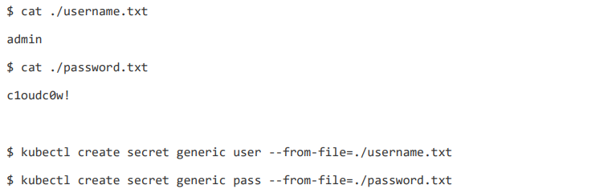

# Volume

>通过之前对 *Deployment* 的学习，我们粗略了解了 Kubernetes 的相关编排能力。*Deployment* 在**无状态应用**场景下被广泛运用，它非常适合来描述我们平时打交道的 **Web 应用**。
>
>而在有状态应用方向，*Deployment* 就显得捉襟见肘了。应用的扩缩容与升级不再是**没有先后顺序**的个体**（拓扑状态）**，应用的数据如何在重启时得以准确的恢复**（存储状态）**，是有状态应用场景下两个最基础的待解决问题。
>
>接下来，我们将主要剖析 Kubernetes 项目处理**容器持久化存储**的核心原理，从而帮助你更好地理解 Kubernetes 是如何描述与解决**存储状态**问题的。


## 从最常见的 Volume 说起

### emptyDir

还记得之前介绍**容器设计模式：SideCar** 时提到的 Tomcat 与 Java 应用的例子吗？这个 *Pod* 的 YMAL 定义如下：

```yaml
apiVersion: v1
kind: Pod
  name: javaweb-2
spec:
  initContainers:
  - image: geektime/sample:v2
    name: war
    command: ["cp", "/sample.war", "/app"]
    volumeMounts:
    - mountPath: /app
      name: app-volume
  containers:
  - image: geektime/tomcat:7.0
    name: tomcat
    command: ["sh","-c","/root/apache-tomcat-7.0.42-v2/bin/start.sh"]
    volumeMounts:
    - mountPath: /root/apache-tomcat-7.0.42-v2/webapps
      name: app-volume
    ports:
    - containerPort: 8080
      hostPort: 8001
  volumes:
  - name: app-volume
    emptyDir: {}
```

*Pod* 中在 `volumes` 通过 `emptyDir: {}` 定义了一个 **emptyDir** 类型的 Volume。并且，该 Volume 通过 `volumeMounts` 字段中的相关定义，被同时挂载到了两个容器之中，实现了容器间的数据共享。

**emptyDir** 类型的 Volume 具有以下特点：

- 在 *pod* 被调度至 *node* 时被创建，kubernetes 会在 *node* 上自动分配一个目录，因此无需明确的指定宿主机 *node* 上对应的目录。
- 该目录的初始内容为空，当 *Pod* 从 *node* 上移除时，**emptyDir** 中的数据会被**永久删除**。


### hostPath

同样的，见的非常多的还有 **hostPath** 类型的 Volume。可将上述 app-volume 作如下调整：

```yaml
apiVersion: v1
kind: Pod
  name: javaweb-2
spec:
  ...
  volumes:
  - name: app-volume
    hostPath:
    path: /data
```

不难理解，**hostPath** 类型的 Volume 为 *pod* 挂载宿主机上的目录或文件，使得容器可以使用宿主机的高速文件系统进行存储，但是存在相关缺点：

- kubernetes 中，*pod* 都是动态在各 *node* 上调度。一个以 **hostPath** 类型 Volume 存储了数据到本地 *node* 上的 *pod* ，在下次调度到另一个 *node* 时，就无法使用在之前 *node* 上所存储的文件了。
- 不过随着 *Pod* 的销毁，**hostPath** 类型的 Volume 所对应的宿主机目录并不会跟着被删除。


通过对 **emptyDir** 和 **hostPath** 的简单介绍，你需要特别注意与理解以下几点：

- **emptyDir** 和 **hostPath** 和 Docker 中的**匿名挂载**和**具名挂载**非常类似，两者原理基本一致，但是不要将其混淆。
- kubernetes 中的 Volume 是 *Pod* 级的，Volume 会被同时挂载至 *Pod* 中的各个容器内；而 Docker 中的 Volume 是容器级的。
- **emptyDir** 和 **hostPath** 多用于 ***Pod* 内容器间的数据共享**，它们解决不了 ***Pod* 间数据共享**的问题。

 

## Projected Volume

在 Kubernetes 中，存在几种特殊的 Volume，它们存在的意义不是为了**存放容器里的数据**，也不是用来进行**容器和宿主机之间的数据交换**。这些特殊 Volume 的作用，是**为容器提供预先定义好的数据** 。所以，从容器的角度来看，这些 Volume 里的信息就是仿佛是被 Kubernetes **投射（Project）**进入容器当中的。这正是**投射卷（Projected Volume）**的含义。

Kubernetes 支持的 **Projected Volume** 目前有四种：

- *Secret*
- *ConfigMap*
- *Downward API*
- *ServiceAccount*


### Secret

*Secret* 最典型的使用场景，莫过于存放数据库的认证信息。

```yaml
apiVersion: v1
kind: Pod
metadata:
  name: test-projected-volume
spec:
  containers:
  - name: test-secret-volume
    image: busybox
    args:
    - sleep
    - "86400"
    volumeMounts:
    - name: mysql-cred
      mountPath: "/projected-volume"
      readOnly: true
  volumes:
  - name: mysql-cred
    projected:
      sources:
      - secret:
        name: user
      - secret:
        name: pass
```

这个 *Pod* 中，定义了一个简单的容器。它声明挂载的 Volume，并不是常见的 **emptyDir** 或者 **hostPath** 类型，而是 **projected** 类型。而这个 Volume 的**数据来源（sources）**，则是名为 user 和 pass 的 *Secret* 对象，分别对应的是数据库的用户名和密码。


这里用到的数据库的用户名，密码，正是以 *Secret* 对象的方式提交给 Kubernetes 保存的。

```bash
kubectl create secret generic user --from-file=./username.txt
```



其中，username.txt 和 password.txt 文件里，存放的就是用户名和密码。而 user 和 pass，则是为 *Secret* 对象指定的名字。


可以通过 `kubectl get` 指令来查看这些 *Secret* 对象。

```bash
kubectl get secrets
```


当然，除了使用 `kubectl create secret` 指令外，也可以直接通过编写 YAML 文件的方式来创建 *Secret* 对象。

```yaml
apiVersion: v1
kind: Secret
metadata:
  name: mysecret
type: Opaque
data:
  user: YWRtaW4=            # Base64 转码后的结果
  pass: MWYyZDFlMmU2N2Rm
```

需要注意的是，*Secret* 对象要求这些数据必须是经过 **Base64** 转码的，以免出现明文密码的安全隐患。

```bash
echo -n 'admin' | base64
```


接下来创建之前的 *Pod*。

```bash
 kubectl create -f test-projected-volume.yaml
```

*Pod* 变成 Running 状态之后，验证一下这些 *Secret* 对象是否已在容器中了。

```bash
kubectl exec -it test-projected-volume -- /bin/sh
```


- 诸如此类的很多 **Key - Value** 形式的数据，多数情况下都可以通过环境变量的形式来处理。这种做法抛开明密文的安全问题不谈，还有一个很大的缺点就是无法动态更新。
- 而像这样通过挂载方式进入到容器内的 *Secret*，一旦其对应的 ETCD 中的对象数据被更新，这些 Volume 里的文件内容，同样也会被更新。kubelet 组件在定时维护这些 Volume。
- 这种更新操作伴随着一定的**延迟**。所以在诸如发起数据库连接的代码处，写好**重试和超时**的逻辑是很有必要的。


### ConfigMap

*ConfigMap* 与 *Secret* 非常类似，区别在于 *ConfigMap* 常用于保存不需要加密的，应用所需的配置信息。

*ConfigMap* 的用法几乎与 *Secret* 完全相同：你一样可以使用 `kubectl create configmap` 从文件或者目录创建 *ConfigMap*，也可以直接编写 *ConfigMap* 对象的 YAML 文件。

```bash
kubectl create configmap ui-config --from-file=example/ui.properties
```


查看该 *ConfigMap* 里保存的信息 。

```bash
kubectl get configmaps ui-config -o yaml
```


### Downward API

*Downward API* 旨在让 *Pod* 里的容器能够直接获取到这个 *Pod* 对象本身的信息。

以下是一个例子。

```yaml
apiVersion: v1
kind: Pod
metadata:
  name: test-downwardapi-volume
  labels:
  zone: us-est-coast
  cluster: test-cluster1
  rack: rack-22
spec:
  containers:
  - name: client-container
    image: k8s.gcr.io/busybox
    command: ["sh", "-c"]
    args:
    - while true; do
        if [[ -e /etc/podinfo/labels ]]; then
          echo -en '\n\n'; cat /etc/podinfo/labels; fi;
        sleep 5;
      done;
  volumeMounts:
  - name: podinfo
    mountPath: /etc/podinfo
    readOnly: false
  volumes:
  - name: podinfo
    projected:
    sources:
    - downwardAPI:
      items:
      - path: "labels"
      fieldRef:
      fieldPath: metadata.labels
```

- *Pod* 中定义了一个简单的容器，声明了一个 *Downward API* 类型的 Projected Volume，其中指出了要暴露 *Pod* 的 `metadata.labels` 信息给容器。
- `path: "labels"` 字段要求了 *Pod* 里 `labels` 的值被 Kubernetes 自动挂载成为容器里的 **/etc/podinfo/labels** 文件。
- 而该容器的启动命令，则是不断打印出 **/etc/podinfo/labels** 里的内容。

所以，当这个 *Pod* 被创建之后，即可通过 `kubectl logs` 指令，查看到这些 `labels` 字段被打印出来。

```bash
kubectl logs test-downwardapi-volume
```


*Downward API* 支持的常用的字段如下。

```
1. 使用 fieldRef 可以声明使用:
spec.nodeName							宿主机名字
status.hostIP							宿主机 IP
metadata.name							Pod 的名字
metadata.namespace						Pod 的 Namespace
status.podIP - Pod 的 IP
spec.serviceAccountName					Pod 的 Service Account 名字
metadata.uid - Pod 的 UID
metadata.labels['<KEY>']				指定 <KEY> 的 Label 值
metadata.annotations['<KEY>']			指定 <KEY> 的 Annotation 值
metadata.labels							Pod 的所有 Label
metadata.annotations					Pod 的所有 Annotation

2. 使用 resourceFieldRef 可以声明使用:
limit.cpu								容器的 CPU limit
requests.cpu							容器的 CPU request
limits.memory							容器的 memory limit
requests.memory							容器的 memory request
```


### ServiceAccount

*Service Account* 就是 Kubernetes 内置的一种**服务账户**，它是 Kubernetes 进行**权限分配**的对象，解决 API Server 的**授权问题**。如，*Service Account* A 只被允许对 Kubernetes API 进行 `GET` 操作，而 *Service Account* B 则可以有 Kubernetes API 的所有操作的权限。

- *Service Account* 的授权信息和文件，实际上保存在它所**绑定**的一个特殊的 *Secret* 对象里的。这个特殊的 *Secret* 对象，就叫作**ServiceAccountToken**。
- **ServiceAccountToken** 由 *Service Account* 的控制器创建。
- 任何运行在 Kubernetes 集群上的应用，都必须使用 **ServiceAccountToken** 里保存的**授权信息（Token）**，才可以合法地访问 API Server。

所以说，Kubernetes 项目的 Projected Volume 严格来说只有三种，**ServiceAccountToken** 只是一种特殊的 *Secret* 而已。


另外，为了使用方便，Kubernetes 已经为你提供了一个的**默认服务账户（default Service Account）**。并且，任何一个运行在 Kubernetes 里的 *Pod*，都可以直接使用这个默认的 *Service Account*，而无需显示地声明挂载它。

查看任意一个运行在 Kubernetes 集群里的 *Pod*。

```bash
kubectl describe pod nginx-deployment-5c678cfb6d-lg9lw
```


这个 *Secret* 类型的 Volume，正是默认 *Service Account* 对应的 **ServiceAccountToken**。

一旦 *Pod* 创建完成，容器里的应用就可以直接从这个默认 **ServiceAccountToken** 的挂载目录里访问到授权信息和文件。这个容器内的路径在 Kubernetes 里是固定的，即：`/var/run/secrets/kubernetes.io/serviceaccount`。


## PV && PVC

*PV* 与 *PVC* 的全称分别是**持久化存储数据卷（*Persistent Volume*）**，**持久化存储数据卷声明（*Persistent Volume Claim*）**。

*PV* 主要用于定义一个持久化存储在宿主机上的目录，如一个 **NFS** 的挂载目录。通常情况下，*PV* 对象是由**运维人员**事先创建在 Kubernetes 集群里**待用**的。可以这样定义一个 **NFS** 类型的 *PV*：

```yaml
apiVersion: v1
kind: PersistentVolume
metadata:
  name: nfs
spec:
  storageClassName: manual
  capacity:
  storage: 1Gi
  accessModes:
  - ReadWriteMany
  nfs:
  server: 10.244.1.4
  path: "/"
```


而 *PVC* 所描述的，通常是 *Pod* **所希望**使用的持久化存储的属性。如，Volume **存储大小**，**可读写权限**等等。*PVC* 对象通常由**开发人员**创建。可以这样声明一个 **1 GiB** 大小的 *PVC*：

```yaml
apiVersion: v1
kind: PersistentVolumeClaim
metadata:
  name: nfs
spec:
  accessModes:
  - ReadWriteMany
  storageClassName: manual
  resources:
  requests:
  storage: 1Gi
```


而用户创建的 *PVC* 要真正被容器使用起来，就必须先和某个符合条件的 *PV* 进行绑定。这里要检查的条件包括两部分：

-  *PV* 和 *PVC* 的 `spec` 字段匹配。如，*PV* 的存储 `storage` 大小，必须满足 *PVC* 的要求。
- *PV* 和 *PVC* 的 `storageClassName` 字段必须一致。

在 *PVC* 和 *PV* 成功绑定之后，*Pod* 就能够像使用 **hostPath** 等常规类型的 Volume 一样，在其 YAML 文件中声明使用这个 PVC 。

```yaml
apiVersion: v1
kind: Pod
metadata:
  labels:
  role: web-frontend
spec:
  containers:
  - name: web
    image: nginx
    ports:
  - name: web
    containerPort: 80
    volumeMounts:
    - name: nfs
      mountPath: "/usr/share/nginx/html"
  volumes:
  - name: nfs
    persistentVolumeClaim:
    claimName: nfs
```

*Pod* 需要做的，就是在 `volumes` 字段里声明自己要使用的 *PVC* 名字。*Pod* 创建之后，kubelet 就会把这个 *PVC* 所对应的 *PV*，也就是一个 **NFS** 类型的 Volume，挂载在这个 *Pod* 容器内的相关目录上。


*PVC* 和 *PV* 的设计，其实和**面向对象**的思想完全一致。

- *PVC* 可以理解为持久化存储的**接口**，它提供了对某种持久化存储的**描述**，但不提供具体的**实现**。
- *PV* 则负责完成这个持久化存储的**实现**部分。
- 作为应用**开发人员**，只需要跟 *PVC* 这个**接口**打交道，而不必关心具体的实现是 **NFS** 还是 **Ceph** 等。而专业的存储相关的知识，可以交给**运维人员**通过 *PV* 来实现。


*PV* 对象，又是如何变成容器里的一个**持久化**存储的呢？

- 持久化 Volume，指的就是这个**宿主机目录**具备**持久性**：该目录里面的内容，既不会因为容器的**删除**而被**清理**，也不会与当前宿主机所**绑定**。这样，当容器被**重启**或者在其他 *node* 上**重建**出来之后，它仍然能够通过挂载这个 Volume，访问到这些内容。
- 最开始提到的 **hostPath** 和 **emptyDir** 类型的 Volume 显然不具备上述特征：它们既有可能被 kubelet 清理掉，也不能被**迁移**到其他 *node* 上。
- 所以大多数情况下，持久化 Volume 的实现，往往依赖于一个**远程存储服务**。如：远程文件存储（**NFS**、**GlusterFS**），远程块存储（公有云提供的远程磁盘）。


*PV* 与 *PVC* 的引入，就是为了很好的描述 **Pod 间数据的共享与复用**这类语意，这是普通的 Pod Volumes （**emptyDir**，**hostPath**等）所做不到的。它将**存储和计算分离**，通过不同的组件来管理**存储资源**和**计算资源**，解耦 *Pod* 和 Volume 之间生命周期的关联。

这样，当 *Pod* 被删除之后，它所使用的 *PVC*，*PV* 仍然存在，在下次 *Pod* **重启**或被**新建**时，即可**复用**到之前的数据。Kubernetes 原生提供的用于描述**有状态应用**的 API 对象 *StatefulSet* ，就是利用这个机制解决了**有状态应用的存储状态问题**。


## StorageClass

*PV* 对象的创建，是由运维人员完成的。而在大规模的生产环境里，这其实是一个非常**麻烦**的工作。 一个大规模的 Kubernetes 集群里很可能有**成千上万**个 *PVC*，这就意味着运维人员必须得事先创建出成千上万个 *PV*。更麻烦的是，随着新的 PVC 不断被提交，运维人员就不得 不继续添加新的，能满足条件的 *PV*，否则新的 *Pod* 就可能因为 *PVC* 绑定不到 *PV* 而失败。

所以，Kubernetes 为用户提供了一套可以**自动创建** *PV* 的机制：**Dynamic Provisioning**。 相比之下，之前人工管理 *PV* 的方式就叫作 **Static Provisioning**。而 **Dynamic Provisioning** 机制工作的核心就在于 *StorageClass* 这个API 对象。

简而言之， *StorageClass* 对象的作用，其实就是创建 *PV* 的**模板**。具体地，*StorageClass* 会定义如下两个部分内容：

- *PV* 的属性。如，存储类型，Volume 的大小。
- 创建这种 *PV* 需要用到的**存储插件**。如，**Ceph** 。

有了这两个信息之后，Kubernetes 就能够根据用户提交的 *PVC*，找到一个对应的 *StorageClass* 。然后，Kubernetes 会调用该 *StorageClass* 声明的**存储插件**，创建出需要的 *PV*。这是一个使用 **Rook** 存储服务的例子：

```yaml
apiVersion: ceph.rook.io/v1beta1
kind: Pool
metadata:
  name: replicapool
  namespace: rook-ceph
spec:
  replicated:
  size: 3
---
apiVersion: storage.k8s.io/v1
kind: StorageClass
metadata:
  name: block-service
provisioner: ceph.rook.io/block
parameters:
  pool: replicapool
  #The value of "clusterNamespace" MUST be the same as the one in which your rook cluster exist
  clusterNamespace: rook-ceph
```

其中  `provisioner` 字段的值是 ：`ceph.rook.io/block`，这正是**存储插件**的名称。


作为应用开发者，只需要在 *PVC* 中指定要使用的 *StorageClass* 名字即可。即上述定义的 block-service。

```yaml
apiVersion: v1
kind: PersistentVolumeClaim
metadata:
  name: claim1
spec:
  accessModes:
  - ReadWriteOnce
  storageClassName: block-service
  resources:
  requests:
  storage: 30Gi
```

Kubernetes 就会通过**存储插件**自动的创建 *PV*，该 *PV* 的 *StorageClass* 名一样会是 block-service 。同时，Kubernetes 将 *StorageClass* 相同的 *PVC* 和 *PV* 绑定起来。

这样，通过 **Dynamic Provisioning** 机制，运维人员只需要在 Kubernetes 集群里创建出数量有限的 *StorageClass* 对象即可，它们将作为各种各样的 *PV* **模板**。


值得注意的是，*StorageClass* 并不是专门为了 **Dynamic Provisioning** 而设计的。如，在最开始的 *PV*，*PVC* 示例中，两者均声明了 `storageClassName: manual`，而实际上 Kubernetes  集群中并没有一个名叫 `manual` 的 *StorageClass* 对象。这是完全没有问题的，这个时候 Kubernetes 进行的是 **Static Provisioning**，只是在做**绑定决策**的时候，它依然会考虑 *PV* 和 *PVC* 的 *StorageClass* 定义。

甚至当在定义 *PV*，*PVC* 时，没有显示的声明 *StorageClass* 也可以。这时，*PVC* 的 `storageClassName` 的值就是 “”，这也意味着它只能够跟 `storageClassName` 也是 “” 的 *PV* 进行绑定。


可以用下图来总结一下 *PV*，*PVC*，*StorageClass* 的关系：


- *PVC* 描述的，是 *Pod* 想要使用的**持久化存储的属性**。如，存储的大小，读写权限。
- *PV* 描述的，是一个具体的 **Volume 的属性**。如， Volume 的类型，挂载目录，远程存储服务器地址。
- *StorageClass* 的作用，是充当 **PV 的模板**。并且，只有同属于一个 *StorageClass* 的 *PV* 和 *PVC*，才可以绑定在一起。