# Redis Keepalived HA

>Redis是一款高性能的键值型内存数据库，其提供了三种集群模式以解决单点问题，分别是主从模式、sentinel哨兵模式，cluster集群模式。本文将简要介绍与验证基于Redis主从 + Keepalived所实现的高可用方案，以取代sentinel哨兵模式。


## 测试环境

| IP            | OS         | VIP           | 中间件                              |
| ------------- | ---------- | ------------- | ----------------------------------- |
| 172.18.40.198 | CentOS 7.6 | 172.18.40.222 | redis (master)，keepalived (master) |
| 172.18.40.199 | CentOS 7.6 | 172.18.40.222 | redis (slave)，keepalived (backup)  |


## 功能验证

### 初始状态

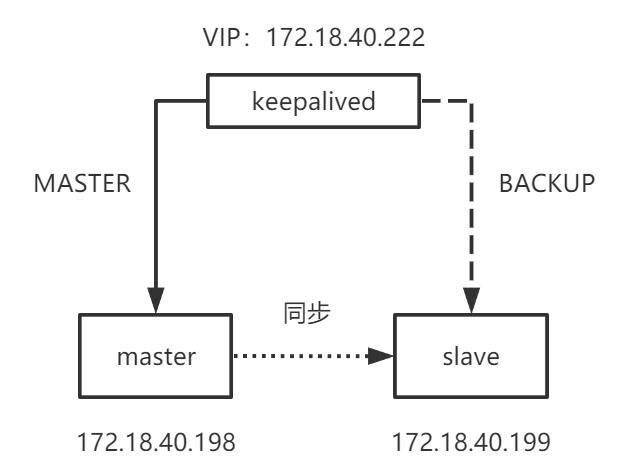


### 测试过程

停止当前redis主节点 (198)。

```bash
service redis stop
```


触发keepalived检测脚本，查看通知脚本日志显示尝试重启redis成功。

```bash
vim /app/log/keepalived/redis-state.log
```


同时停止当前redis主节点 (198) 和keepalived主节点 (198)，模拟宕机。

```bash
service redis stop && service keepalived stop
```


查看keepalived从节点系统日志 (199)，显示已切换为`MASTER`状态。

```bash
journalctl -xe
```


VIP发生漂移。

```bash
ip a
```

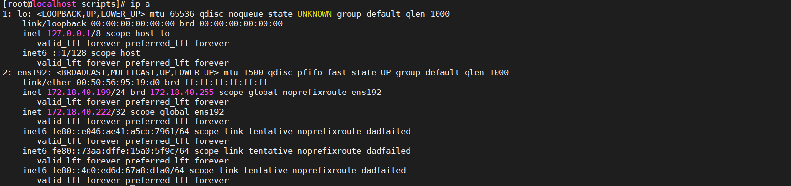


查看当前keepalived主节点 (199)通知脚本日志，显示redis从节点已切换为主 (199)，完成切换。


检查199服务器redis的info信息，显示确实已经提升为主节点。

```bash
/app/soft/redis-5.0.5/bin/redis-cli -a powersi@redis info replication
```

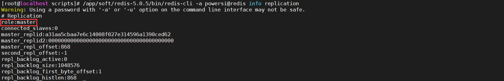


恢复已停止的keepalived原主节点 (198)。

```bash
service keepalived start
```


查看198系统日志，显示当前keepalived节点已通过检测，且重新提权成为主节点。


VIP已漂回198服务器。


查看198通知脚本日志，显示keepalived首先尝试重启了198服务器的redis，再`SYNC`当前redis主节点 (199) 进行数据同步，最后将198的redis提升为主节点，完成切回。


同时间，检查199服务器的通知脚本日志，显示其再等待对方`SYNC`同步后，切换回了redis从节点。至此，整个容灾流程已跑通。


## 数据丢失验证

### Java demo

```java
package com.xzq.keepalived;

import redis.clients.jedis.Jedis;
import redis.clients.jedis.exceptions.JedisConnectionException;
import redis.clients.jedis.exceptions.JedisDataException;

/**
 * 计数器
 *
 * @author xzq
 */
public class IncrDemo {

    public static void main(String[] args) throws InterruptedException {

        // 从VIP获得redis连接
        Jedis client = new Jedis("172.18.40.222", 6379);
        client.auth("powersi@redis");
        // 总请求数
        int qry = 0;
        // 总异常数
        int err = 0;

        while (true) {
            try {
                // 发送连续请求
                int pos = client.incr("data").intValue();
                System.out.println("成功写入数据，当前data自增至" + pos);
                // 存在数据丢失 打印相关信息
                if (qry != pos - 1) {
                    System.out.println("数据丢失，原请求数" + qry + "，现自增后结果" + pos);
                }
                // 更新请求数
                qry = pos;
                Thread.currentThread().sleep(50);
            } catch (JedisConnectionException e1) {
                err++;
                System.out.println("第" + err + "次连接异常，无法访问redis");
                try {
                    // 尝试重新获取redis连接
                    client = new Jedis("172.18.40.222", 6379);
                    client.auth("powersi@redis");
                    System.out.println("重新获取redis连接成功");
                } catch (Exception e2) {
                    System.out.println("第" + err + "次尝试获取redis连接失败");
                }
            } catch (JedisDataException e3) {
                System.out.println("当前redis节点不可写");
            }
        }
    }
}

```


### 容灾切换

>**场景描述**
>
>- 前提：初始状态。
>- 事件：198服务器宕机，199服务器redis从节点提升为主节点，并继续对外提供服务。

启动Java测试demo，持续`incr`中。

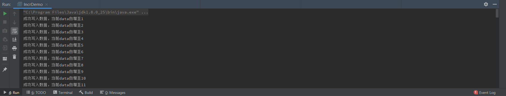


模拟198服务器宕机。


redis客户端连接中断，在尝试2次重连后成功，继续写入数据，自增Key连续，无丢失数据日志打印。容灾切换过程无数据丢失。

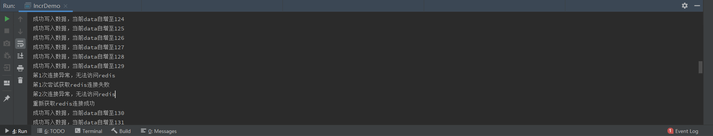


### 恢复切回

>**场景描述**
>
>- 前提：198服务器宕机，199服务器redis提升为主节点且持续对外提供服务。
>- 事件：198服务器keepalived恢复，redis主节点切回，同时199服务器redis降级为从节点。

模拟198服务器宕机。


启动Java测试demo，持续incr中。


恢复198服务器keepalived。


keepalived尝试重启198服务器的redis，之后同步了10s的数据，最后将198的redis提升为主节点。

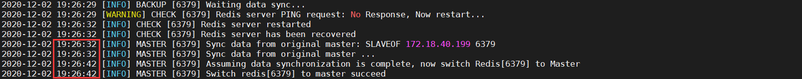


keepalived切回时，redis客户端连接中断，在尝试1次重连后成功，之后10s的同步数据时间均不可写。

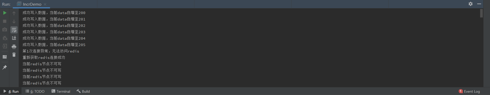


数据同步完成，198服务器redis提升为主节点，对外提供服务，继续写入数据，自增Key连续，无丢失数据日志打印。恢复切回过程无数据丢失。

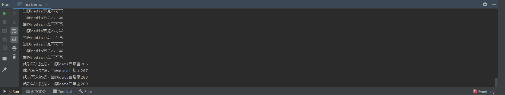

>**说明**
>
>- 这里的数据无丢失是片面的，只能说明10s内将数据同步完成了。假如数据量很大，比如此时199服务器redis已运行了几天，这时198服务器恢复，10s的同步时间并未同步完所有数据，则可能导致数据丢失。


### 特殊情况

>**场景描述**
>
>- 前提：恢复切回后，数据刚同步完成，198服务器redis提升为主节点。
>- 事件：5s内，再次发生容灾切换，即198服务器keepalived宕机。

启动Java测试demo，持续incr中。


198服务器宕机，容灾切换发生，重新获得redis连接后，自增Key连续，无数据丢失。

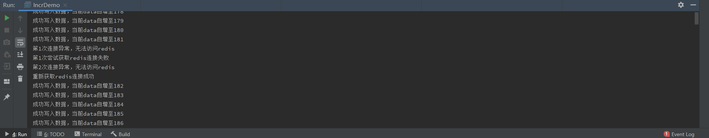


198服务器keepalived恢复。恢复切回，重新获取redis连接。

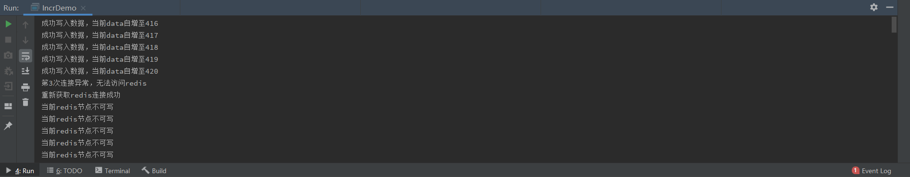


198服务器redis数据同步完成，自增Key连续，无数据丢失。

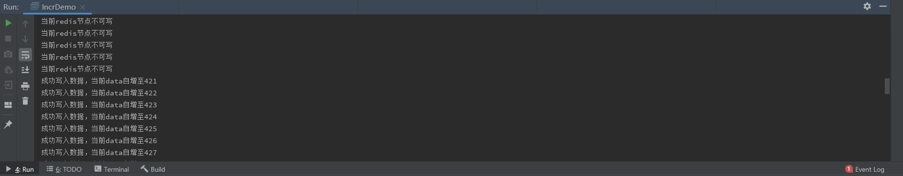


5s内，198服务器再次宕机，VIP漂移至199服务器，此时199服务器redis仍处于redis_backup.sh脚本中等待对方同步的状态 (199服务器redis等待同步睡眠15s，而198服务器redis同步只用10s)，其状态仍然为redis主节点，即还未向当前对外提供服务的198服务器同步这5s内的最新数据 ，造成数据丢失情况。下图自增Key为421，正好对应198服务器恢复后写入的第一份数据。

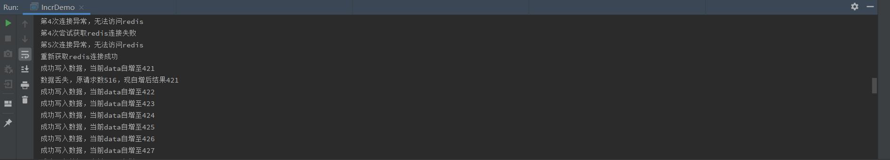


## 相关问题

### keepalived当前state获取方法

使用`notify`命令指定keepalived状态文件。

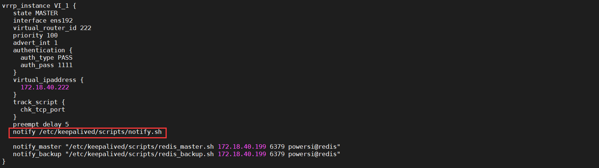


定义通知脚本notify.sh。

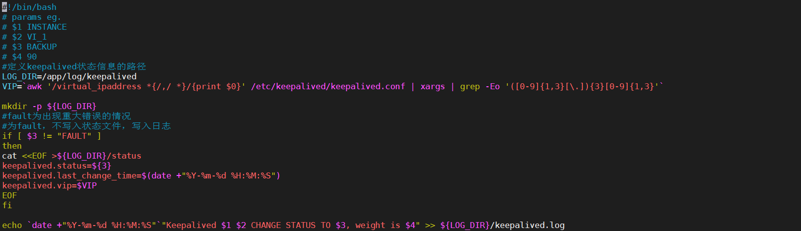


查看实时打印的keepalived状态日志。

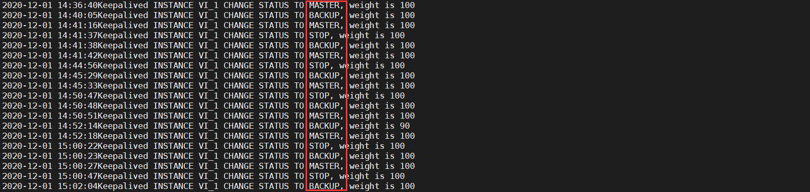


截取当前keepalived状态。

```bash
awk 'END {print $8}' /app/log/keepalived/keepalived.log | sed 's/,//g'
```


### keepalived初始化BACKUP状态

重启keepalived主节点。


系统日志。

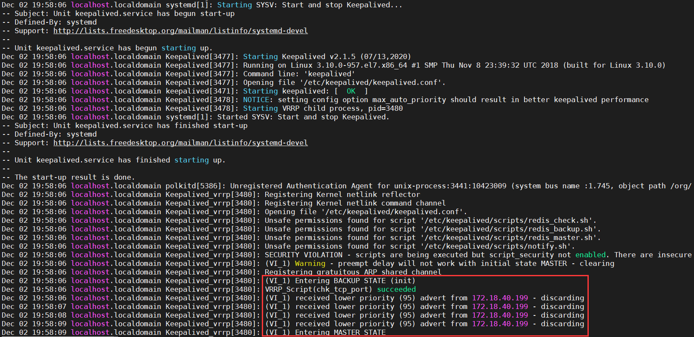


可见keepalived启动流程如下：

- 初始化当前节点为`BACKUP`，执行`notify_backup`所指定的通知脚本。
- 运行`VRRP_Script`配置块中指定的检测脚本，节点权值发生转变。
- 若当前节点权值满足成为`MASTER`，则切换为`MASTER`，同时执行`notify_master`所指定的通知脚本。


### 存在双向同步情况

>**场景描述**
>
>- 前提：初始状态。
>- 事件：keepalived主节点 (198) 重启。

重启198服务器keepalived。


198服务器系统日志。


>**说明**
>
>- 16:59，keepalived重启，初始化`BACKUP`，执行redis_backup.sh。
>- 17:03，keepalived重启4秒后 (keepalived检测间隔)，通过检测脚本，提权为`MASTER`，执行redis_master.sh。
>- 17:03 --- 17:13，redis_master.sh脚本执行期间，发现199服务器redis存活，尝试同步。此时198服务器redis为从节点。
>- 17:13，redis_master.sh脚本同步数据开始10s后 (脚本中同步时间设置的10s)，198服务器redis成为主节点。
>- 17:14，redis_backup.sh开始执行15s后 (睡眠15秒)，发现当前keepalived节点为`MASTER`，不执行降级从节点动作。无日志打印。


199服务器系统日志。


>**说明**
>
>- 16:59，198服务器keepalived主节点死亡，199服务器keepalived立即被提升为`MASTER`，同时触发redis_master.sh。
>- 17:03，198服务器keepalived重启4秒后，进行了第一次脚本检测且通过，其权值恢复且被提升为`MASTER`。同时，199服务器keepalived切换为`BACKUP`，触发redis_backup.sh。
>- 16:59 --- 17:09，redis_master.sh脚本执行期间，发现198服务器redis存活，尝试同步。此时199服务器redis为从节点。
>- 17:09，redis_master.sh脚本同步数据开始10s后 (脚本中同步时间设置的10s)，199服务器redis成为主节点。
>- 17:18，redis_backup.sh开始执行15s后 (睡眠15秒)，发现当前keepalived节点为`BACKUP`，降级从节点。


可见，17:03 --- 17:09时间段内，198、199服务器redis均为从节点且相互同步数据。


## 附页

### redis_check.sh (检测)

```bash
#!/usr/bin/env bash

PORT=$1
PASSWORD=$2
. /home/app/.bashrc

REDISCLI="redis-cli -p $PORT -a $PASSWORD"
LOGFILE="/app/log/keepalived/redis-state.log"

function log() {
    local LEVEL=$1
    local MESSAGE=$2
    local TS=`date '+%Y-%m-%d %H:%M:%S'`

    echo "$TS [$LEVEL] CHECK [$PORT] $MESSAGE" >> $LOGFILE
}

RESP=`$REDISCLI PING`
if [ "$RESP"x != "PONG"x ]; then
	log WARNING "Redis server PING request: No Response, Now restart..."
        service redis restart
	sleep 3
	log INFO "Redis server restarted"
	if [ "`$REDISCLI PING`"x != "PONG"x ]; then
		log ERROR "Redis server has crashed" 
		exit 1
	else 
		log INFO "Redis server has been recovered"
	fi
	# 获取当前keepalived状态，MASTER，BACKUP，STOP
	STATE=`awk 'END {print $8}' /app/log/keepalived/keepalived.log | sed 's/,//g'`
	if [ "$STATE"x == "MASTER"x ]; then
		$REDISCLI SLAVEOF NO ONE
		if [ $? -ne 0 ]; then
			log ERROR "Switch redis[$PORT] to master failed"
		else
			log INFO "Switch redis[$PORT] to master succeed"
		fi
	fi
	exit 0
else
	exit 0
fi
```


### redis_master.sh (提升主节点)

```bash
#!/usr/bin/env bash

MASTER_IP=$1
MASTER_PORT=$2
PASSWORD=$3
. /home/app/.bashrc

REDISCLI="redis-cli -p $MASTER_PORT -a $PASSWORD"
LOGFILE="/app/log/keepalived/redis-state.log"

function log() {
    local LEVEL=$1
    local MESSAGE=$2
    local TS=`date '+%Y-%m-%d %H:%M:%S'`

    echo "$TS [$LEVEL] MASTER [$MASTER_PORT] $MESSAGE" >> $LOGFILE
}

# 判断待同步主节点是否存活
RESP=`$REDISCLI -h $1 PING`
if [ "$RESP"x = "PONG"x ]; then
    log INFO  "Sync data from original master: SLAVEOF $MASTER_IP $MASTER_PORT"
    # slaveof当前主节点，sync同步数据
	$REDISCLI SLAVEOF $MASTER_IP $MASTER_PORT
	if [ $? -ne 0 ]; then
		log ERROR "Sync data from original master failed"
	else
		log INFO "Sync data from original master ..."
	fi
    # 睡眠10s，等待数据同步
	sleep 10
fi

log INFO "Assuming data synchronization is complete, now switch Redis[$MASTER_PORT] to Master"
# 提升当前slave为master
$REDISCLI SLAVEOF NO ONE
if [ $? -ne 0 ]; then
    log ERROR "Switch redis[$MASTER_PORT] to master failed"
else
    log INFO "Switch redis[$MASTER_PORT] to master succeed"
fi
```


### redis_backup.sh (降级从节点)

```bash
#!/usr/bin/env bash

MASTER_IP=$1
MASTER_PORT=$2
PASSWORD=$3
. /home/app/.bashrc

REDISCLI="redis-cli -p $MASTER_PORT -a $PASSWORD"
LOGFILE="/app/log/keepalived/redis-state.log"

function log() {
    local LEVEL=$1
    local MESSAGE=$2
    local TS=`date '+%Y-%m-%d %H:%M:%S'`

    echo "$TS [$LEVEL] BACKUP [$MASTER_PORT] $MESSAGE" >> $LOGFILE
}

log INFO "Waiting data sync..."

sleep 15

# 当前keepalived状态，MASTER，BACKUP，STOP
STATE=`awk 'END {print $8}' /app/log/keepalived/keepalived.log | sed 's/,//g'`

# 若当前keepalived状态为MASTER，则不将当前redis降级为从
if [ "$STATE"x != "MASTER"x ]; then
	log INFO "Switching redis server $MASTER_PORT to slave mode"
	$REDISCLI SLAVEOF $MASTER_IP $MASTER_PORT
	if [ $? -ne 0 ]; then
		log ERROR "Switch redis server $MASTER_PORT to slave mode failed"
	else
		log INFO "Switch redis server $MASTER_PORT to slave mode succeed"
	fi
fi
```


### keepalived.conf

- MASTER

```conf
! Configuration File for keepalived
global_defs {
   router_id REDIS-HA
   script_user root
}

vrrp_script chk_tcp_port {
    script "/etc/keepalived/scripts/redis_check.sh 6379 powersi@redis"	# 检测脚本
    weight -10	# script返回值非0时，priority减少10
    interval 4	# 检测间隔
    rise 3		# 成功3次，服务器被标记为成功
    fall 2		# 失败2次，服务器被标记为失败
}

vrrp_instance VI_1 {
   state MASTER	# 初始状态
   interface ens192
   virtual_router_id 222
   priority 100	# 权值
   advert_int 1
   authentication {
     auth_type PASS
     auth_pass 1111
   }
   virtual_ipaddress {
     172.18.40.222
   }
   track_script {
     chk_tcp_port
   }
   preempt_delay 5
   notify /etc/keepalived/scripts/notify.sh
   
   # 当前keepalived节点切换为MASTER时，触发redis_master.sh (提升主节点脚本)
   notify_master "/etc/keepalived/scripts/redis_master.sh 172.18.40.199 6379 powersi@redis"	
   # 当前keepalived节点切换为BACKUP时，触发redis_backup.sh (降级从节点脚本)
   notify_backup "/etc/keepalived/scripts/redis_backup.sh 172.18.40.199 6379 powersi@redis"
}

```

- BACKUP

```conf
! Configuration File for keepalived
global_defs {
   router_id REDIS-HA
   script_user root
}

vrrp_script chk_tcp_port {
    script "/etc/keepalived/scripts/redis_check.sh 6379 powersi@redis"
    weight -10
    interval 4
    rise 3
    fall 2
}

vrrp_instance VI_1 {
   state BACKUP
   interface ens192
   virtual_router_id 222
   priority 95
   advert_int 1
   authentication {
     auth_type PASS
     auth_pass 1111
   }
   virtual_ipaddress {
     172.18.40.222
   }
   track_script {
     chk_tcp_port
   }
   preempt_delay 5
   notify /etc/keepalived/scripts/notify.sh

   notify_master "/etc/keepalived/scripts/redis_master.sh 172.18.40.198 6379 powersi@redis"
   notify_backup "/etc/keepalived/scripts/redis_backup.sh 172.18.40.198 6379 powersi@redis"
}
```


