# Redis 主从双中心容灾

>Redis是一款高性能的键值型内存数据库，其提供了三种集群模式以解决单点问题，分别是主从模式、sentinel模式，cluster模式。本文将对Redis主从模式集群的容灾方案进行简要说明。


## 测试环境

| IP            | PORT | ROLE   | OS         | LOCATION |
| ------------- | ---- | ------ | ---------- | -------- |
| 172.18.40.173 | 6379 | master | CentOS 7.5 | A        |
| 172.18.40.174 | 6379 | slave  | CentOS 7.5 | A        |
| 172.18.40.175 | 6379 | slave  | CentOS 7.5 | B        |


## 主从同步

>Redis 支持简单且易用的**主从复制**（master-slave replication）功能，该功能可以让从服务器（slave server）成为主服务器（master server）的精确复制品。


### 相关特征

- **异步复制**，不保证强一致性。
- 一个主服务器可以有多个从服务器。
- **从服务器也可以有自己的从服务器**，多个从服务器之间可以构成一个图状结构。
- **复制功能不会阻塞主服务器**：即使有一个或多个从服务器正在进行初次同步（SYNC），主服务器也可以继续处理命令请求。
- **复制功能也不会阻塞从服务器**：只要在 `redis.conf` 文件中进行了相应的设置，即使从服务器正在进行初次同步（SYNC），服务器也可以使用旧版本的数据集来处理命令查询。不过，在从服务器删除旧版本数据集并载入新版本数据集的那段时间内，连接请求会被阻塞。
- 复制功能可以单纯地用于**数据冗余**（data redundancy）， 也可以通过让多个从服务器处理只读命令请求来提升**扩展性**（scalability）：比如说， 繁重的`SORT`命令可以交给附属节点去运行。
- 可以通过复制功能来让主服务器免于执行持久化操作：只要关闭主服务器的持久化功能，然后由从服务器去执行持久化操作即可（**前提是从服务器一直存活**，靠**增量同步**来保证自身数据的更新，同时持久化到本地）。


### 全量同步（SYNC）

Redis全量同步一般发生在slave初始化阶段，这时slave需要将master上的所有数据都复制一份。具体步骤如下： 

- 无论是初次连接还是重新连接，当建立一个从服务器时，从服务器都将向主服务器发送一个`SYNC`命令。
- 接到`SYNC`命令的主服务器将开始执行`BGSAVE`，并在保存操作执行期间，**将所有新执行的写入命令都保存到一个缓冲区里面**。
- 当`BGSAVE`执行完毕后，主服务器将执行保存操作所得的 `.rdb` 文件发送给从服务器，从服务器接收这个 `.rdb` 文件，并将文件中的数据载入到内存中（反序列化）。
- 之后主服务器会以Redis命令协议的格式，**将写命令缓冲区中积累的所有内容都发送给从服务器**。
- 全量同步结束后，后续master收集到的写命令都会通过之前建立的连接，增量发送给salve端，slave重做这些命令以保证数据的更新，称为**增量同步**。
- 即使有多个从服务器同时向主服务器发送`SYNC`，主服务器也只需执行一次`BGSAVE`命令，就可以处理所有这些从服务器的同步请求。


### 部分重同步（PSYNC）

从服务器可以在主从服务器之间的连接断开时进行自动重连，在Redis 2.8版本之前，断线之后重连的从服务器总要执行一次完整重同步（full resynchronization）操作。

从Redis 2.8开始， 在网络连接短暂性失效之后，主从服务器可以尝试继续执行原有的复制进程（process），而不一定要执行完整重同步操作。

这个特性需要主服务器为被发送的复制流创建一个内存缓冲区（in-memory backlog），并且主服务器和所有从服务器之间都记录一个复制偏移量（replication offset）和一个主服务器ID（master run id），当出现网络连接断开时， 从服务器会重新连接，并且向主服务器请求继续执行原来的复制进程：

- 如果从服务器记录的主服务器ID和当前要连接的主服务器的ID相同，并且从服务器记录的偏移量所指定的数据仍然保存在主服务器的复制流缓冲区里面，那么主服务器会向从服务器发送断线时缺失的那部分数据，然后复制工作可以继续执行。
- 否则的话，从服务器就要执行完整重同步操作。
- Redis 2.8以上版本的该部分重同步特性则用到一个新增命令`PSYNC`。


## 初步验证

### 预期状态

初始双机房环境。

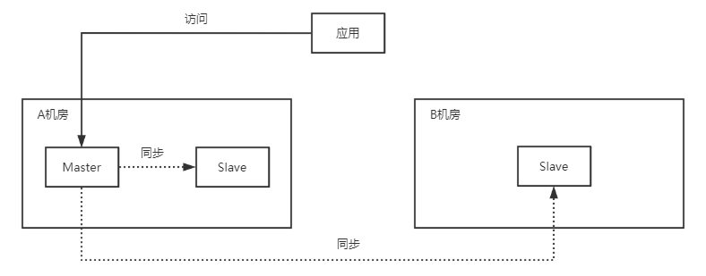


A机房宕机，切换至B机房工作。

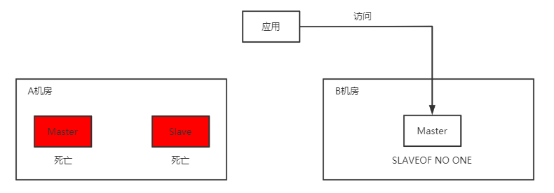


A机房恢复，进行数据同步。

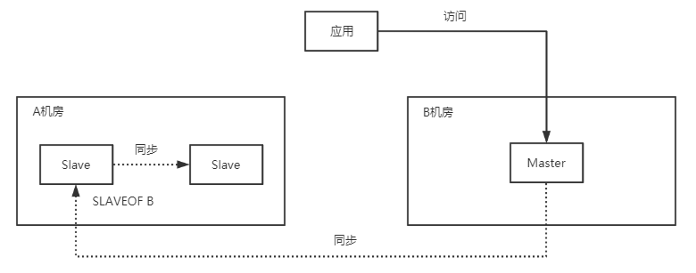


数据同步完成，恢复至初始状态。

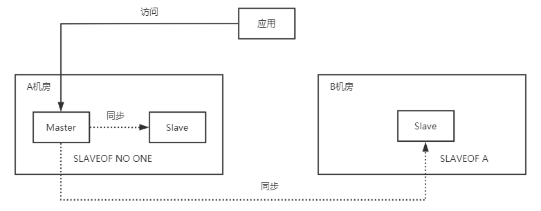


### 测试过程

搭建主从集群，置173为master节点（A机房），174（A机房）、175（B机房）为slave节点。在主节点查看复制信息。

```redis
INFO REPLICATION
```

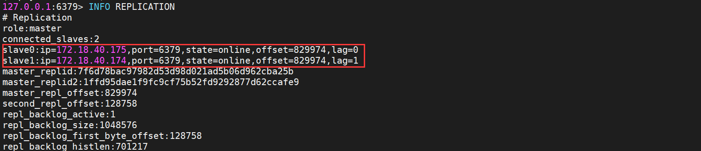


在A机房主节点（173）添加Key，测试同步。

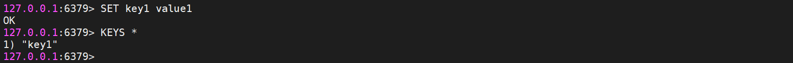


分别在两个从节点（174、175）查看数据同步情况。

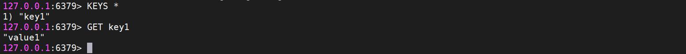


手动关闭A机房所有节点（173、174），模拟掉电。

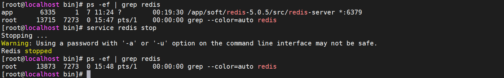

这里选择依次关闭两个节点，其实不太准确，最贴切的测试方案应该是A机房的主从节点均部署在同一服务器上，用直接关机来模拟掉电。不过由于Redis主从集群没有自动容灾的能力，对于测试结果没有影响。而在Redis cluster集群模式下，若关闭节点有先后顺序，则会得到截然不同的结果。


查看此时B机房从节点（175）的信息，显示A机房主节点已下线。

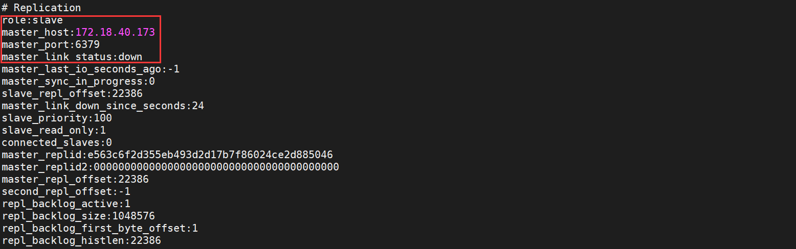


将B机房从节点（175）提升为主节点，模拟容灾触发。

```redis
SLAVEOF NO ONE
```

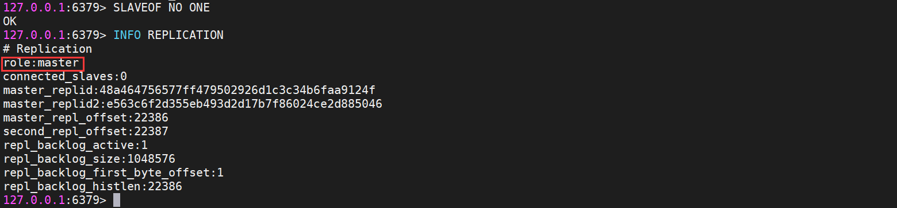


在B机房新主节点（175）写入数据，模拟备用机房启用，且对外提供服务。

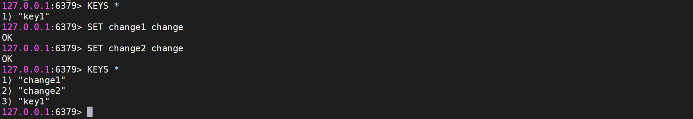


重启A机房的所有节点（173、174），模拟电力恢复。

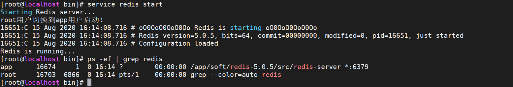


分别查看恢复后的A机房主从节点（173、174）数据，丢失掉电期间B机房新主节点所添加的部分数据。

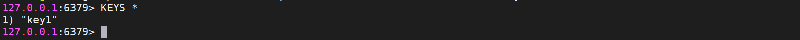


将A机房的主节点（173）设置为B机房新主节点（175）的从节点，利用主从备份来恢复数据。

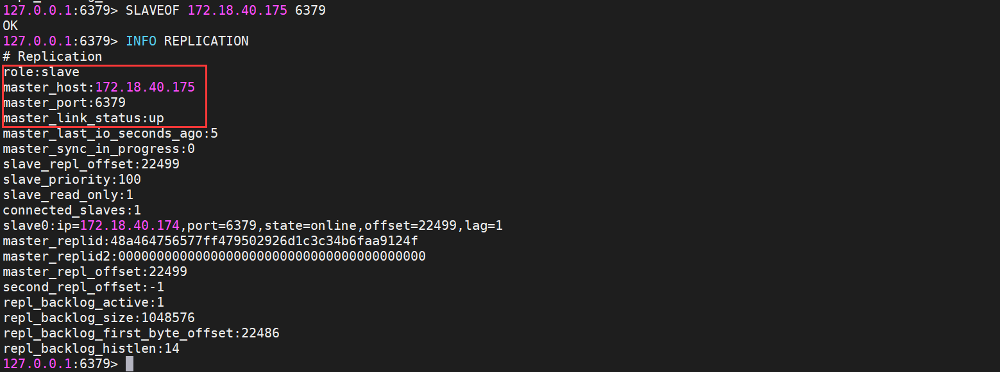


新从服务器（173）建立，触发全量同步。再次查看A机房从从节点（173、174）的数据。

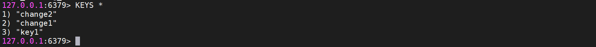


数据已同步，将集群恢复至初始状态。模拟A机房（173、174）完全恢复，准备对外开始提供服务。

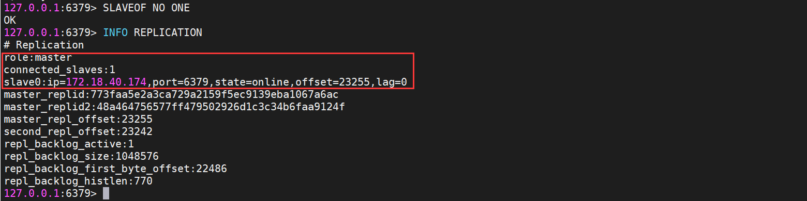


将B机房的主节点（175）设置为A机房主节点（173）的从节点，继续负责备份。

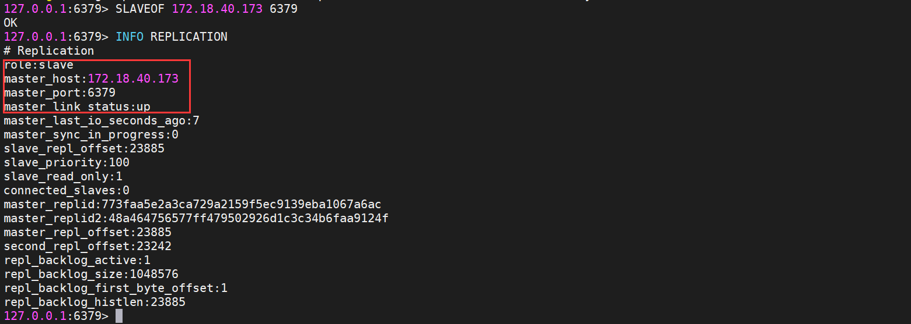


在A机房主节点（173）再次写入数据，分别查看两个从节点（174、175）的备份情况。

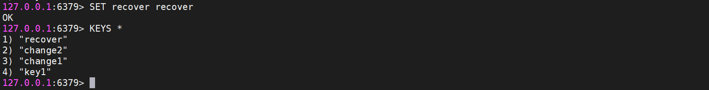

从节点数据。

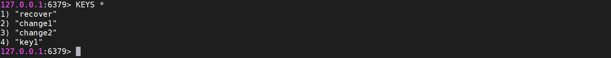


##  整合Keepalived

### 初态

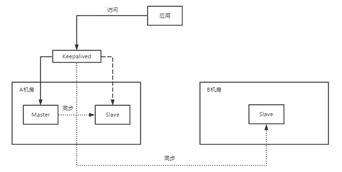

>**说明**
>
>1. [Redis Keepalived HA](http://iiiceoo.github.io/#/md/redis/redis-keepalived-ha/redis-keepalived-ha)
>2. Redis集群整体为一主两从，A机房分布一主一从，B机房放置一从。主要目标为，**在A机房健康时，极大可能的使用A机房的Redis实例对外提供服务**；当A机房完全宕机时，切换至B机房提供服务。
>3. A机房主从间搭建Keepalived，对外开放一个统一的`VIP`，**VIP总指向A机房主节点的地址**。
>4. B机房的**从节点**`slaveof VIP`，即在A机房健康的情况下，**它总对当前的主节点进行备份**。


### 故障转移

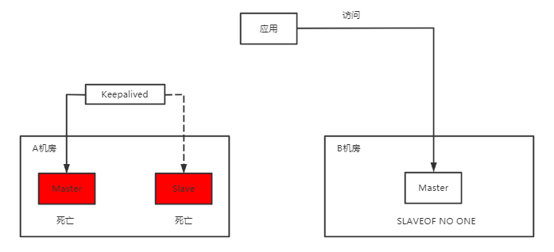

>**说明**
>
>1. B机房**从节点**执行`SLAVEOF NO ONE`命令，将自身提升为**主节点**。
>2. DNS切换至灾备场景，B机房开始对外提供服务。


### 反向同步

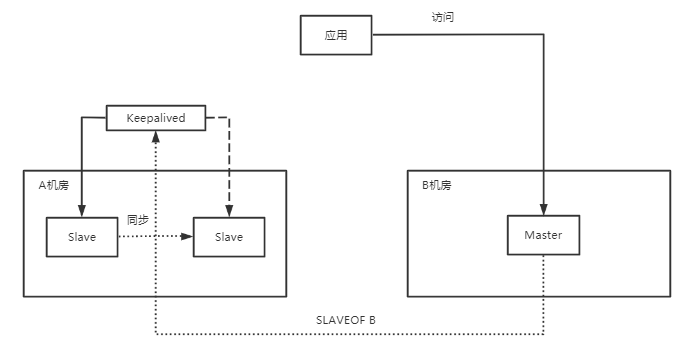

>**说明**
>
>1. A机房故障恢复。
>2. 通过由**VIP**获得A机房对应**主节点**连接，执行`SLAVEOF B`命令开始进行数据同步。


### 恢复

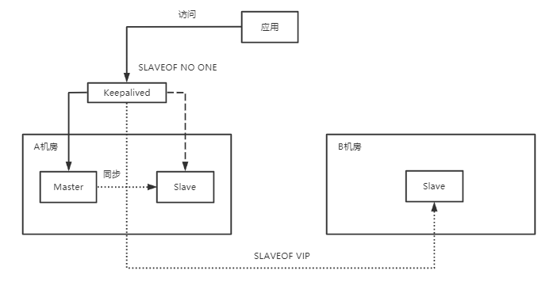

>**说明**
>
>1. 通过**VIP**获得A机房对应**从节点**的连接，执行`SLAVEOF NO ONE`命令提升其自身为**主节点**。
>2. B机房**主节点**执行`SLAVEOF VIP`命令，恢复初态。
>3. DNS切换为默认场景，A机房恢复对外提供服务。