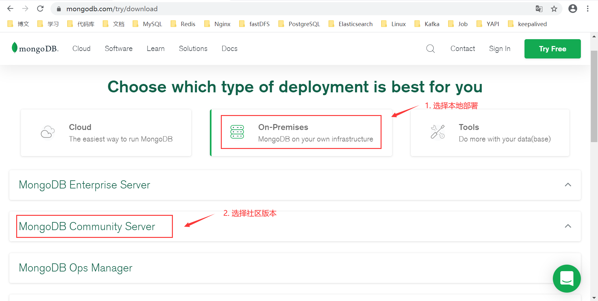

# YApi部署

>YApi 是一款高效、易用、功能强大的 api 管理软件，旨在为开发、产品、测试人员提供更优雅的接口管理服务。可以帮助开发者轻松创建、发布、维护 API。本文将简要介绍YApi的部署流程。


## 测试环境

| IP             | CPU  | Mem  | OS         | APP                    |
| -------------- | ---- | ---- | ---------- | ---------------------- |
| 192.168.33.100 | 2C   | 2G   | Centos 7.5 | Nodejs，monggodb，YApi |


## Nodejs安装

访问nodejs官网，[下载最新安装包](https://nodejs.org/en/download/)。注意nodejs版本需7.6+。


上传包至服务器，解压安装。

```bash
tar -xvf node-v12.18.2-linux-x64.tar.xz
mv node-v12.18.2-linux-x64 /usr/local/nodejs
```


建立软连接。

```bash
ln -s /usr/local/nodejs/bin/node /usr/local/bin/node
ln -s /usr/local/nodejs/bin/npm /usr/local/bin/npm
```


在任何目录输入 node -v 显示版本号就安装完毕。


## Mongodb安装

访问mongodb官网，[下载最新安装包](https://www.mongodb.com/try/download)。注意mongodb版本需2.6+。




上传包至服务器，解压安装。

```bash
tar -xzvf mongodb-linux-x86_64-rhel70-4.2.8.tgz
mv mongodb-linux-x86_64-rhel70-4.2.8 /usr/local/mongodb
```


新增数据、日志、配置目录，修改配置文件。

```bash
cd /usr/local/mongodb/
mkdir data log config
cd config/
vim mongodb.config
```


mongodb.config详情。


以指定配置文件启动mongodb，这里事先配置了bin目录的环境变量。

```bash
mongod -f /usr/local/mongodb/conf/mongodb.conf
```


启动成功显示。


若需要关闭mongod服务。

```bash
mongod -f /usr/local/mongodb/conf/mongodb.conf –-shutdown
```

或在客户端中关闭mongod服务。

```mongodb
> use admin
> db.auth("account","password")
> db.shutdownServer()
```


连接mongodb。

```bash
mongo
```


查看数据库。

```mongodb
> show dbs
```


可以看到，这里并未看到mongodb初始的三个数据库，这是由于之前定义的配置文件mongodb.conf中已开启了**权限认证**，所以这里先为mongodb添加用户，通过权限认证后方可看到相关数据库。


在admin库创建一个超级用户，角色为userAdminAnyDatabase。

```mongodb
> use admin
> db.createUser({user: "admin", pwd: "123456", roles: [{ role: "userAdminAnyDatabase", db: "admin"}]})
```


建立yapi库，作为后续YApi使用的数据库，同时也为它也建立一个管理员。

```mongodb
> use yapi
> db.createUser({user: "yapi", pwd: "yapi", roles: [{role: "dbOwner", db: "yapi"}]})
```


这里选择为yapi用户赋`dbOwner`角色而不是普通的`readWrite`角色。原因是后续YApi部署时初始化表结构时有相关建立索引的操作，如果只是普通的readWrite角色可能由于权限不足，**无法创建索引而出错**。


现在则能验证是否能通过权限认证而看到相关表信息。

```mongodb
> use admin
> db.auth("admin", "123456")
> show dbs
```


这里看不到yapi库是由于yapi库中没有数据，mongodb的数据库只有在有**数据添加时才被真正创建**。


## YApi部署

相关地址如下，官方部署文档中的命令行部署方式执行YApi部署。

[官方部署文档]: https://hellosean1025.github.io/yapi/devops/index.html
[github地址]: https://github.com/YMFE/yapi
[gitee地址]: https://gitee.com/mirrors/YApi


创建YApi目录，git拉取项目。

```bash
mkdir /usr/local/yapi
cd /usr/local/yapi
git clone https://gitee.com/mirrors/YApi vendors
```


修改YApi配置文件config.json。

```bash
cp vendors/config_example.json ./config.json
vim config.json
```


安装生产依赖，执行部署。

```bash
cd vendors
npm install --production --registry https://registry.npm.taobao.org
```


有相关报错，这里提示mysql用户没有权限去创建相关目录，这是由于**npm命令禁止root操作**，显然这里自动切换至mysql用户来执行命令了而导致权限不够。可在npm命令后加上`--unsafe-perm`参数解决该问题，即忽略这种安全策略，可用root用户执行npm命令。


npm启动YApi服务。

```bash
npm run install-server
```


服务启动成功，初始管理员账号：`admin@admin.com`，密码：`ymfe.org`，服务运行在`192.168.33.100:3000`。


访问YApi。


同时可见yapi目录下已生成了初始化锁。


若需要重新初始化yapi服务，请先删除该文件`init.lock`，同时删除mongodb中yapi库的所有数据。然后**重新在vendors目录下！！！**执行`npm run install-server`即可。


常见问题。


连接mongodb认证失败，这是由于mongodb.conf默认的`bind_ip=127.0.0.1`配置项。这时若yapi配置文件config.josn中的db配置servername为静态IP 192.168.33.100则报上述错误。

可以采用更改`bind_ip=0.0.0.0`即不设置mongodb的远程连接IP限制解决该问题，这里即采用的这种方法。当然更改config.json中的`servername=127.0.0.1`亦可。


## 后台运行

之前YApi服务均在前台运行，且切断终端连接服务也随之停止。这里可采用pm2对node的应用进行管理，同时也可用nohup + &命令解决这个问题。这里采用nohup。


nohup + &后台不挂断运行。

```bash
nohup node vendor/server/app.js &
```


在执行nohup命令的文件夹下生成了nohup.out文件。


exit安全退出终端，检查YApi是否还能访问。


这里注意，切记用`exit`命令退出终端，**直接叉掉终端可能导致nohup失效**。


YApi仍正常访问，部署完成。


